<table>
  <tr>
    <td width="190" align="center" valign="middle">
      
    </td>
    <td valign="middle">
      <h1>Cortex</h1>
      <p><strong>Reliable multi-agent coordination for complex software engineering work in Codex.</strong></p>
      <p>
        Cortex turns a large task into durable, evidence-backed coordination.
        It preserves tasks, delegations, reports, governance assessments,
        initiatives, and closure records in a local ledger while leaving every
        orchestration and safe next-step decision to the model.
      </p>
      <p>
        
        
        
        
      </p>
    </td>
  </tr>
</table>

## Install with Codex — recommended

> [!IMPORTANT]
> **⚡ Copy the prompt below into a new Codex task.** It tells Codex to read this
> repository's current installation guide, install Cortex from the GitHub
> Marketplace `main` branch, install and configure Codebase Memory MCP,
> configure Codex, and verify the result.

```text
Install and configure the Cortex plugin for this Codex environment.

First, read the complete installation instructions and requirements in this
repository's README. Treat it as authoritative:
https://github.com/igovet/codex-cortex-orchestrator/blob/main/README.md

Then complete the setup end to end:

1. Check every prerequisite required by that README (including Codex plugin and
   multi-agent support, Python 3.11+ with tomllib, Git, and Bash). Install every
   missing prerequisite with the supported package manager for this operating
   system. Do not install unnecessary packages or Python dependencies.
2. Install and configure the Codebase Memory MCP server as `codebase_memory`,
   following the README's **Codebase Memory MCP** section and its linked
   official upstream instructions. Install its required dependencies, register
   it with Codex, enable automatic indexing when supported, and verify that
   Codex can use it for this exact project root. Restart Codex if its
   instructions require a restart.
3. For a fresh installation, add the Cortex Marketplace from the main branch
   exactly with:
   codex plugin marketplace add https://github.com/igovet/codex-cortex-orchestrator --ref main --json
   If the `cortex` Marketplace is already registered, refresh it with the
   documented update flow instead of adding a duplicate. Then install the
   plugin (or use the README's documented remove/reinstall update flow) with:
   codex plugin add cortex@cortex --json
4. Preserve existing ~/.codex/config.toml settings and add or correct every
   Cortex-required setting documented in the README: multi_agent_v2 = true and
   agents.default_subagent_model = "gpt-5.6-luna".
   Keep user approval review enabled; do not enable Ask for me / Approve for me.
5. Confirm that the V12 package has no enabled lifecycle hooks or hook-trust
   step, then run the README's relevant verification checks. Start a new Codex
   task if the README requires it.

Use only the instructions and commands documented in that README. If an
elevated system permission, an interactive desktop confirmation, or a material
choice is required, explain exactly what is needed and ask me before proceeding.
```

> Cortex is activated only when you explicitly select it. An ordinary complex
> request—or merely mentioning orchestration—does not create a Cortex session.

## Table of contents

- [Install with Codex — recommended](#install-with-codex--recommended)
- [Installation](#installation)
  - [System requirements](#1-system-requirements)
  - [Choose a project root](#choose-a-project-root)
  - [macOS-specific notes](#macos-specific-installation-notes)
  - [Required Codex configuration](#required-codex-configuration)
  - [Post-install hook status](#required-post-install-hook-trust)
  - [Codex Desktop](#2-install-on-codex-desktop)
  - [Codex CLI](#3-install-on-codex-cli)
  - [Orchestration commands](#4-orchestration-commands)
  - [Existing repositories and harvest](#existing-repositories-use-harvest-when-needed)
- [Strongly recommended: Codebase Memory MCP](#strongly-recommended-codebase-memory-mcp)
- [How orchestration works](#how-orchestration-works)
- [Profiles and model routing](#profiles-and-model-routing)
- [Developing Cortex](#developing-cortex)
- [Support Cortex 💜](#support-cortex-)
- [Verification and diagnostics](#verification-and-diagnostics)

---

## Installation

### 1. System requirements

| Component | Requirement | Why it is needed |
| --- | --- | --- |
| Codex | Desktop or CLI with Plugins and multi-agent support | Loads the plugin, skills, MCP server, and advisory agents |
| Python | **3.11+**, with the standard-library `tomllib` module | Runs the local Cortex MCP server and validators |
| Git | A current version | Fetches and refreshes the GitHub Marketplace source |
| Bash | **3.2+** | Runs repository development and local-source synchronization scripts |
| Operating system | macOS or Linux; WSL is recommended on Windows | The MCP server launches through `python3` and repository tooling uses Bash |

No additional Python packages are required through `pip`: the Cortex runtime
uses the Python standard library. Confirm that the required tools are available:

```bash
python3 --version
python3 -c 'import tomllib; print("tomllib: ok")'
git --version
codex --version
```

### Choose a project root

> [!WARNING]
> **Use a specific repository or worktree as `project_root`; never use an OS
> root or a broad system/home directory.** Each resolved root maps to one
> project ledger. A broad root creates the wrong project boundary and risks
> mixing unrelated task context in one private namespace.

Choose the exact project, for example `/workspace/my-service`. Cortex resolves
the root before deriving its project hash and requires it to exist as a
directory.

The installed MCP configuration invokes `python3` directly. Confirm that
`python3` resolves to Python 3.11+ in the environment that launches Codex. The
repository-only `CORTEX_PYTHON` override applies to local source synchronization
commands documented under [Developing Cortex](#developing-cortex); it does not
rewrite the installed MCP command.

### macOS-specific installation notes

The Plugins workflow is the same on macOS, but the local runtime may require a
separate Python 3.11+ installation:

- macOS does not guarantee a suitable Python 3.11+ runtime.
- macOS ships `/bin/bash` 3.2, which the repository helper scripts support.
- Homebrew uses `/opt/homebrew` on Apple Silicon and `/usr/local` on Intel; use
  `brew --prefix` instead of hard-coding either location.
- Apps opened from Finder or the Dock do not necessarily inherit shell startup
  files such as `~/.zprofile`, `~/.zshrc`, or `~/.bashrc`.

Install the prerequisites with [Homebrew](https://brew.sh/):

```bash
# Install Apple's command-line tools first if they are not already present.
xcode-select --install

brew install python@3.11 git
```

Resolve and verify the installed runtimes:

```bash
"/bin/bash" --version
"$(brew --prefix python@3.11)/bin/python3.11" --version
"$(brew --prefix python@3.11)/bin/python3.11" -c 'import tomllib; print("tomllib: ok")'
```

For Codex CLI sessions, make sure Homebrew is initialized before running
`codex`. Homebrew prints the exact `shellenv` command for the machine:

```bash
eval "$(brew shellenv)"
export PATH="$(brew --prefix python@3.11)/bin:$PATH"
python3 --version
codex
```

For Codex Desktop, ensure its launch environment resolves `python3` to the same
Python 3.11+ installation. A Desktop app opened from Finder or the Dock may not
inherit the shell `PATH`; configure the application launch environment or start
Codex from a shell where `python3 --version` is correct. Fully quit and reopen
Codex afterward, then start a new task.

### Required Codex configuration

> [!IMPORTANT]
> Configure Codex before the first V12 orchestration, then start a **new task**.
> Cortex requires the Codex multi-agent runtime, and the global default model
> for internal subagents must be **Luna**.

Add the following settings to `~/.codex/config.toml`:

```toml
[features]
multi_agent_v2 = true

[agents]
default_subagent_model = "gpt-5.6-luna"
```

The settings have distinct purposes:

- `multi_agent_v2 = true` enables exact native model and reasoning-effort
  selection for each subagent.
- `default_subagent_model = "gpt-5.6-luna"` lets Cortex select logical Luna
  without copying Luna into a native `model` override. Terra and Sol remain
  explicit overrides. Every selected effort is passed unchanged.

For clearer coordinator explanations and full plain-text question/answer
context, the recommended top-level Codex setting is:

```toml
model_verbosity = "high"
```

This setting is recommended rather than required. Apply it before starting a
new task so the task inherits the configured response style.

You may also approve all tools exposed by the local Cortex MCP server:

```toml
[plugins."cortex@cortex".mcp_servers.cortex]
default_tools_approval_mode = "approve"
```

The MCP setting affects Cortex ledger tools only. It does not authorize shell
commands, patches, external messages, destructive actions, scope expansion, or
tools from other plugins. Keep those decisions routed through Codex or the
user's configured approval policy.

> [!WARNING]
>
> ### Keep external and destructive approvals with the user
>
> Cortex governance is advisory. It is not an approval system and cannot
> replace Codex/user authorization for destructive, external, privileged, or
> materially scope-expanding actions.

### Required post-install hook trust

> [!IMPORTANT]
> **Cortex v12 ships no native lifecycle hooks.** There is no hook-trust step
> after installation. The installable package contains neither lifecycle hook
> code nor an enabled hook manifest.

V12 does not infer authority or completion from `SessionStart`,
`SubagentStart`, `SubagentStop`, `Stop`, environment variables, host epochs, or
native child binding. A worker can finish without a report or stop observation;
the coordinator may record the evidence gap and create a replacement directly.
No hook enables or blocks delegation, report reads, governance closure, or the
user-facing final answer.

### 2. Install on Codex Desktop

Codex Desktop and Codex CLI use the Plugins Marketplace system. The general
user workflow is documented in the
[official OpenAI plugin documentation](https://developers.openai.com/codex/plugins).

#### Add the GitHub Marketplace and install Cortex

> [!IMPORTANT]
> **Cortex is not published in the public plugin directory.** Add this GitHub
> repository as a Marketplace source before looking for Cortex in Desktop.

1. Open the **Plugins** tab in Codex Desktop.
2. Select **Manage** in the upper-right corner of the Plugins page.
3. Open the **Marketplace** tab under **Manage extensions**.
4. Select **Add marketplace**.
5. Complete the **Add plugin marketplace** dialog:

   | Field | Value |
   | --- | --- |
   | **Source** | `https://github.com/igovet/codex-cortex-orchestrator` |
   | **Git ref** | `main` |
   | **Sparse paths** | Leave empty; the Marketplace manifest is at the repository root |

6. Select **Add marketplace** and wait for confirmation. The source should
   appear in **Manage → Marketplace** as **cortex**.
7. Return to the Plugins directory, open **Personal**, and find **Cortex**. Do
   not search for it in the public directory.
8. Open the Cortex details page and select **+ / Install**.
9. Review the requested permissions and bundled MCP server. V12 requests no
   lifecycle hook trust.
10. Verify the [required configuration](#required-codex-configuration).
11. Start a **new Codex task**. Existing tasks do not load newly installed
    skills, MCP tools, profiles, or a different multi-agent adapter.
12. Open **Skills**, select **Cortex Orchestrator**, and describe your goal.

#### Update on Desktop

1. Open **Plugins → Manage → Marketplace**.
2. Find **cortex** and select **Upgrade marketplace**. To refresh every
   configured Git Marketplace, use **Upgrade all marketplaces**.
3. Return to **Plugins → Installed → Cortex**.
4. Install the available newer Cortex version. If the UI offers only uninstall
   and install actions, uninstall Cortex and install it again from **Personal**.
5. Confirm that the V12 package requests no lifecycle hook trust.
6. Recheck `multi_agent_v2` and the Luna default.
7. Start a **new Codex task**. An existing task may retain the previous plugin
   cache and catalog.

### 3. Install on Codex CLI

Register the GitHub Marketplace first. Cortex is not available in the public
plugin directory:

```bash
codex plugin marketplace add https://github.com/igovet/codex-cortex-orchestrator --ref main --json
```

Then start the interactive Codex CLI:

```bash
codex
```

Open the plugin browser:

```text
/plugins
```

Then:

1. Switch to the newly added **cortex** Marketplace tab.
2. Open **Cortex** and install it.
3. If needed, press `Space` to enable the installed plugin.
4. Confirm that V12 requests no lifecycle hook trust.
5. Verify the [required configuration](#required-codex-configuration).
6. Exit the current CLI session and start `codex` again.
7. In the new session, invoke `$cortex:orchestrator` or open `/skills`.

For a direct, non-interactive installation after adding the Marketplace, run:

```bash
codex plugin add cortex@cortex --json
```

#### Update on CLI

Open `/plugins`, select the **cortex** Marketplace, and install the newer
version. To refresh and reinstall it entirely from the terminal, run:

```bash
codex plugin marketplace upgrade cortex --json
codex plugin remove cortex@cortex --json
codex plugin add cortex@cortex --json
```

After every update, verify the required configuration, exit the current
session, and start a new one.

### 4. Orchestration commands

Cortex exposes one explicit entry point with several routes. On Desktop,
select **Skills → Cortex Orchestrator** or mention the skill in chat. In the
CLI, use `$cortex:orchestrator` or `/skills`.

| Command | Purpose | Example |
| --- | --- | --- |
| `$cortex:orchestrator <task>` | Start ordinary V12 coordination | `$cortex:orchestrator Find the race condition and fix it with tests` |
| `$cortex:orchestrator help` | Show read-only help without changing the project or ledger | `$cortex:orchestrator help` |
| `$cortex:orchestrator harvest` | Update missing or stale source-backed project knowledge | `$cortex:orchestrator harvest` |
| `$cortex:orchestrator harvest-refresh` | Re-audit and rebuild project knowledge documentation | `$cortex:orchestrator harvest-refresh` |
| `$cortex:orchestrator normal` | Leave the active Cortex route | `$cortex:orchestrator normal` |

Example tasks:

```text
$cortex:orchestrator Design and implement secure API-key rotation,
including migration evidence, tests, and residual-risk documentation.

$cortex:orchestrator Review the current change, identify regressions,
and synthesize independently verified findings.

$cortex:orchestrator harvest-refresh
```

#### Existing repositories: use harvest when needed

> [!IMPORTANT]
>
> ### Knowledge maintenance is an explicit route, not a lifecycle prerequisite
>
> Run `$cortex:orchestrator harvest` when an existing repository needs a
> source-backed knowledge baseline. V12 never blocks ordinary coordination
> because harvest has not run or project documentation is incomplete.

Start the knowledge update with:

```text
$cortex:orchestrator harvest
```

The resulting baseline uses the established project layout:

```text
docs/project/index.md
docs/project/conventions.md
docs/project/verification.md
docs/project/decisions.md
docs/project/gotchas.md
docs/features/index.md
docs/features/<feature>/index.md
```

`harvest-refresh` performs a full source-backed re-audit. Both routes remain
model-owned orchestration: the coordinator delegates every source/code/config
read, analysis, documentation edit, and verification to workers, while its
bounded index route only selects the knowledge contract for those delegations.
Their reports inform later delegations. Cortex does not impose a universal phase
order or a governance admission relation. When a plan or decision is relevant,
the coordinator preserves its exact lineage as declared worker evidence; it
does not make unrelated downstream work or closure unavailable.

#### Documentation impact is assessed after verified tasks

After worker-reported project verification, the coordinator makes a
report-grounded documentation-impact decision. Material behavior, architecture,
interface, command, verification, convention, or feature-ownership changes
require a documentation-sync worker and a separate documentation-verifier
worker. No impact requires a finalized worker-owned report with an explicit
English documentation-impact section and material/no-impact rationale; when
existing finalized reports do not contain that section, a bounded
evidence-synthesis worker submits it. The final initiative links that exact
report ref and closure evidence cites it; a self-asserted
`documentation_not_required` value is invalid.
The coordinator never submits a report on a worker's behalf. Documentation is
durable navigation, not runtime authority. Source, executable configuration,
schemas, and tests remain authoritative when prose drifts.

> [!CAUTION]
> Never place secrets, personal data, raw worker reports, private diagnostic
> logs, or credentials in generated documentation.

---

## Strongly recommended: Codebase Memory MCP

> [!WARNING]
>
> ### Install Codebase Memory MCP before serious repository exploration
>
> **[DeusData/codebase-memory-mcp](https://github.com/DeusData/codebase-memory-mcp)**
> builds a local graph of functions, classes, calls, routes, and dependencies.
> Cortex workers can use it for architecture discovery, impact analysis, and
> end-to-end tracing, especially in large monorepos.
>
> Codebase Memory is not a hard runtime dependency. If it is unavailable, a
> worker should make one bounded attempt and use ordinary repository tools.

Quick install on macOS/Linux:

```bash
curl -fsSL https://raw.githubusercontent.com/DeusData/codebase-memory-mcp/main/install.sh | bash
```

Review the remote installation script before running it. For Windows, manual
installation, and package-manager options, see the
[official Codebase Memory README](https://github.com/DeusData/codebase-memory-mcp#quick-start).

After installation:

1. Restart Codex so it loads the MCP server.
2. Ask Codex to index the exact project root, or enable automatic indexing:

   ```bash
   codebase-memory-mcp config set auto_index true
   ```

3. Confirm that the indexed root matches the exact absolute `project_root`.

Codebase Memory is an evidence source, not a Cortex capability or governance
gate. Its absence cannot prevent safe work, report submission, closure, or a
final answer.

---

## How orchestration works

Cortex is more than a prompt asking Codex to “run several agents.” V12 combines
a durable local coordination ledger with model-owned orchestration and
governance. The root coordinator is a strict control plane: it delegates every
project action and every substantive domain analysis to workers, then reasons
only from user input, its bounded project-knowledge route, ledger state, and
immutable worker reports.

```mermaid
flowchart TB
    U(["User outcome, constraints,<br/>acceptance criteria, and language"]) --> ACT["Explicit activation<br/>user selects cortex:orchestrator<br/>ordinary complexity never activates Cortex"]
    ACT --> C0["Coordinator control plane<br/>orchestration and delegation only<br/>user communication follows user language"]
    C0 --> MODE{"Classify/revise C1 · C2 · C3<br/>then select governance depth<br/><b>minimal · light · full</b>"}
    MODE --> START["create_task — the only root-bearing call<br/>English objective + original request/language<br/>requirements · constraints · acceptance · verification<br/>stores canonical root; returns public task_ref<br/>then set_governance_mode"]

    subgraph MODEL["Coordinator lane — orchestration + bounded knowledge routing"]
        direction TB
        BOUNDARY["Never inspect source/code/config or perform project work<br/>Never edit · build · test · directly verify · do domain analysis"]
        START --> SPLIT{"Construct/follow evidence-driven DAG<br/>persist initiative revisions + delegation graph<br/>not a project solution plan"}
        SPLIT --> ROUTE["Closed direct-read routing exception<br/>applicable AGENTS.md + two indexes + selected pages<br/>already-known exact paths only<br/>no shell · search · graph · candidate probes"]
        ROUTE --> KC["Compile one contract per delegation<br/>documents · requirements · verification · ownership<br/>known doc state · further-discovery boundary"]
        KC --> D1["create_delegation A<br/>objective · role · textual scope · instructions"]
        KC --> D2["create_delegation B<br/>objective · role · textual scope · instructions"]
        KC --> DN["create_delegation …N<br/>parallel when scopes do not conflict"]

        D1 --- SCOPE["scope = required non-empty text boundary<br/>details belong in instructions · object scope is invalid"]
        D1 --- LANG["English internal plane: every worker commentary · message · final<br/>and durable operational string is English<br/>verbatim user text only in labeled *_original fields"]
        D1 --- PROFILE["profile_name = exact packaged profile<br/>role = separate human label<br/>verify loaded proof or disclose degraded fallback"]

        D1 --> R1{"Choose exact model + effort"}
        D2 --> R2{"Choose exact model + effort"}
        DN --> RN{"Choose exact model + effort"}

        R1 --> X1["Luna: omit native model override<br/>Terra/Sol: pass exact model<br/>always pass exact reasoning_effort"]
        R2 --> X2["Independent per-delegation choice<br/>low · medium · high · xhigh · max"]
        RN --> XN["Profiles are advisory<br/>no backend routing or fallback ladder"]
        C0 --- BOUNDARY
    end

    subgraph WORKERS["Worker lane — all project action and domain analysis"]
        direction TB
        X1 --> W1["Worker A reads its brief<br/>canonical root + compiled knowledge contract"]
        X2 --> W2["Worker B consumes supplied contract<br/>does not independently redo routing"]
        XN --> WN["Worker N<br/>read_delegation"]
        W1 --> A1["Discover · inspect · analyze<br/>edit · build · test as authorized"]
        W2 --> A2["Independent project action<br/>within its textual ownership boundary"]
        WN --> AN["Specialist · reviewer · writer<br/>or replacement work"]
        A1 --> P1["submit_report<br/>single or chunked begin · append · finalize<br/>progress · result · synthesis · plan<br/>opaque prose; compact report_ref returned"]
        A2 --> P2["submit_report<br/>partial/completed/blocked/failed"]
        AN --> P3["submit_report<br/>evidence + limitations"]
        WN -. "may end without report" .-> MISS["Evidence gap<br/>no lifecycle blocker"]

        VDELEGATE["Coordinator creates verifier delegation<br/>with exact model + effort"] --> VW["Independent verifier worker"]
        VW --> VCHECK["Run proportional checks, tests,<br/>falsification, review, or security analysis"]
        VCHECK --> VP["submit_report<br/>verification evidence + limitations"]

        PLANDEL["Coordinator creates planner delegation"] --> PW["Planner worker<br/>English project solution plan report"]
        PW --> PLANWRITE["submit_report type=plan<br/>single or begin · append · finalize<br/>stable ID · immutable manifest digest"]
        PLANWRITE --> PLANPOLICY{"review_policy + coordinator policy<br/>informational · required<br/>required review pauses only plan-dependent work"}

        DOCDEL["Coordinator creates documentation-sync delegation"] --> DW["Technical-writer worker<br/>update project + feature knowledge"]
        DW --> DOCWORK["Document material behavior · architecture · interfaces<br/>commands · verification · conventions · ownership"]
        DOCWORK --> DP["submit_report<br/>documentation change evidence"]
        DOCVERIFY["Coordinator creates documentation verifier"] --> DV["Independent documentation verifier worker"]
        DV --> DVCHECK["Check source grounding · links · commands<br/>Mermaid · scope · preserved user content"]
        DVCHECK --> DVP["submit_report<br/>documentation verification evidence"]

        NODOCDEL["Coordinator creates bounded no-doc<br/>evidence-synthesis/technical-writer delegation<br/>when a final documentation-impact report is needed"] --> NODOCW["Worker-owned English documentation-impact rationale<br/>report-grounded evidence when useful"]
        NODOCW --> NODOCP["submit_report<br/>finalized documentation not required evidence"]
    end

    subgraph PROJECT["Target project/workspace — workers only"]
        direction LR
        FILES["Project files and source"]
        CMDS["Commands · builds · tests"]
        DOMAIN["Domain evidence · external tools<br/>subject to Codex/user approval"]
    end

    A1 -. "worker-owned access" .-> FILES
    A2 -. "worker-owned access" .-> CMDS
    AN -. "worker-owned access" .-> DOMAIN
    VCHECK -. "worker-owned verification" .-> FILES
    VCHECK -. "worker-owned verification" .-> CMDS
    FILES --- NOWRITE["Cortex writes no .codex directory,<br/>ledger, plan, report, or view under project_root"]

    P1 --> EVIDENCE["Coordinator consumes worker Summary + exact Report ref<br/>passes only relevant refs into later delegations"]
    P2 --> EVIDENCE
    P3 --> EVIDENCE
    MISS --> REWORK

    EVIDENCE --> REVIEW{"Evaluate evidence,<br/>assumptions, contradictions, and risk"}
    REVIEW -- "new material risk" --> REVISE["Append mode revision<br/>name new evidence and depth rationale"]
    REVISE --> SPLIT
    REVIEW -- "insufficient or failed evidence" --> REWORK["Create rework, specialist,<br/>or replacement delegation"]
    REWORK --> SPLIT
    REVIEW -- "real product/scope decision" --> ASK["Ask user in ordinary chat<br/>in the user's latest meaningful language"]
    ASK --> REVIEW
    P2 -- "blocked report or real worker question" --> QUESTION["Coordinator asks a complete localized question<br/>and records the user's exact response + English normalization"]
    QUESTION --> SAMEWORKER{"Same persisted worker is live and safe to resume?"}
    SAMEWORKER -- "yes" --> RESUME["followup_task to exact native_task_name<br/>decision + report refs copied byte-for-byte"]
    SAMEWORKER -- "no / ambiguous" --> REWORK
    RESUME --> W2
    REVIEW -- "verification is needed" --> VDELEGATE
    REVIEW -- "planning is useful" --> PLANDEL
    VP --> EVIDENCE
    PLANPOLICY -- "informational" --> EVIDENCE
    PLANWRITE -. "finalized plan report is predecessor" .-> D1
    PLANPOLICY -- "required or light/full review relation" --> PLANLINK["Read ready approval_view; publish exact plan revision<br/>and plans/current.md as a localized clickable link"]
    PLANLINK --> UDEC{"User decision<br/>approve · reject · request_revision<br/>clarification · cancel · accept_risk · override"}
    UDEC --> DECISION["record_user_decision<br/>append original + English normalization<br/>bind exact compact subject_ref, digest,<br/>ready-view sequence and approval_handle"]
    DECISION -- "approve exact revision" --> EVIDENCE
    DECISION -- "revision requested" --> REWORK
    DECISION -- "clarification only" --> PLANLINK
    REVIEW -- "project verification reports satisfy acceptance" --> DOCIMPACT{"Assess documentation impact<br/>from worker reports only"}
    DOCIMPACT -- "material impact" --> DOCDEL
    DP --> DOCVERIFY
    DP -. "missing/failed evidence" .-> REWORK
    DVP --> DOCREADY["Coordinator consumes documentation handoff"]
    DVP -. "inadequate evidence" .-> REWORK
    DOCIMPACT -- "no material impact" --> NODOCEVID{"Finalized worker report already<br/>contains explicit no-doc rationale?"}
    NODOCEVID -- "yes" --> NODOC["Use finalized worker-owned report<br/>explicit English documentation-impact section<br/>no meaningless edit"]
    NODOCEVID -- "no" --> NODOCDEL
    NODOCP --> NODOC
    DOCREADY --> CLOSE{"Model-authored advisory verdict<br/>ready · ready_with_risks · not_ready"}
    NODOC --> NODOCINIT["record_initiative<br/>exact task + documentation-impact report<br/>+ every other finalized evidence report"]
    NODOCINIT --> CLOSE
    CLOSE -. "best effort after evidence settles" .-> RECORD["submit_governance_closure<br/>advisory task or initiative evidence<br/>cite exact report refs + digests"]
    RECORD -- "optional follow-up evidence" --> VERIFYCLOSE["inspect_governance<br/>bounded task or initiative view<br/>verify links · subject · verdict"]
    VERIFYCLOSE -- "verified or disclosed limitation" --> FINAL(["User-facing final answer"])
    RECORD -. "closure write unavailable<br/>honest advisory limitation" .-> FINAL

    subgraph INIT["Project-level initiatives — model-owned program view"]
        direction LR
        I0["record_initiative<br/>goal · risk · informational status"] --> IR["Append initiative revisions"]
        IR --> IL["Parent · dependency · task · report links"]
        IL --> IW["Unresolved/cyclic dependencies<br/>persist as warnings"]
        IW --> IC["Separate initiative closure<br/>may retain residual risk"]
    end
    START -. "link tasks across time" .-> I0
    EVIDENCE -. "link report evidence" .-> IL
    IC -. "program evidence" .-> REVIEW

    subgraph LEDGER["Durable V12 backend sidecar — storage and integrity only"]
        direction LR
        DB[("~/.codex/cortex/v12/projects/<br/>p-&lt;project-hash&gt;/cortex.db<br/>SQLite schema v1")]
        ROOT["create_task alone carries project_root<br/>saves canonical root + canonical task ID<br/>returns task_ref; no host-root inference"]
        ANCHOR["Public callers use compact typed refs only<br/>t_/d_/r_/u_/i_ (12 hex)<br/>canonical IDs remain non-callable DB evidence"]
        TL["Ordered task-scoped timeline<br/>tasks · delegations · report start/append/finalize · governance<br/>one-time derived backfill for retained V12 rows"]
        SAFE["Hard boundaries:<br/>schema/size · idempotency · compact-reference existence<br/>project isolation · transactions/FKs/uniqueness<br/>light/full plan → approval relation only"]
        NOGATE["No hidden workflow/lifecycle authority:<br/>no host stop event · profile capability · dependency warning<br/>or closure verdict chooses the next stage"]
        MAINT["Operator CLI outside the 11-tool MCP registry<br/>health · shard backup · checkpoint · optimize · vacuum<br/>offline restore · projection cleanup · backup retention"]
        ROOT --- DB --- ANCHOR --- TL --- SAFE --- NOGATE
        MAINT -. "task-ID anchor · exact confirmations<br/>restore only after MCP stopped" .-> DB
    end

    subgraph VIEWS["Host-private human-readable views — derived, never authority"]
        direction TB
        VIEWROOT["~/.codex/cortex/v12/projects/p-&lt;hash&gt;/tasks/&lt;task_ref&gt;/<br/>index · task · plans · delegations · reports · decisions · timeline"]
        JOBS["Canonical mutation + timeline + projection job commit atomically<br/>materialize afterward: best effort · dirs 0700 · files 0600"]
        VIEWSTATE{"human_view<br/>ready · stale · conflict · unavailable · disabled"}
        VERIFYVIEW["Publish only a ready returned absolute path<br/>regular/no-symlink · digest + source sequence current<br/>[localized readable label](&lt;exact returned path&gt;)"]
        FALLBACK["No current view: disclose in user language<br/>summarize canonical SQLite evidence inline · keep working"]
        JOBS --> VIEWROOT --> VIEWSTATE
        VIEWSTATE -- "verified ready" --> VERIFYVIEW
        VIEWSTATE -- "not ready" --> FALLBACK
    end

    START -. "durable write" .-> DB
    D1 -. "durable write" .-> TL
    D2 -. "durable write" .-> TL
    P1 -. "immutable report" .-> TL
    P2 -. "immutable report" .-> TL
    P3 -. "immutable report" .-> TL
    DP -. "immutable report" .-> TL
    DVP -. "immutable report" .-> TL
    RECORD -. "append-only task or initiative closure" .-> TL
    DECISION -. "append-only user evidence" .-> TL
    IR -. "revision history" .-> TL
    NOGATE -. "cannot prohibit safe next step" .-> C0
    TL -. "enqueue after canonical write" .-> JOBS
    VERIFYVIEW -. "plan · progress · report · decision · final links<br/>always with localized summary" .-> C0
    FALLBACK -. "projection failure is nonblocking" .-> C0
    ERROR["All 11 tools: successful structuredContent<br/>Caller-correctable failure: isError + concise actionable text<br/>no raw diagnostics or report content"] -. "MCP response contract" .-> C0

    classDef user fill:#ede9fe,stroke:#7c3aed,color:#1f1638,stroke-width:2px;
    classDef model fill:#eef2ff,stroke:#4f46e5,color:#111827,stroke-width:1.5px;
    classDef worker fill:#ecfeff,stroke:#0891b2,color:#083344,stroke-width:1.5px;
    classDef evidence fill:#ecfdf5,stroke:#059669,color:#052e16,stroke-width:1.5px;
    classDef governance fill:#fff7ed,stroke:#ea580c,color:#431407,stroke-width:1.5px;
    classDef ledger fill:#f8fafc,stroke:#475569,color:#0f172a,stroke-width:1.5px;

    class U,FINAL user;
    class ACT,C0,BOUNDARY,SPLIT,ROUTE,KC,D1,D2,DN,SCOPE,LANG,PROFILE,R1,R2,RN,X1,X2,XN,REWORK,ASK,QUESTION,SAMEWORKER,RESUME,VDELEGATE,PLANDEL,PLANLINK,DOCDEL,DOCVERIFY,DOCIMPACT,DOCREADY,NODOC,NODOCDEL,NODOCINIT model;
    class W1,W2,WN,A1,A2,AN,P1,P2,P3,MISS,VW,VCHECK,VP,PW,PLANWRITE,DW,DOCWORK,DP,DV,DVCHECK,DVP,NODOCW,NODOCP worker;
    class FILES,CMDS,DOMAIN,NOWRITE,EVIDENCE,REVIEW evidence;
    class MODE,START,REVISE,PLANPOLICY,UDEC,DECISION,CLOSE,RECORD,VERIFYCLOSE,I0,IR,IL,IW,IC governance;
    class ROOT,ANCHOR,DB,TL,SAFE,NOGATE,MAINT,VIEWROOT,JOBS,VIEWSTATE,VERIFYVIEW,FALLBACK,ERROR ledger;
```



### The coordinator-only boundary

The root coordinator orchestrates; it does not perform the project task. This
is a permanent V12 invariant, independent of governance mode, task size, or
worker availability.

| Coordinator may | Coordinator must delegate to workers |
| --- | --- |
| Define the outcome, acceptance criteria, constraints, verification needs, and a dynamic orchestration DAG | Project discovery, source/code/config searches or reads, domain analysis, and the project solution plan |
| Direct-read already-known exact paths in the bounded route: applicable `AGENTS.md`, the two project/feature indexes, and only task-relevant linked pages | Shell/commands, `rg`/`find`/globs/graph/source/repository search, candidate probes, arbitrary documentation scanning, unrelated-link traversal, and documentation editing |
| Select or revise governance and create/inspect ledger records | Creating or editing project files and implementing substantive work |
| Create delegations, choose each worker's exact model/effort, enforce the recorded light/full plan-review relation, and coordinate native workers | Project commands, builds, tests, browser checks, external research, and every verification action |
| Read bounded report evidence, record coordinator-attributed user decisions, decide rework/replacement, and record advisory closure | Any attempt to fill an evidence gap by independently inspecting or testing the target project |
| Publish verified current host-private task/plan/report/decision links with concise localized summaries | Publishing a bare, stale, conflicted, unavailable, or unverified artifact path |

The bounded route exists only to compile the exact knowledge requirements for
each delegation. The bundled `orchestrator` skill is the single authority for
the route and six-part contract; profiles consume the supplied contract and do
not reconstruct it. Otherwise the coordinator reasons from the user's request,
Cortex records, and worker reports. Missing or inadequate evidence creates a
focused follow-up, review, verification, rework, or replacement delegation,
never coordinator-side project investigation.

The route is a closed read allowlist, not project-tool authority. Every
coordinator read uses a non-shell direct reader after the exact path is already
known. Unknown roots or paths and unavailable direct reads require a native
discovery/retrieval worker. Root discovery and every project-local state or
artifact check—including Git, manifests, caches, worktrees, existence/absence
or unchanged-state, and `.codex`—are worker-owned even when read-only, pre-plan,
report-recovery, or explicitly requested from the coordinator.

### Governance resolution

The coordinator model classifies and may revise C1/C2/C3, then selects
`minimal`, `light`, or `full`, records the
assessment, and may revise it when new evidence changes the appropriate depth.
The backend stores each revision; it does not classify, promote, or veto the
model's selection.

| Request and context | Effective mode | Model responsibility |
| --- | --- | --- |
| C1: bounded, low-risk, single-scope task | `minimal` by default | Define outcome and acceptance, delegate proportional verification, summarize reported unresolved items |
| C2: multi-step, cross-component, user-visible, ambiguous-acceptance, or substantial code work | `light` | Build only the worker-owned-stage DAG; use a planner report where a solution plan is needed; track risks and verification evidence |
| C3: security, privacy, authentication, financial, destructive, production-critical, multi-repository, multi-task, or long-lived initiative work | `full` | Build only the worker-owned-stage DAG; delegate planning, falsification, independent review, and detailed closure evidence |
| Explicit user override | User-selected mode | Preserve `source=user_override`; record a concise risk warning when appropriate and continue safe work |

The C-level and selected depth are model-owned reasoning. For `light` and
`full`, the ledger additionally preserves one narrow, monotonic relation: a
completed planner report and the user's explicit approval of that exact ready
revision must be present before downstream delegation. It still does not choose
stages, profiles, models, efforts, acceptance, rework, or closure. Open
initiatives, dependency warnings, absent reports, missing closure, and a
`not_ready` verdict do not otherwise disable safe coordination tools; schema,
compact-reference, project-isolation, approval, and filesystem boundaries still
apply.

### The orchestration cycle

1. **Explicit activation.** Cortex starts only after the user selects
   `cortex:orchestrator`. The model defines the outcome, observable acceptance
   criteria, material constraints, and proportional verification needs.
2. **Durable task and mode.** `create_task` records the English-normalized
   objective, verbatim original request, user language, and bounded task
   contract. Requirements, constraints, acceptance criteria, and verification
   plan are each non-empty and meaningful before the call; optional `context`
   never substitutes for them. `set_governance_mode` appends the model or
   user-override assessment.
3. **Dynamic DAG and bounded routing.** The coordinator builds only the
   orchestration DAG, never a project solution plan, and delegates all
   project discovery, inspection, domain analysis, implementation,
   documentation, and verification. Its only target-project read exception is
   the orchestrator-owned route through applicable `AGENTS.md`, the two
   project/feature indexes, and only task-relevant linked pages. It runs
   independent scopes concurrently when beneficial. Planning is an optional
   `planner` stage whose immutable plan report is the predecessor for
   plan-dependent work. There is no universal wave, phase, or planner-first
   order. A requested or necessary plan can create a coordinator-owned review
   hold for plan-dependent work, but `light`/`full` never create a backend
   admission gate or make unrelated safe delegations unavailable.
4. **Precise dispatch.** The coordinator provides rich six-part knowledge
   guidance for each delegation in `instructions` and the native brief. It is
   advisory worker context, not server-parsed output grammar.
   Every delegation also records its objective, separate human-readable `role`,
   exact packaged `profile_name`, required concise textual `scope`, finalized
   compact input report/decision refs, persisted server-derived native task
   name, and exact model/effort pair. The first worker of a profile uses that
   exact profile name; same-profile siblings receive `_2`, `_3`, and later
   numeric suffixes. The returned worker brief carries the
   corresponding immutable manifest digests.
   Detailed execution belongs in `instructions`; an object-shaped `scope` is
   invalid. The coordinator—not the backend—chooses profile, model, and effort.
   The successful receipt supplies one attested native-dispatch payload; the
   coordinator copies its server-derived `native_dispatch.task_name` and native
   arguments byte-for-byte into exactly one host spawn for that delegation and
   waits for that worker's report. It never
   reassembles an ad-hoc prompt or reuses one worker across delegations.
5. **Plan review when needed.** A planner publishes an English `plan` report.
   A requested or necessary main plan always receives a verified exact revision
   and host-private Markdown link with localized approve/revise/reject/cancel
   input. The coordinator records the exact-revision approval through
   `record_user_decision`; implementation or research beyond discovery/planning
   receives that decision ref before dispatch when the work is plan-dependent.
   The ready-view relation is validated for the specific approval request, but
   governance mode never creates a backend admission gate; a revised plan gets
   a new digest and never inherits approval.
6. **Immutable evidence with strict ownership.** Workers alone call
   `submit_report` for their own `progress`, `result`, `synthesis`, `plan`,
   verification, and documentation-impact reports. The coordinator creates the
   delegation, dispatches its exact rendered brief, waits, and consumes the
   worker's concise native `Summary` plus exact server-returned `Report ref`;
   it does not reread the completed report merely to summarize it and never
   submits on behalf of a worker. A downstream worker reads the report body
   only when its declared work genuinely requires it. A small report can be
   submitted once; a large report uses a stable ID across `begin`, sequential
   `append`, exact-manifest `finalize`, or explicit `abort`. Every compact ref, digest,
   and cursor is copied byte-for-byte from a successful result or inspection,
   never parsed, reconstructed, normalized, or suffixed.
7. **Evidence-driven adaptation.** The coordinator loads `adaptive-pipeline`
   after a material report, decision, failed/incomplete check, changed risk,
   contradiction, scope change, or documentation finding. It reads only the
   bounded evidence needed, then may add, remove, reorder, retry, or
   parent-link rework worker stages and appends the resulting pipeline revision
   through the existing task-linked initiative plus delegation/report/decision
   graph; completed reports remain immutable. It never reopens project
   artifacts, reruns checks, or writes the project plan.
   The standard Codex To-Do projection mirrors only current pipeline stages and
   review state; it is refreshed whenever either changes and never becomes a
   worker-subtask checklist or report-body mirror. Worker handoff summaries
   carry the current stage/state, outcome, next owner/action, pipeline/review
   delta, changed or verified surface, exact report ref/digest, and residual
   risk or unrun checks, so routine coordinator report-body reads are not
   needed.
8. **Project initiatives when useful.** Multiple tasks with a shared long-lived
   goal, risk, milestone, or dependency can be linked through an initiative.
   The model owns its status, relationships, and interpretation.
9. **Conditional documentation stage.** After project verification, the
   coordinator assesses documentation impact from worker reports only. Material
   changes to behavior, architecture, interfaces, commands, verification,
   conventions, or feature ownership require a delegated
   `documentation-sync` update to project/feature knowledge followed by a
   separate delegated documentation verification. When there is no material
   impact, require a finalized worker-owned report containing an explicit
   English documentation-impact section and material/no-impact rationale, and
   do not create meaningless edits. If the existing reports do not contain that
   section, create one bounded
   evidence-synthesis/documentation-impact worker and wait for its finalized
   report. The coordinator may use its bounded routing reads to identify owned
   knowledge paths, but never edits or verifies the documentation itself and
   never calls `submit_report`.
10. **Advisory close and active publication.** After that conditional
   documentation stage and settled finalized evidence, the model makes a best
   effort to store a supported exact-subject closure. The no-impact route can
   create or update an initiative with the exact task relationship, the exact
   documentation-impact report ref, and every other required report link; cite
   those refs and returned digests in closure evidence; and inspect task and
   initiative governance when useful. A separate task closure may be recorded
   when a distinct task verdict helps, but neither closure is a lifecycle gate.
   The model claims durable `ready` only after the relevant write and inspection
   agree; otherwise it gives the user a localized final answer with verified
   host-private links and concise summaries, disclosing any closure or
   projection limitation and summarizing canonical SQLite evidence inline.

### V12 delegation and report protocol

A delegation is a durable, model-authored work record. Its required `scope` is
a non-empty text string of at most 65,536 characters containing a concise
boundary of worker ownership; detailed execution belongs in `instructions`, and
object-valued scopes are invalid. `create_delegation` returns a stable
compact `delegation_ref` plus a complete worker brief. The coordinator selects one exact
packaged `profile_name` and verifies its loaded proof; the separate `role` is a
bounded human-readable assignment label, never profile proof. An unavailable
fallback is limited to a degraded non-durable dispatch with a complete role
contract plus explicit disclosure. A worker can call
`read_delegation`, perform its bounded work, and submit one or more immutable
reports for that same delegation. The worker owns every `submit_report` call;
the coordinator never submits plan, result, verification, synthesis, or
documentation-impact evidence on its behalf. Ordinary inspection creates no
receipt; a worker handoff `read_reports` call creates an immutable page
receipt for the exact consuming delegation. Neither receipt proves native
termination or acceptance.

Every task, delegation, report, initiative, decision, and closure ID, digest,
and cursor is opaque immutable return data for model callers. Copy the exact
value from a successful result or current inspection before every call. Never
parse, concatenate, reconstruct, normalize, reformat, or append a suffix to one
of these values, even when a validation error exposes its syntax.

`submit_report` supports five modes without adding another public tool:

- omitted/`single` accepts one `progress`, `result`, `synthesis`, or `plan` JSON
  body up to 64 KiB;
- `begin` creates a stable assembling `report_ref`;
- sequential `append` adds a labeled complete-JSON chunk up to 32 KiB;
- `finalize` accepts only the exact chunk count and manifest digest, then stores
  the final status;
- `abort` retains the existing chunks with an English reason.

Chunked reports allow at most 256 chunks and 8 MiB per report, eight assembling
reports and 16 MiB of assembling content per task, and 128 MiB retained content
per task. Each accepted append records the task-scoped
`report_chunk_appended` event as well as the report start, final submission, or
abort event. `read_reports` accepts 1–20 unique known report refs in requested order, up to 32
section filters, an opaque selection-scoped cursor, and `max_bytes` up to 65,536.
It returns ordered, complete JSON chunks
within a 224 KiB response ceiling; `max_bytes=0` returns metadata only. A small complete one-chunk report may also
expose legacy `content`. Task/delegation inspection never exposes bodies.

Later delegations receive only relevant finalized `report_refs` and their exact
manifest digests, plus at most 20 selected user-decision refs. Before using a
predecessor's full body, a worker calls `read_reports` with
`reader_kind="worker"` and its
own `consumer_delegation_ref`; the database records the exact returned digest,
chunk indexes, and input/output cursor chain. Coordinator reads are explicitly
classified and do not prove downstream consumption. The worker brief exposes
only each selected decision's English normalization, never the exact original
response. Contradictory,
partial, blocked, failed, assembling, or aborted evidence remains visible
rather than being flattened into a server-owned verdict.

There is no backend-enforced fixed `wait_agent`/read/continue sequence and no
`SubagentStop` barrier. Native waiting is ordinary host coordination outside
the ledger, but the coordinator still waits for or reconciles the exact spawned
worker before consuming its worker-owned report. If it ends without a report,
the coordinator can disclose the evidence gap and create a parent-linked
replacement delegation.

### V12 plans and user decisions

A plan is a `report_type=plan` report with a canonical content/manifest digest.
Plan creation may set `review_policy=informational|required` and may name a
same-task finalized predecessor through `supersedes_report_ref`. Derived review
states distinguish informational, awaiting user, approved, revision requested,
rejected, cancelled, and superseded plans.

`record_user_decision` appends coordinator-attributed `user_via_coordinator`
evidence for a task, plan, initiative, delegation, or report. It records one of
`approve`, `reject`, `request_revision`, `clarification`, `cancel`,
`accept_risk`, or `override`, preserving `response_original` beside the English
`prompt_en`/`response_en` normalization and `user_language`. Plan/report
decisions require the exact `sha256:<64hex>` subject digest; a plan must already
be finalized and completed. A later decision may supersede an earlier decision
but may never bind a different digest through replay.

The record is evidence, not cryptographic proof that a particular human acted.
For a plan marked `required`, and for the active `light`/`full` relation, the
coordinator asks for explicit review before dependent work. Cortex then checks
only that the supplied compact plan, approval decision, ready-view handle,
digest, and sequence describe the same immutable revision; it does not infer a
human response or assess the plan text. Clarification is not approval, and a
new plan digest requires a new decision. Inspection, report reads, recovery,
and safe planning work remain available; the narrow relation prevents only
downstream delegation that would bypass the required review.

### V12 evidence and briefing boundaries

The bundled `orchestrator` and `cortex-control` skills define coordinator
policy, safety, governance, evidence handoff, model routing, and the uniform
tool protocol. Advisory profiles add worker role guidance without becoming a
second runtime contract.

The bundled `orchestrator` is the single authority for bounded knowledge
routing and its reusable per-delegation template. The coordinator reads only
the applicable `AGENTS.md` files, `docs/project/index.md`,
`docs/features/index.md`, and task-relevant pages selected from those indexes.
It uses a non-shell direct reader only for already-known exact paths; shell,
commands, `rg`, `find`, globs, graph/source/repository search, directory listing,
and candidate probes are excluded. Unknown roots or paths are worker discovery.
The coordinator then embeds one compiled six-part semantic contract in the delegation
`instructions` and native worker brief:

1. exact documents to consume first and why they apply;
2. only task-applicable requirements, with source paths;
3. exact verification commands, working directories, and evidence needs;
4. ownership constraints and mutation/external-action boundaries;
5. known missing, stale, conflicting, or incomplete documentation state;
6. whether further documentation discovery is authorized and, if so, its
   exact purpose, boundary, and stopping condition.

This is not another MCP request object. Profiles consume it as supplied input,
do not repeat the index path list, and never independently redo routing. A
missing or unreadable index produces a bounded discovery-worker delegation.
Worker-reported documentation drift is assessed for task impact; it does not
automatically activate harvest.

Only `create_task` accepts the exact resolved `project_root` and stores the
canonical project association. It returns a 14-character deterministic
`task_ref` (`t_` plus a 12-hex task suffix) for public task-anchored calls and
preserves the full `task_id` as durable evidence. Resolution scans only private
V12 shards and fails closed on zero or ambiguous matches.
Its optional arbitrary JSON `context` never supplies or overrides the root.
The seven task-anchored public tools use `task_ref` to locate and validate the
saved project ledger; historical full `task_id` locators remain direct-service
compatibility only. Initiative calls use the task only as a project anchor,
never as permission. The native worker brief carries
the saved root for working-directory context. MCP call metadata has no
guaranteed project-root binding, the plugin's stdio `cwd="."` is the plugin
directory rather than the target project, and V12 has no root-inference hook.

The task's operational `objective` is English-normalized. `create_task` also
preserves exact `user_request_original`, `user_language`, and the
`cortex/task-contract/v1` result contract: requirements, constraints,
acceptance criteria, and verification plan. Each contract list contains at most
100 non-empty items of at most 4,096 characters. The public call requires the
exact original request and a concrete language; compatibility defaults exist
only for already-retained older pre-release rows. Coordinator-to-user messages
follow the latest meaningful user language. Every native worker commentary,
update, inter-worker message, final response, tool-authored durable string,
ledger record, and generated-view operational source is English; acceptance
checks the entire child transcript, not only its final. Verbatim user language
appears only in labeled original fields beside separate English-normalized
fields. A worker-authored product artifact may use another language only when
the task itself requires it.

The worker brief is coordination context, not lifecycle authority. Profiles do
not contain model literals or capability rules. Prompt volume targets are
advisory only; material user instructions, decisions, risks, report references,
or verification evidence must not be dropped merely to meet a target.

Tasks, delegations, reports, assessments, initiative revisions, and closures
retain ordered ledger sequences. `inspect_task`, `read_delegation`, and
`inspect_governance` use `after_sequence` plus `limit` for bounded incremental
chronology (`after_sequence=0`, `limit=50` by default; limit 1–200) and return
`timeline`, `next_sequence`, and `has_more`. Task and
delegation inspection expose compact report references; `read_reports` is the
only report body/chunk reader. Large reports remain section- and byte-bounded
rather than being returned as one unbounded body. The current MCP schema owns
exact argument and response shapes.

`handles.next_sequence` is a nonnegative timeline position copied only into
`after_sequence`. `handles.cursor` is a string-only opaque `read_reports`
continuation value. They are separate handles and must never be converted,
concatenated, or substituted.

Retained V12 rows receive a one-time, conservative task-scoped chronology repair
on a normal store open when the V12 backfill marker is absent. It appends only
missing derived events—such as `report_chunk_appended` and unambiguously linked
initiative/closure history—without rewriting an existing timeline row or report
body. Every repaired payload carries a bounded `backfill` marker; ambiguous
report-only lineage is warned about rather than guessed. The repair transaction
also queues a best-effort refresh of the affected host-private views.

### V12 host-private human-readable views

SQLite remains the sole canonical store, but V12 projects current task state to
private Markdown beside the database:

```text
~/.codex/cortex/v12/projects/p-<project-hash>/
├── cortex.db
└── tasks/<task_ref>/
    ├── plans/current.md
    ├── plans/revisions/<plan-report-id>.md
    └── reports/<report-id>.md
```

The compact `task_ref` (`t_<12-hex>`) is the readable directory name. Full
canonical task IDs remain in SQLite and rendered evidence, never in a
user-facing projection link path. Existing released `tasks/<task-id>/`
directories migrate lazily with an atomic no-replace rename; a competing compact
directory is preserved and reported as a non-ready conflict.

Only finalized reports and plans are materialized. They are human-readable
documents with a title, state, labeled headings, normal lists, paragraphs, and
report sections; they are not raw nested field dumps and do not expose task IDs,
timeline history, delegation details, decision records, or other SQLite ledger
data. The renderer owns the document hierarchy: ordinary caller-authored
strings are treated as data and sanitized context-sensitively so headings,
lists, tables, blockquotes, HTML, rules, and fences cannot inject structure.
Readable punctuation is retained; only explicitly typed blocks (such as a
code block) emit their intended formatting. An optional
`cortex/report-view/v1` envelope is parsed only at render time; malformed,
unknown, or legacy content uses the safe generic fallback and never changes
report submission or persistence. When a ready view is useful, the coordinator publishes only the
exact returned report or plan path as a localized clickable Markdown link, for
example `[Открыть план](</absolute/path/to/t_ref/plans/current.md>)`; it never
constructs, wraps, or line-breaks that destination.

V12 creates no `.codex` directory, database, plan, report, view, or ignore rule
under `project_root`. Markdown is disposable and never parsed back into SQLite.
Task, delegation, decision, initiative, closure, governance, handoff, index,
and timeline records remain SQLite-only; none has a user-facing Markdown view.

The canonical mutation, timeline event, and private projection job commit in
one SQLite transaction. Materialization runs afterward as a nonblocking,
best-effort operation using same-directory temporary files, `fsync`, atomic
replace, parent-directory `fsync`, and read-back digest verification. Directly
altered generated files are preserved as `conflict`; they are never silently
overwritten. Per-target serialization, leases, and newer-sequence supersession
keep concurrent writers bounded. Directories use `0700`; Markdown uses `0600`.

Every mutation/read may expose a dynamic `human_view` state: `ready`, `stale`,
`conflict`, `unavailable`, or `disabled`. An absolute `path` is returned only
for `ready`, after no-symlink/regular-file, digest, task-subtree, and current
source-sequence checks. The coordinator actively links verified views—with a
concise localized summary—during plan review, progress/status, report
acceptance or rework, user decisions, and the final answer. It never publishes
a bare or stale path. If a view is not ready, it says so in the user's language
and summarizes canonical ledger evidence inline without delaying safe work.

The full projection layout, tamper behavior, publication contract, and
verification scenarios are documented in
[human-readable task views](docs/features/human-readable-task-views/index.md).

### V12 model-owned rework and recovery

The server owns no recovery state machine and no Luna → Terra → Sol escalation.
After new or failed evidence, the coordinator chooses whether to create rework,
replace a worker, select a different specialist, request user input, or finish
with disclosed limitations. It does not inspect the project to repair or
validate a failed report. Any replacement receives a freshly selected exact
model and reasoning effort.

A `not_ready` closure is an advisory recommendation. It can be followed by a
new delegation immediately. Missing closure, missing worker report, unresolved
dependency, or failed ledger write does not prohibit the next safe meaningful
step. The model should disclose only material missing evidence and residual
risk.

### V12 closed public response boundary

Every tool has a closed input schema and an advertised `outputSchema` in the
active MCP registry. Runtime validation consumes the same input schema and
validates each successful service result against that tool's `outputSchema`
before transport. A successful MCP tool result carries canonical data in
`structuredContent`; its text content is a compact, actionable summary and
handles rather than a duplicated large payload, with `isError=false`.

Caller-correctable failures instead return `isError=true` and one bounded,
sanitized text-content explanation with a stable Cortex code and next action;
they intentionally omit `structuredContent` so clients never validate an error
against a successful `outputSchema`. Server-state faults use a sanitized JSON-RPC
internal error rather than a second incompatible tool-error shape. No error may
include task/report content, credentials, raw diagnostics, filesystem state, or
private ledger records.

Writes support optional bounded opaque idempotency tokens. Omit the token for a
new mutation and retain only its returned retry handle for an exact retry;
Cortex does not interpret client token text. Replaying the same operation/key with
the same normalized payload returns the original record and `replayed=true`.
Reusing it with a different payload returns a non-mutating
`idempotency_conflict`.

Core coordination calls validate shapes, sizes, enumerations, compact-reference
existence, and project isolation. Initiative status, dependency warnings,
closure verdict, and missing governance records never choose or prohibit the
next safe operation. Plan review and documentation evidence remain
coordinator-owned advisory practices; report/decision lineage is validated only
when a caller explicitly supplies those references for declared work.

### V12 public API and audience boundary

`tools/list` exposes exactly the same eleven tools to coordinators and workers.
`create_task` is the sole explicit root boundary. Task-anchored creation and
governance operations require `task_ref`; `read_delegation` resolves its owner
from `delegation_ref`, `submit_report` from `delegation_ref`, and `read_reports`
from `report_refs`. These entity-derived public calls accept neither `task_ref`
nor canonical `task_id`; no direct-ID, alias, or mixed request shape is accepted by the
public MCP schema. No public operation infers a root
from host metadata, thread identity, or process working directory.

| Tool | Contract |
| --- | --- |
| `create_task` | Create one durable project-scoped task from explicit `project_root`, exact original request and concrete language, English objective, and four non-empty meaningful result-contract arrays; return compact `task_ref`. |
| `inspect_task` | Use `task_ref` to read compact task history after `after_sequence`, bounded by `limit`, and exact persisted continuation dispatches. Continuations are lifecycle-unknown: reconcile the exact native identity with the host and obtain a finalized report, explicit blocked/partial handoff, or parent-linked replacement before a durable successor relies on them. |
| `create_delegation` | Use `task_ref` to persist bounded work with separate human `role`, exact packaged `profile_name`, required textual `scope`, exact model/effort, and selected report/decision inputs; return an attested worker brief and exact native-dispatch payload carrying the saved root. Use this receipt directly for normal spawning; do not create then immediately read. |
| `read_delegation` | Use `delegation_ref` plus `after_sequence` to resolve and read compact history without a receipt; do not supply `task_ref` or `task_id`. |
| `submit_report` | Use `delegation_ref` for a single body or stable-reference `begin`/`append`/`finalize`/`abort` report: `progress`, `result`, `synthesis`, or `plan`; do not supply `task_ref` or `task_id`. |
| `read_reports` | Use `report_refs` to resolve bounded metadata or complete JSON chunks for 1–20 known reports, selected sections, opaque cursor, and integer `max_bytes` budget. Do not supply `task_ref` or `task_id`. Worker handoff reads additionally name the exact consuming delegation reference and leave immutable page receipts. |
| `set_governance_mode` | Use `task_ref` to append a `minimal`, `light`, or `full` assessment. |
| `record_initiative` | Use `task_ref` as the project anchor and only `dependency_refs`, `linked_task_refs`, `linked_delegation_refs`, `linked_report_refs`, and `linked_decision_refs` for initiative relationships. |
| `inspect_governance` | Use `task_ref` to read bounded project/task/initiative governance history. |
| `submit_governance_closure` | Use `task_ref` to append an advisory closure with required `subject_type` and matching compact `subject_ref`. It records evidence but never gates safe work or a truthful user-facing answer. |
| `record_user_decision` | Use the complete canonical `task_ref`/subject-ref/digest/decision/response field set to append coordinator-attributed original/English evidence. For `approve`, also copy the complete exact ready approval-view relation: report ref/digest, opaque handle, view digest, and source sequence. |

There is no coordinator/worker audience filtering, capability matrix,
host-bound lifecycle authority, receipt-gated lifecycle admission, action
multiplexer, or tool-name alias. Worker handoff reads can create immutable
consumption receipts, but those receipts are delivery evidence rather than
host authority. The server validates the exact packaged
`profile_name` and projects native arguments statelessly, but never spawns,
binds, or authorizes the native worker.

### V12 bundled skills and advisory roles

The bundled `orchestrator` and `cortex-control` skills are the authoritative
runtime model contract. A delegation carries bounded assignment data and exact
worker requirements; advisory profile templates supply role-specific workflow
and quality guidance without choosing a model, pinning an effort, authorizing a
tool, or imposing a lifecycle.

Codex supplies an activated bundled skill through host skill context. It is not
an MCP resource: neither coordinators nor workers call `read_mcp_resource`,
`resources/read`, or a Cortex tool for a `skill://` URI. The active eleven-tool
registry remains the sole tool-shape authority.

The model records report evidence by compact ref. It should preserve material
contradictions, assumptions, decisions, verification outcomes, and unresolved
risks across delegations. Worker reads create immutable consumption receipts;
there is no universal phase order or profile-capability admission. The active
plan/approval and closure relations instead require their exact documented
evidence lineage.

Project-facing evidence is always worker-produced. The coordinator may compare,
challenge, and synthesize reports, but a missing or contradictory claim triggers
another worker delegation—not a coordinator file read, search, command, or
test.

Project-facing evidence includes root resolution and all project-local
artifact/state checks: Git, manifests, caches, worktrees, existence/absence or
unchanged-state, and `.codex`. A user request asking the coordinator to check
one of these is translated into a worker delegation.

Documentation follows the same evidence boundary. Once project verification is
reported, the coordinator either delegates a material documentation-sync change
and an independent verification of it, or obtains a finalized worker-owned
documentation-impact report with an explicit material/no-impact rationale. The
stage is mandatory as a decision but conditional as an edit, and it precedes
advisory closure and the final answer. Missing update or
documentation-verification evidence leads to model-owned rework, replacement,
or explicit risk disclosure; it never becomes a backend lifecycle gate.

### V12 governance, security, and verification

Governance assessments are append-only. An explicit user override is stored as
`source=user_override` and is never rewritten by a backend classifier. The
latest user override remains the effective projection across later model
assessments; those revisions name the new evidence and can warn or recommend a
different depth without silently replacing the user's choice.

Project initiatives use `proposed`, `active`, `paused`, `completed`, `closed`,
or `cancelled`. The backend accepts any transition among these values. Parent,
dependency, task, and report relationships stay project-scoped. Missing or
cyclic same-project dependencies are retained as warnings and do not block
status updates or closure.

Task and initiative closure verdicts are `ready`, `ready_with_risks`, and
`not_ready`. The verdict belongs to the model. A closure may cite evidence,
unresolved risks, follow-ups, completion notes, and—when applicable—an
initiative status. The backend records the statement but never chooses what
happens next.

### Why this is more reliable than ordinary multi-agent work

- **State survives compaction and resume.** With the retained `task_ref` for
  calls and canonical `task_id` for durable evidence, tasks,
  delegations, reports, assessments, initiatives, and closures remain in the
  project ledger and can be read in bounded pages through `inspect_task` and
  `inspect_governance`; the server does not scan for a lost task or recover a
  native worker. The coordinator restores user language, current plan, pending
  user decision, and human-view status from canonical ledger evidence, never by
  parsing Markdown.
- **Retries are idempotent.** Same-payload replays return the original record;
  conflicting replays cannot mutate the ledger.
- **Evidence is explicit.** Later workers receive stable immutable report refs,
  and reads preserve the coordinator's requested order.
- **Governance improves judgment without inventing a workflow engine.** Risks,
  mode history, warnings, plan-review evidence, and closure recommendations
  inform reasoning. Exact references remain strict when supplied, but no
  governance relation admits work or selects the next worker or solution.
- **The coordinator can adapt without becoming a worker.** It can revise mode,
  create rework, delegate independent verification, replace a worker, ask the
  user, or finish with disclosed risk without a server-owned recovery ceremony
  or direct project access.
- **Project programs are durable.** Initiatives link several tasks and reports
  and can outlive one orchestration task.
- **Documentation does not override source.** Project and feature pages provide
  navigation; delegated workers verify consequential claims against source,
  schemas, executable configuration, and tests.
- **Privacy is the default.** State remains local, and raw reports, secrets,
  personal data, and diagnostics are excluded from logs and documentation.

### Internal structure

```text
plugins/cortex/
├── .codex-plugin/plugin.json   # Manifest and UI metadata
├── .mcp.json                   # Local eleven-tool MCP server
├── agents/                     # 22 advisory role templates
├── assets/logo.png             # Plugin logo
├── profiles.json               # Advisory profiles and model recommendations
├── scripts/                    # Direct MCP server and schema-v1 runtime
└── skills/                     # Authoritative bundled runtime model contract
```

The V12 database is separate for each resolved project root:

```text
~/.codex/cortex/v12/projects/p-<sha256-of-resolved-project-root>/cortex.db
```

Schema v1 contains tasks, delegations, report manifests and chunks, plan
metadata, append-only user decisions, governance assessments, initiatives,
append-only initiative revisions, current initiative links, governance
closures, an ordered timeline, human-view projection jobs, idempotency records,
and additive migration metadata. SQLite transactions, WAL, uniqueness, and
foreign keys preserve concurrent integrity. State/project/task/view directories
are `0700`; database, WAL, SHM, and generated Markdown files are `0600`; and
symlink or non-regular database/view paths are rejected before use. The
host-private Markdown tree documented above is derived from these rows and is
never read back as authority.

The first normal `create_task` open automatically upgrades the one released
pre-human-view V12 layout transactionally, preserving existing rows and
canonicalizing its legacy reports into immutable chunks. Other unknown or
future layouts fail closed; V11 remains a separate, untouched database family.

V12 never opens, migrates, deletes, or modifies V11 databases. V11 tools and
unfinished V11 tasks are incompatible with V12; the historical V11 namespace
is neither an identity source nor a fallback recovery surface.

---

## Profiles and model routing

Cortex includes 22 advisory specialist profiles:

| Area | Profiles |
| --- | --- |
| Discovery and planning | `explorer`, `planner`, `architect`, `database_architect` |
| Implementation | `frontend_dev`, `backend_dev`, `fullstack_dev`, `mobile_dev`, `data_engineer`, `devops_engineer`, `general` |
| Diagnosis and improvement | `debugger`, `refactorer`, `performance_engineer`, `ux_designer`, `accessibility_auditor`, `accessibility_fixer` |
| Quality control | `qa_engineer`, `code_reviewer`, `security_auditor`, `build_verification` |
| Documentation | `technical_writer` |

Profiles describe useful roles, operating workflows, quality bars, and
escalation conditions. They never select a model, authorize a public tool, or
enforce a capability.

### Adaptive model policy

The coordinator chooses one exact model and reasoning effort independently for
every delegation. Governance mode does not choose a single pair for the task.
`profiles.json` is the canonical recommendation source:

| Exact model | Recommended effort | Choose for |
| --- | --- | --- |
| `gpt-5.6-luna` | `high` | Default bounded work, including Explorer/discovery, ordinary implementation, QA, and deterministic rechecks; raise Luna effort before changing models |
| `gpt-5.6-terra` | `high` | Only evidence-backed genuinely complex non-security implementation, cross-cutting analysis, demanding review, or planning that benefits from Terra |
| `gpt-5.6-sol` | `high` | Security work and security-focused review only |

All three models support `low`, `medium`, `high`, `xhigh`, and `max`. Those
values are a native transport support boundary, not a backend policy matrix.
The model may choose a non-recommended supported effort when the assignment
warrants it.

Every native subagent dispatch uses `fork_turns="none"` and preserves the exact
effort. It is copied unchanged from the matching durable delegation's returned
native-dispatch payload; one durable delegation maps to exactly one host spawn:

- Logical Luna omits the native `model` argument because Luna is the configured
  default, but still passes the exact `reasoning_effort`.
- Terra passes `model="gpt-5.6-terra"` plus the exact effort.
- Sol passes `model="gpt-5.6-sol"` plus the exact effort.

The backend validates but never derives or rewrites a coordinator-selected
pair. There is no server-owned Luna → Terra → Sol escalation. A replacement
delegation always receives a fresh coordinator choice.
Explorer and ordinary discovery always use Luna. Terra is selected only when
genuinely complex non-security work or planning is evidenced; Sol remains
reserved for security-focused work and review.

---

## Developing Cortex

> [!CAUTION]
> End users install and update Cortex through the GitHub Marketplace flow above.
> `./scripts/sync-cortex.sh` is the supported repository-development and local
> source synchronization path for this checkout; it is not a replacement for
> the public installation instructions.

### Runtime boundary

The complete installable product lives under `plugins/cortex/`: the manifest,
profiles, authoritative skills, MCP configuration, and runtime. Root-level
`scripts/`, `tests/`, `docs/`, and `AGENTS.md` support repository development
and are not installed runtime authority.

Important entry points:

| Path | Purpose |
| --- | --- |
| `plugins/cortex/scripts/cortex.py` | V12 MCP server facade |
| `plugins/cortex/.mcp.json` | Direct Python MCP server startup configuration |
| `plugins/cortex/scripts/cortex_runtime/v12_contract.py` | Bounded task/report constants and canonical report digests |
| `plugins/cortex/scripts/cortex_runtime/v12_store.py` | Project-isolated schema-v1 storage |
| `plugins/cortex/scripts/cortex_runtime/v12_projections.py` | Host-private derived Markdown materialization |
| `plugins/cortex/scripts/cortex_runtime/v12_maintenance.py` | Task-anchored host-private operator CLI outside MCP |
| `plugins/cortex/scripts/cortex_runtime/worker_message.py` | Attested direct native worker-message rendering |
| `plugins/cortex/scripts/cortex_runtime/public_contracts.py` | Exact uniform eleven-tool catalog |
| `plugins/cortex/profiles.json` | Advisory profiles and model recommendations |
| `plugins/cortex/skills/orchestrator/SKILL.md` | Single authoritative outcome-first orchestration skill |
| `plugins/cortex/skills/cortex-control/SKILL.md` | Authoritative eleven-tool, nonblocking, and task-anchor semantics |
| `.agents/plugins/marketplace.json` | Repository-local Marketplace |
| `scripts/sync-cortex.sh` | Synchronize and verify this local source checkout during development |

Lifecycle hook code is not a V12 entry point and must be absent from the
installable release.

### Recommended development loop

```bash
# 1. Inspect the checkout and host without changing Codex configuration
PYTHONDONTWRITEBYTECODE=1 python3 -B scripts/cortex-host-preflight.py

# 2. Run source contract checks
PYTHONDONTWRITEBYTECODE=1 python3 -B scripts/cortex-prompt-lint.py
PYTHONDONTWRITEBYTECODE=1 python3 -B -m pytest -q tests/test_marketplace_release_gate.py

# 3. Preview the update without writing
./scripts/sync-cortex.sh --dry-run

# 4. Install or reinstall only after explicit user direction
./scripts/sync-cortex.sh

# 5. Open a new ordinary interactive Codex task and test the changed behavior

# 6. Confirm that the installed copy matches the checkout
./scripts/sync-cortex.sh --check
```

`sync-cortex.sh` validates package metadata, synchronizes `cortex@cortex`,
enables `multi_agent_v2`, and enforces the required Luna default while
preserving unrelated configuration. In normal synchronization mode it also
removes only disposable Python bytecode beneath `plugins/cortex` and refreshes
the marked orchestrator routing table from `profiles.json`; read-only modes do
not rewrite source state. It does not import, migrate, or modify user V11
ledgers or unrelated plugin data.

To select another Python interpreter:

```bash
CORTEX_PYTHON=/absolute/path/to/python3.11 ./scripts/sync-cortex.sh --dry-run
CORTEX_PYTHON=/absolute/path/to/python3.11 ./scripts/sync-cortex.sh
```

### Operator maintenance

V12 also packages a local administrator CLI for explicit health, project-shard
backup, checkpoint, optimize, vacuum, offline restore, derived-projection
prune/regeneration, and sealed-backup retention. It is **not** an MCP tool and
does not change the exact eleven-tool catalog. Every operation starts from an
existing V12 `task_id`, derives the host-private shard from that ID, accepts no
`project_root` or arbitrary destination, emits bounded sanitized JSON, touches
no V11 state, and writes nothing to the target project.

From this checkout, run the module from the packaged scripts directory:

```bash
cd plugins/cortex/scripts
export CORTEX_TASK_ID='paste-exact-task-id-here'
PYTHONDONTWRITEBYTECODE=1 python3 -B -m cortex_runtime.v12_maintenance health \
  --task-id "$CORTEX_TASK_ID"
```

Mutating commands require their exact uppercase confirmation token. Backups
cover the entire selected project shard, not only the anchor task. Restore is
strictly offline: stop every normal Cortex MCP process using the shard first,
then supply `RESTORE`, the exact task and `p-<hash>` shard, and
`MCP_STOPPED`. That final value is an operator assertion; the CLI cannot stop or
lock out a live MCP server. Projection pruning and backup retention default to
dry-run and never remove canonical ledger rows.

The complete commands, safety boundaries, and verification contract are in
[operator maintenance](docs/features/operator-maintenance/index.md).

### Versioning

The current V12 public contract release is **12.0.0**. Version and build identity are
defined by `plugins/cortex/.codex-plugin/plugin.json`.

When changing the plugin, update the version according to SemVer:

- patch for a fix without new functionality;
- minor for a backward-compatible feature;
- major for a large or breaking change.

Build metadata after `+` may be used as a cachebuster, while SemVer communicates
the public compatibility boundary. V11 tools and unfinished V11 tasks are not
compatible with V12.

### Development agreements

- Do not create a second repository-level copy of the orchestration skill.
- Preserve exact machine-readable profile names from `profiles.json`.
- Keep profiles advisory; never add model/effort pins or tool authority to role
  templates.
- Keep the public catalog at exactly the eleven canonical tools with one shared
  coordinator/worker projection.
- Keep the root coordinator orchestration-only. All project discovery, source
  inspection, domain analysis, edits, commands, builds, tests, and verification
  belong to delegated workers. Its only project-read exception is the bounded
  orchestrator-owned knowledge route used to compile delegation requirements.
- Keep that route closed to non-shell direct reads of already-known exact paths.
  Delegate unknown roots/paths, shell/search/graph discovery, and every
  project-local state or artifact check, including `.codex` absence or
  unchanged-state.
- Keep the exact path list and six-part knowledge-contract template only in the
  bundled orchestrator skill. Profiles consume the compiled per-delegation
  contract and never independently redo documentation routing.
- Pass the exact resolved `project_root` only to `create_task`. Use returned
  `handles.task_ref` on the seven task-anchored calls; do not copy a long
  UI-rendered `task_id` or infer a root from MCP metadata,
  process `cwd`, thread identity, database scanning, or a lifecycle hook.
- Treat every returned ID, digest, and cursor as opaque byte-for-byte data.
  Never parse, reconstruct, normalize, concatenate, or suffix it; recover the
  exact value from a successful tool result or inspection.
- Keep delegation `scope` a required non-empty text boundary; put execution
  detail in `instructions`, and reject object-shaped scopes.
- Select `profile_name` from the exact packaged names and verify loaded renderer
  proof; keep `role` as a separate human-readable label. Never treat free-form
  role text as profile proof. Limit unavailable fallback to degraded non-durable
  dispatch, disclose it, and supply a complete explicit role contract.
- Keep every native worker commentary, update, message, final response,
  tool-authored durable string, and report English; scan complete child threads,
  not only their final messages or database rows.
  Preserve verbatim user language only in labeled original fields beside
  English-normalized fields; localize coordinator-to-user summaries and links.
- Keep large report content behind the single/chunked `submit_report` protocol
  and bounded `read_reports` section/cursor/byte selection. Do not expose report
  bodies through task or delegation inspection. The owning native worker alone
  calls `submit_report`; the coordinator waits and consumes the worker's
  concise Summary plus exact Report ref. A downstream worker reads the body
  through `read_reports` only when its declared work requires it.
- Treat `record_user_decision` as append-only coordinator-attributed evidence.
  Bind plan/report decisions to exact canonical digests. Preserve the single
  documented light/full plan-approval relation; never add approval, rejection,
  cancellation, or missing-review admission rules beyond it.
- Keep human-readable Markdown host-private beside the canonical database.
  Never write Cortex artifacts under `project_root`, never parse views back into
  SQLite, and publish only verified current absolute paths with localized
  summaries.
- Keep operator maintenance outside the MCP registry. Derive its only targets
  from a retained V12 `task_id`; accept no project root, arbitrary path, or V11
  target; preserve canonical data during projection/backup cleanup.
- Keep restore strictly offline. `RESTORE`, exact task/shard, backup ID, and
  `MCP_STOPPED` record deliberate operator intent but never substitute for
  actually stopping every normal MCP process using the shard.
- Never add initiative status, dependency warnings, closure verdict, or
  governance mode to core-operation admission checks. Plan review and report
  lineage are coordinator-owned evidence practices, not backend gates.
- After worker-reported project verification, make the report-grounded
  documentation-impact decision before closure. Material changes require a
  documentation-sync worker plus a separate verifier for `docs/project/` and
  `docs/features/`; no impact requires a finalized worker-owned report with an
  explicit English documentation-impact section and material/no-impact
  rationale, linked in the final initiative and cited by exact report ref and
  digest in closure evidence. A coordinator
  `documentation_not_required` assertion alone is invalid.
- Use `apply_patch` for source edits and prefer read-only validation modes before
  installation.
- Never commit `.codex/cortex`, runtime ledgers, diagnostic logs, credentials,
  raw reports, personal data, or other private state.

---

## Support Cortex 💜

Cortex remains open source. If it is useful to your work, you can support its
continued development and maintenance through
[GitHub Sponsors](https://github.com/sponsors/igovet). Sponsorship helps fund
testing and experimentation with multi-agent coordination, plus the tooling,
documentation, skills, and MCP integrations that make it better. Sponsorship is
entirely optional.

---

## Verification and diagnostics

Run the release/protocol gate before publishing a change:

```bash
PYTHONDONTWRITEBYTECODE=1 python3 -B -m pytest -q tests/test_marketplace_release_gate.py
```

The gate builds the allowlisted source candidate, compiles the bundled Python,
starts an isolated MCP server, asserts the exact eleven-tool catalog, and
exercises schema-v1 storage and additive migration, idempotency, concurrent
writes, compact inspection, chunked-report assembly and bounded reads,
digest-bound plan decisions, host-private projection security and tamper
handling, zero project-root writes, cross-project isolation, governance
revision history, free initiative status transitions, unresolved/cyclic
dependency warnings, `not_ready` rework, V11 preservation, hook absence, and
exact model/effort transport.

Run the bounded supporting diagnostics:

```bash
PYTHONDONTWRITEBYTECODE=1 python3 -B scripts/cortex-prompt-lint.py
PYTHONDONTWRITEBYTECODE=1 python3 -B scripts/validate-cortex-marketplace.py
PYTHONDONTWRITEBYTECODE=1 python3 -B scripts/verify-cortex-release.py --mode source
git diff --check
./scripts/sync-cortex.sh --dry-run
```

The self-contained skill/profile lint checks the bundled runtime contract and
advisory profile invariants without making a model call. It is structural source
evidence, not behavioral evaluation. Actual coordinator behavior is verified in
fresh ordinary interactive Luna/high `codex` tasks inside tmux.

Live verification is separate installation/host evidence. Use an ordinary
interactive `codex` session inside tmux; do **not** use `codex exec`:

```bash
tmux new-session -s cortex-v12-smoke
codex
```

Keep live checks narrowly targeted to the modified function, tool, or contract;
do not substitute an exec-mode wrapper or detached session. Record the exact
session command, scope, outcome, and any unrun checks.

After installation or update, run exactly one fresh interactive Cortex session
first. Require worker-verified acceptance and an advisory `ready` closure with
no coordinator boundary violation. Only after that single-session pass may any
concurrent multi-session smoke begin.

Exercise several explicitly activated tasks: a bounded minimal task, light work
revised after security evidence, a `not_ready` closure followed by rework, and a
project initiative closed with a disclosed unresolved dependency. Include a
Russian-user plan-review scenario that publishes the verified immutable plan
revision and current-plan links with Russian summaries, records a digest-bound
decision, and keeps every worker commentary, message, final response, and
durable operational artifact in English. Confirm that the coordinator uses
only user interaction, Cortex ledger operations, native
worker coordination, worker reports, and the bounded orchestrator-owned
knowledge route. Every source/code/config read or search and every project edit,
command, test, and verification action must appear in a worker's delegation and
report. Confirm that coordinator documentation reads are limited to applicable
`AGENTS.md`, the two indexes, and task-relevant linked pages, use non-shell
direct reads of already-known exact paths, and never use shell, `rg`, `find`,
globs, graph/source/repository search, or candidate probes. Include a
required-plan case with no coordinator project operation before the review hold
and a reportless/rework case where a requested project-local `.codex` check is
delegated. Exercise a material
documentation-impact branch with documentation-sync and verifier workers, plus
a no-impact branch with a finalized worker-owned explicit English
documentation-impact section and material/no-impact rationale, linked by exact
report ref in the initiative and closure evidence, and no edit. Confirm that the
coordinator never self-asserts `documentation_not_required` without that report
and can still answer when closure or a current human view is missing, discloses the
view state and summarizes canonical evidence instead of publishing a stale
path, and requires no hook or server recovery sequence. Verify that Cortex
created no file or directory under the target `project_root` and that published
host-private task, report, plan, decision, and timeline paths are regular files
with current digest/sequence evidence.

Run the read-only preflight on a local or SSH host with:

```bash
PYTHONDONTWRITEBYTECODE=1 python3 -B scripts/cortex-host-preflight.py
```

Before release, verify the exact allowlisted working-tree candidate, then verify
that the same required installable files are committed unchanged:

```bash
PYTHONDONTWRITEBYTECODE=1 python3 -B scripts/verify-cortex-release.py --mode source
PYTHONDONTWRITEBYTECODE=1 python3 -B scripts/verify-cortex-release.py --mode head
```

Source mode and installed-plugin checks are different evidence classes. Do not
claim installation, interactive model behavior, or published package state from
a source-only result. Record every unrun gate or environment limitation.

Unexpected MCP errors may be written to a private same-user diagnostic log.
Treat that log as sensitive: inspect only a bounded tail, extract sanitized
correlation metadata, and never paste raw records into chat, issues, prompts,
commits, or external systems.

The remaining publication requirements are documented in
[docs/release-readiness.md](docs/release-readiness.md).
