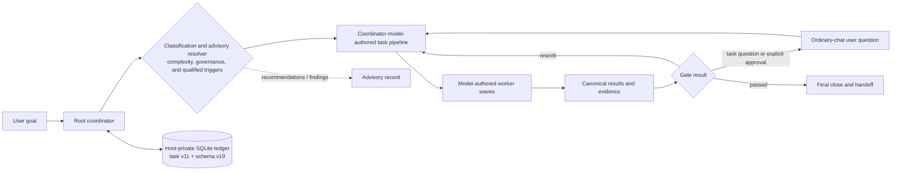

<table>
  <tr>
    <td width="190" align="center" valign="middle">
      
    </td>
    <td valign="middle">
      <h1>Cortex</h1>
      <p><strong>Reliable multi-agent orchestration for complex software engineering work in Codex.</strong></p>
      <p>
        Cortex turns a large task into a verifiable pipeline. It selects the
        right profile, model, and reasoning effort for every stage, isolates
        workers, preserves decisions, semantic events, and results in a local ledger, and does
        not declare the work complete without evidence.
      </p>
      <p>
        
        
        
        
      </p>
    </td>
  </tr>
</table>

## Install with Codex — recommended

> [!IMPORTANT]
> **⚡ Copy the prompt below into a new Codex task.** It tells Codex to read this
> repository's current installation guide, install Cortex only through its
> supported synchronization script, install and configure Codebase Memory MCP,
> configure Codex, and verify the result.

```text
Install and configure the Cortex plugin for this Codex environment.

First, read the complete installation instructions and requirements in this
repository's README. Treat it as authoritative:
https://github.com/igovet/codex-cortex-orchestrator/blob/main/README.md

Then complete the setup end to end:

1. Check every prerequisite required by that README (including Codex plugin and
   multi-agent support, Python 3.11+ with tomllib, Git, and Bash). Install every
   missing prerequisite with the supported package manager for this operating
   system. Do not install unnecessary packages or Python dependencies.
2. Install and configure the Codebase Memory MCP server as `codebase_memory`,
   following the README's **Codebase Memory MCP** section and its linked
   official upstream instructions. Install its required dependencies, register
   it with Codex, enable automatic indexing when supported, and verify that
   Codex can use it for this exact project root. Restart Codex if its
   instructions require a restart.
3. Install or update Cortex only by running `./scripts/sync-cortex.sh` from
   this checkout. First use `./scripts/sync-cortex.sh --dry-run` when a
   no-write preview is needed, then run `./scripts/sync-cortex.sh` and verify
   with `./scripts/sync-cortex.sh --check`. Do not use Marketplace screens,
   `codex plugin` commands, or manual configuration edits as alternative
   installation paths.
4. Preserve existing ~/.codex/config.toml settings and add or correct every
   Cortex-required setting documented in the README: multi_agent_v2 = true and
   agents.default_subagent_model = "gpt-5.6-luna".
   Keep user approval review enabled; do not enable Ask for me / Approve for me.
5. Complete the required Cortex hook-trust flow and run the README's relevant
   verification checks. Start a new Codex task if the README requires it.

Use only the instructions and commands documented in that README. If an
elevated system permission, an interactive desktop confirmation, or a material
choice is required, explain exactly what is needed and ask me before proceeding.
```

> Cortex is activated only when you explicitly select it. An ordinary complex
> request—or merely mentioning orchestration—does not create a Cortex session.

## Table of contents

- [Install with Codex — recommended](#install-with-codex--recommended)
- [Installation](#installation)
  - [System requirements](#1-system-requirements)
  - [Choose a project root](#choose-a-project-root)
  - [macOS-specific notes](#macos-specific-installation-notes)
  - [Required Codex configuration](#required-codex-configuration)
  - [Required hook trust](#required-post-install-hook-trust)
  - [Install or update Cortex](#2-install-or-update-cortex)
  - [Orchestration commands](#3-orchestration-commands)
  - [Existing repositories: run harvest first](#existing-repositories-run-harvest-first)
- [Strongly recommended: Codebase Memory MCP](#strongly-recommended-codebase-memory-mcp)
- [How orchestration works](#how-orchestration-works)
- [Profiles and model routing](#profiles-and-model-routing)
- [Developing Cortex](#developing-cortex)
- [Support Cortex 💜](#support-cortex-)
- [Verification and diagnostics](#verification-and-diagnostics)

---

## Installation

### 1. System requirements

| Component | Requirement | Why it is needed |
| --- | --- | --- |
| Codex | Desktop or CLI with Plugins and multi-agent support | Loads the plugin, skills, MCP server, and internal agents |
| Python | **3.11+**, with the standard-library `tomllib` module | Runs the local Cortex MCP server, hooks, and validators |
| Git | A current version | Fetches and refreshes the source checkout synchronized by the supported script |
| Bash | **3.2+** | The launcher supports the Bash shipped by macOS; no Bash 4.2+ install is required |
| Operating system | macOS or Linux; WSL is recommended on Windows | The current runtime launcher is Bash-based |

No additional Python packages are required through `pip`: the Cortex runtime
uses the Python standard library. Confirm that the required tools are available:

```bash
python3 --version
python3 -c 'import tomllib; print("tomllib: ok")'
git --version
codex --version
```

### Choose a project root

> [!WARNING]
> **Use a specific repository or worktree as `project_root`; never use an OS
> root or a broad system/home directory.** Do not start Cortex from `/`, your
> home directory, or directories such as `/home`, `/usr`, `/etc`, `/var`,
> `/opt`, `/tmp`, `/System`, `/Library`, or `/Users`.
>
> Before orchestration starts, Cortex recursively creates a
> content-addressed hash manifest of the selected root. On a system-wide or
> home-wide tree that can take a long time, consume substantial I/O, and make
> Codex or the terminal appear to hang. Select the actual project instead, for
> example `/workspace/my-service`. Cortex rejects the broad roots above
> before manifest capture.

If the correct Python interpreter is not the default `python3`, provide its
absolute path:

```bash
export CORTEX_PYTHON=/absolute/path/to/python3.11
```

The variable must be visible to the process that launches Codex. A Desktop app
started from the graphical shell may not read `~/.bashrc`; in that case, set
`CORTEX_PYTHON` in the environment used to launch the app.

### macOS-specific installation notes

The Plugins Marketplace workflow is the same on macOS, but the local runtime
requires additional preparation:

- macOS does not guarantee a suitable Python 3.11+ installation. Python 3.11+
  remains the only runtime prerequisite that may need to be provided separately.
- macOS ships `/bin/bash` 3.2, which the Cortex launcher supports directly.
  Bash 4.2+, GNU coreutils, and third-party shell libraries are not required.
- Homebrew uses `/opt/homebrew` on Apple Silicon and `/usr/local` on Intel.
  Use `brew --prefix` instead of hard-coding either location.
- Apps opened from Finder or the Dock do not necessarily inherit shell startup
  files such as `~/.zprofile`, `~/.zshrc`, or `~/.bashrc`.

Install the prerequisites with [Homebrew](https://brew.sh/):

```bash
# Install Apple's command-line tools first if they are not already present.
xcode-select --install

brew install python@3.11 git
```

Resolve and verify the installed runtimes:

```bash
export CORTEX_PYTHON="$(brew --prefix python@3.11)/bin/python3.11"

"/bin/bash" --version
"$CORTEX_PYTHON" --version
"$CORTEX_PYTHON" -c 'import tomllib; print("tomllib: ok")'
```

For Codex CLI sessions, make sure Homebrew is initialized before running
`codex`. Homebrew prints the exact `shellenv` command for your machine during
installation. A portable setup for the current shell is:

```bash
eval "$(brew shellenv)"
export CORTEX_PYTHON="$(brew --prefix python@3.11)/bin/python3.11"
codex
```

For Codex Desktop, the application process must receive `CORTEX_PYTHON`. If the
app is launched from Finder or the Dock, set it for the current macOS login
session before opening Codex:

```bash
launchctl setenv CORTEX_PYTHON "$(brew --prefix python@3.11)/bin/python3.11"
```

Fully quit and reopen Codex afterward, then start a new task. `launchctl setenv`
is scoped to the current login session and may need to be repeated after a
logout or restart. If your app launcher or device-management system already
provides environment variables, configure the same values there instead.

### Required Codex configuration

> [!IMPORTANT]
> Configure Codex before the first orchestration, then start a **new task**.
> Cortex requires the Codex multi-agent runtime, and the global default model for internal
> subagents must be **Luna**. Without a confirmed Luna default, the host cannot
> reliably apply the standard hidden-worker routing policy.

Add the following settings to `~/.codex/config.toml`:

```toml
[features]
multi_agent_v2 = true

[agents]
default_subagent_model = "gpt-5.6-luna"
```

The two settings above are required in every configuration:

- `multi_agent_v2 = true` enables explicit model and reasoning-effort routing
  for each subagent. An already-open task retains the adapter selected when it
  was created.
- `default_subagent_model = "gpt-5.6-luna"` allows Cortex to launch standard
  hidden Luna workers without copying the expected model into a native model
  override. Cortex still selects Terra and Sol explicitly when policy requires
  them.

For clearer coordinator explanations and full plain-text question/answer
context, the recommended top-level Codex setting is:

```toml
model_verbosity = "high"
```

This setting is recommended rather than required by the Cortex runtime. Apply
it before starting a new task so the new task inherits the configured response
style.

`./scripts/sync-cortex.sh` enforces both settings. It enables
`multi_agent_v2`; if the existing default subagent model is not Luna, it first
stores a private timestamped backup of `config.toml` and then replaces only
that setting. `--dry-run` previews the change and `--check` fails on drift.
`scripts/cortex-host-preflight.py` independently checks both prerequisites.
Start a new Codex task after any change so the host reloads them.

Cortex questions and plan approval use ordinary chat messages and do not
require or invoke MCP form elicitation. The coordinator sends one detailed
final assistant message, ends the turn, and resumes the same durable task when
the user replies in the next ordinary message.

You may also approve all tools exposed by the local Cortex MCP server:

```toml
[plugins."cortex@cortex".mcp_servers.cortex]
default_tools_approval_mode = "approve"
```

The MCP setting affects Cortex tools only. It does not change the approval
policy for shell commands, patches, or tools provided by other plugins.

To keep other approval decisions routed to the user:

```toml
approval_policy = "on-request"
approvals_reviewer = "user"
```

> [!WARNING]
> ### Do not use **Ask for me / Approve for me** with Cortex
>
> This Codex permission mode enables auto-review by setting
> `approvals_reviewer = "auto_review"`. Every eligible approval request is then
> routed to a **separate reviewer agent** instead of being shown directly to
> the user. That review is an additional model request with its own context,
> latency, token usage, and model-budget cost.
>
> Cortex already has its own evidence, result, and gate-review pipeline. Adding
> a second model-based approval reviewer increases cost and makes the execution
> path harder to reason about without improving the Cortex orchestration
> contract. Keep `approvals_reviewer = "user"` and select the manual user-review
> permission mode. Do not continue until **Ask for me / Approve for me** is
> disabled.

Codex Desktop may change the active permission mode when the selected model
changes. Recheck the permission control after changing models and confirm that
it still routes approvals to the user. See the
[official OpenAI auto-review documentation](https://developers.openai.com/codex/sandboxing/auto-review)
for the separate reviewer-agent flow.

### Required post-install hook trust

> [!IMPORTANT]
> After every installation or update, review and trust the Cortex lifecycle
> hooks **before starting orchestration**. Hook trust is content-hash based, so
> a new plugin build may require renewed approval even when the hook names have
> not changed.

Cortex registers the native lifecycle hooks. Their model-visible output is
bounded telemetry validated against Codex's event-specific command-output
schemas: only
`SessionStart` and `SubagentStart` may return
`hookSpecificOutput`, and the nested output contains only `hookEventName` plus
optional `additionalContext`; `SubagentStop` and `Stop` return `{}`. Internal
telemetry classifications are dropped at this boundary.

| Hook | Purpose |
| --- | --- |
| `SessionStart` | Emits a bounded compaction handoff advisory; it cannot restore or reconstruct a capability |
| `SubagentStart` | Privately joins a native V2 worker to its dispatch through host MCP thread metadata while emitting only bounded telemetry |
| `SubagentStop` | Privately records the exact native terminal Stop while emitting no model-visible lifecycle identity |
| `Stop` | Emits an identity-free coordinator-stop telemetry observation |

For an installation synchronized by the supported script, accept the hook trust
prompt shown by Codex. Before approving it, confirm that:

- the plugin ID is exactly `cortex@cortex`;
- the source is the installed plugin's `hooks/hooks.json`;
- the command invokes the same installed cache's `scripts/cortex-launcher` and
  `scripts/cortex_hook.py`;
- the set contains the registered native lifecycle hooks and no unexpected additional
  hooks.

Do not approve a hook whose plugin ID, source path, command, or hook set differs
from this contract. Resolve the mismatch or reinstall the plugin first.

The native hook observations are trusted local input inside Cortex's same-user
local-state boundary; they are not cryptographic proof or server attestation.
Malicious same-user modification of the plugin or its private database is
outside this threat model. If hook identity or trust is unknown, or the hook is
disabled, stale, rejected, or unverifiable, do not start orchestration: the
native completion barrier fails closed. Hook output never supplies a
capability, task recovery path, or replacement-worker authority, and models
must not inspect plugin or private state. After trust is approved, fully
restart Codex and open a new task.

### 2. Install or update Cortex

> [!IMPORTANT]
> **`./scripts/sync-cortex.sh` is the only supported Cortex installation and
> update path.** Do not use Marketplace screens, `codex plugin` commands, or
> manual configuration edits as an alternative installation route.

From this checkout, run:

```bash
# Optional read-only preview
./scripts/sync-cortex.sh --dry-run

# Install or update this checkout
./scripts/sync-cortex.sh

# Verify that the installed copy matches this checkout
./scripts/sync-cortex.sh --check
```

Approve the registered native lifecycle hooks in
[Required post-install hook trust](#required-post-install-hook-trust), verify
the [required configuration](#required-codex-configuration), then start a new
Codex task. Existing tasks do not load newly synchronized skills, hooks, or MCP
tools.

### 3. Orchestration commands

Cortex exposes one explicit entry point with several routes. On Desktop,
select **Skills → Cortex Orchestrator** or mention the skill in chat. In the
CLI, use `$cortex:orchestrator` or `/skills`. The coordinator preserves an
explicitly selected route when starting the orchestration.

| Command | Purpose | Example |
| --- | --- | --- |
| `$cortex:orchestrator <task>` | Start ordinary orchestration | `$cortex:orchestrator Find the race condition and fix it with tests` |
| `$cortex:orchestrator help` | Show read-only help without changing the project or ledger | `$cortex:orchestrator help` |
| `$cortex:orchestrator harvest` | Build or synchronize the repository knowledge baseline; required before the first task in an existing project | `$cortex:orchestrator harvest` |
| `$cortex:orchestrator harvest-refresh` | Rebuild project knowledge documentation from source | `$cortex:orchestrator harvest-refresh` |
| `$cortex:orchestrator normal` | Leave the active Cortex route | `$cortex:orchestrator normal` |

Example tasks:

```text
$cortex:orchestrator Design and implement secure API-key rotation,
including the migration, tests, and documentation.

$cortex:orchestrator Review the current PR, identify regressions,
check security, and verify the findings with tests.

$cortex:orchestrator harvest-refresh
```

#### Existing repositories: run harvest first

> [!IMPORTANT]
> ### Run `$cortex:orchestrator harvest` before the first task in an existing project
>
> Cortex workers rely on durable repository knowledge under `docs/project/` and
> `docs/features/`. For an existing codebase, run the harvest route once before
> ordinary feature, debugging, migration, review, or refactoring work. This
> gives later workers an evidence-backed map of the project's architecture,
> features, commands, conventions, verification paths, decisions, and known
> pitfalls.

Start the initial knowledge build with:

```text
$cortex:orchestrator harvest
```

If the project does not already have a current, source-backed coverage manifest,
`harvest` automatically performs a full baseline census rather than a shallow
incremental update. The pipeline plans the repository domains, explores them,
synthesizes the architecture, writes the canonical documentation, independently
reviews coverage, and verifies the finished knowledge tree.

The resulting baseline includes:

```text
docs/project/index.md
docs/project/conventions.md
docs/project/verification.md
docs/project/decisions.md
docs/project/gotchas.md
docs/features/index.md
docs/features/<feature>/index.md
```

For large restructures, a stale knowledge tree, or suspected coverage gaps, run
a full independent rebuild:

```text
$cortex:orchestrator harvest-refresh
```

#### Documentation is maintained automatically after tasks

After the initial harvest, you do **not** need to run `harvest` after every
task. Cortex automatically adds scoped documentation synchronization after C2
or C3 work, and whenever verified changes affect behavior, interfaces,
architecture, project commands, conventions, gotchas, decisions, or feature
ownership.

The documentation worker updates only the affected durable pages, preserves
protected human-authored text, verifies links and commands against the finished
implementation, and keeps the feature registry consistent. Documentation is
therefore updated as part of the task pipeline before the final close gate.

A small local C1 fix that changes none of those durable facts intentionally
skips documentation sync. Cortex does not create documentation merely to record
that a task occurred.

`help` and `normal` do not start durable orchestration. Project-wide pruning
and maintenance are not model-facing operations. `harvest` is incremental only after a verified
coverage manifest establishes a complete baseline; otherwise Cortex performs a
full audit. `harvest-refresh` always rebuilds the inventory from current source.

> [!CAUTION]
> `/cortex` and `/normal` are not registered Codex slash commands. Use
> `$cortex:orchestrator ...` or select the skill through `/skills`.

---

## Strongly recommended: Codebase Memory MCP

> [!WARNING]
> ### Install Codebase Memory MCP before serious orchestration work
>
> **[DeusData/codebase-memory-mcp](https://github.com/DeusData/codebase-memory-mcp)**
> builds a local graph of functions, classes, calls, routes, and dependencies.
> Cortex uses it for fast architecture discovery, impact analysis, and tracing
> end-to-end execution paths. This is especially valuable in large monorepos:
> without the graph, workers must search and read files more sequentially,
> consuming more time and context while increasing the chance of missing a
> non-obvious caller, alternate entry point, or cross-service relationship.
>
> Codebase Memory is not a hard runtime dependency. If the MCP server is not
> available, a worker makes one bounded attempt and falls back to ordinary
> repository tools. Nevertheless, it is **strongly recommended** for C2 and C3
> tasks.

Quick install on macOS/Linux:

```bash
curl -fsSL https://raw.githubusercontent.com/DeusData/codebase-memory-mcp/main/install.sh | bash
```

Review the remote installation script before running it. For Windows, manual
installation, and package-manager options, see the
[official Codebase Memory README](https://github.com/DeusData/codebase-memory-mcp#quick-start).

After installation:

1. Restart Codex so it loads the new MCP server.
2. Ask Codex to index the project, or enable automatic indexing:

   ```bash
   codebase-memory-mcp config set auto_index true
   ```

3. Confirm that the project is resolved by its **exact absolute root**.

Internal Cortex workers use Codebase Memory; the coordination-only root does
not. Every immutable worker briefing includes a project key precomputed from
the canonical root with Codebase Memory's current path-key algorithm: safe
ASCII is preserved, separators and other unsafe ASCII become collapsed dashes,
non-ASCII UTF-8 bytes become lowercase hex, and overlong keys receive the
same bounded FNV-1a suffix. Workers use this key directly and call
`list_projects` at most once only after a real lookup failure, ambiguity, or
key drift/collision; any fallback must match the exact canonical root. The
`planner`, `explorer`, `architect`, and `database_architect` profiles may
perform one bounded refresh when the exact index is missing or stale. Other
profiles do not loop on MCP setup and use the safe fallback instead.

---

## How orchestration works

Cortex is more than a prompt asking Codex to “run several agents.” It is a
local control plane with explicit stages, durable state, and verifiable
transitions.



### Governance resolution

Before dispatching the chosen pipeline, Cortex evaluates the requested
governance mode, task complexity, and qualified risk or topology signals. The
requested mode is `auto`, `required`, or `off`; the effective mode is
`minimal`, `light`, or `full`. This classification produces server-owned
recommendations, findings, and evidence obligations. It does not replace or
veto the pipeline selected by the orchestrator.

| Request and context | Effective mode | Result |
| --- | --- | --- |
| `auto`, C1, and no qualified signal | `minimal` | Recommends the chosen pipeline with verification evidence and an audit receipt. |
| `auto`, C2, and no qualified signal | `light` | Recommends policy, decision/assumption/risk, process-reflection, and verification obligations; the orchestrator decides whether and where to execute them. |
| `auto` with C3 or a qualified signal | `full` | Recommends independent governance review before ordinary work and before final close; the recommendation is recorded without changing the chosen route. |
| `required` at any complexity | `full` | Records the full-governance recommendation and findings; it is not a server pipeline veto. |
| `off` | `minimal` only for C1 with a complete Boolean assessment of every documented trigger; C2/C3 or any triggered risk is recorded as an advisory finding, while objective safety and authorization boundaries still apply. |

Qualified signals include security, privacy, credentials or sensitive data,
destructive work, migrations, external actions, public-contract,
authorization, or integrity work, and explicit multi-repository, linked-task,
long-lived-lane, conflicting-resource, or multi-session topology. Counts
alone do not raise the governance mode.

In `full` mode, `governance_activation` and `governance_close` are available
as read-only recommendations and evidence-producing gates. The orchestrator
owns `chosen_pipeline`; Cortex exposes `recommended_pipeline`,
`recommended_parallel_groups`, and `pipeline_advice` separately and records
when the chosen route differs. Governance findings, missing evidence,
planner/reapproval advice, and gate-order recommendations therefore trigger
server-owned corrective dispatch or rework, not a policy stop or an automatic
pipeline replacement. Only objective integrity, capability, authorization,
and safety boundaries can reject an otherwise executable choice. For the
record model, capability boundary, and integrity rules, see the
[orchestration ledger documentation](docs/features/orchestration-ledger/index.md).

### The orchestration cycle

1. **Explicit activation.** Cortex preserves the exact user request,
   acceptance criteria, and task boundaries.
2. **Evidence-first scoping and planning.** C2 starts with Explorer discovery.
   C3 and knowledge harvest start with a read-only Planner **scope** phase that
   publishes a complete discovery brief and all validated discovery domains. The
   final Planner **plan** phase runs after discovery and all design gates, and
   consumes their predecessor result references before publishing the decision-complete
   `planning` artifact. `scope` gathers evidence but never closes a user-intent
   question; material decisions still use the worker-question flow.
3. **Canonical ordering.** C1 is `discover → implementation → review → close`.
   C2 is `discover → design gates → plan → implementation → qa → review →
   documentation → close`. C3 is `scope → discover → design gates → plan →
   implementation → qa → review → documentation → close`. Harvest is `scope →
   discover → architecture → plan → documentation → review → close`.
   Architecture, database architecture, and UX gates precede plan; security,
   performance, and accessibility remain post-implementation audits before
   review. These are base routes: the governance resolver may wrap any route
   with the full-mode review gates described above.
4. **Precise dispatch.** Every worker receives a profile, model, reasoning
   effort, mission scope, ownership, acceptance criteria, and verification
   responsibilities.
5. **Isolated execution.** The root remains a coordinator and does not mix its
   own project changes with worker work. Independent read-only tasks run in
   parallel, while overlapping writes are serialized.
6. **Results instead of trust.** Every worker publishes the canonical
   `cortex/attempt-result/v1` payload. Planner Scope may additionally
   publish a complete `scoping` projection (`overview`, `context_files`, and
   all validated discovery domains); Planner Plan may publish a complete
   `planning` projection. The server also attaches the task-wide
   `resolved_user_decisions` snapshot. These projections never widen the
   worker-authored AttemptResult fields.
   A result read is repeatable, but it remains unavailable until every bound
   native child has a canonical terminal result and exact matching terminal
   `SubagentStop`. The coordinator supplies no lifecycle evidence and never inspects
   plugin or private state. Only the first complete coordinator read after that barrier
   may publish the user-facing completion link. That same message summarizes
   what completed and what happens next; early reads and rereads remain
   link-free.
7. **Approval and adaptive replanning.** `plan_approval` defaults to `auto` at
   every complexity. A visible plan-approval hold is allowed only when the
   user explicitly requested plan approval; an internal policy-generated
   reapproval signal is advisory and does not pause the task. When explicit
   approval is requested, the review records the plan revision, planner result
   reference, verified-predecessor digest, and semantic future-pipeline digest.
   The approval decision is a detailed `cortex/chat-interaction/v1`
   ordinary-chat hold with approve/revise/cancel outcomes; silence never
   implies approval. Evidence-driven changes remain orchestrator-owned:
   recommendations can add corrective work or rework, while the server keeps
   the chosen route and prior history unless an objective hard boundary rejects
   it.
8. **Automatic documentation sync.** When completed work changes durable
   behavior, interfaces, architecture, commands, decisions, or ownership,
   Cortex dispatches a technical writer to update the affected project and
   feature documentation before closing the task.
9. **Verified close.** A task completes only after the required gates are
   satisfied and the final handoff is ready.

### 11.0.1 worker completion and AttemptEvent protocol

Cortex 11.0.1 uses one database-centric worker protocol. A worker checkpoints
semantic facts with `record_attempt_event`, closes a valid attempt with
`submit_attempt`, and applies a server-issued same-attempt correction only
through `repair_attempt`. `AttemptEvent` is append-only and keyed for
idempotent retries; its event kinds cover findings, decision evidence,
blockers, worker-attested verification claims, progress, and notes.

After successful submission, the worker ends its task-scoped Cortex calls and
the coordinator continues generic `wait_agent` cycles. Ordinary waits use a
300-second timeout for progress, not an exact-child target, and their output is
not lifecycle evidence. An early, timed-out, steered, partial, or unrelated
wake-up authorizes no result read or continuation. Once all canonical results
and matching terminal Stops are durable, the canonical read becomes available.
Generic wait output is progress only.

Submission and repair are separate MCP tools, not branches of one multiplexed
request. Each public tool owns one complete, closed, one-level `inputSchema`,
and the runtime validates the call with that same schema. The tool description
states only the operation's short semantic purpose. Skills, prompts, and
documentation do not repeat argument names, field schemas, or schema
templates. There are no compatibility aliases.

The server adds facts that a worker cannot authoritatively assert: the opaque
attempt identity, exact native dispatch identity, task revision, profile,
phase, predecessor scope, timestamps, changed files from baseline/current
workspace observation, canonical result identity, and exact native Stop.
Command, browser, console, network, accessibility, layout, and test claims
remain worker-attested; the server receipt attests only their exact identity,
digest, and storage. Manifest reconciliation is server-observed. A missing
required evidence class remains explicit and cannot be turned into a pass by
including a sentence in a result. The result and event rows are committed in
SQLite schema v19 before any user-facing result is materialized.

The lifecycle is deliberately explicit:

```text
RUNNING → WORK_COMPLETED → FINALIZING → COMPLETED
     ├── BLOCKED
     └── FAILED
```

`WORK_COMPLETED` means the worker's semantic result is durable. `FINALIZING`
represents server-owned result views, handoff compilation, and other server-owned
infrastructure work. `COMPLETED` is reached only after required finalization
passes. `BLOCKED` and `FAILED` remain meaningful semantic worker outcomes, but
technical lifecycle states (`blocked`, `needs_input`, validation failures,
stale observations, lost dispatches, and missing projections) are normalized into
server-owned recovery and corrective work. A missing file, transport error, or
lost native observation does not become a user-facing Cortex blocker.
A serialization, view, or infrastructure failure after `WORK_COMPLETED` is
retried against the same attempt and never creates a replacement worker.
An active dispatched attempt without a finalized canonical result prevents an
unverified gate pass, handoff, terminal acceptance, or coordinator completion;
it does not block the orchestration route. Cortex continues through the
server-derived wait, retry, or corrective dispatch until the exact result is
available. A native child binding is recovery metadata only; the coordinator
must read the result, receive the server-derived continuation, and only then
close that child.

### 11.0.1 ContextCompiler and HandoffCompiler boundaries

`ContextCompiler` is the only normal coordinator-to-worker context boundary.
It compiles task intent, requirements, constraints, decisions, assigned scope,
mission scope, acceptance criteria, verification requirements, validated
predecessor result references, and server observations into a complete,
immutable dispatch briefing. The briefing is a private capability export: its
path, identity, and digest are checked, but it is not mutable task state.

`HandoffCompiler` creates target-specific projections over canonical references
rather than copying mutable task state. Implementation workers receive requirements,
decisions, mission scope, and task boundaries. QA workers receive changed files,
acceptance and verification needs, observed checks, unresolved findings, and
risk areas. Review workers receive the change inventory, requirements,
verification evidence, open findings, and relevant decisions. Cross-stage
handoff uses server-derived result references and assignment-granted context.

A successful `read_dispatch_briefing` and an assigned
`read_predecessor_result` call create idempotent server-owned read observations
scoped to the exact task, attempt, dispatch, result identity, and digest. The
worker does not prove a read with prose. The coordinator and compiler consume
canonical result references and observations, never an arbitrary file selected
from a project directory.

### 11.0.1 same-attempt finalization and recovery

Host MCP thread metadata and trusted local `SubagentStart`/`SubagentStop` events
privately join a native V2 worker to its dispatch and record its exact terminal
Stop. `SubagentStop` is the exact terminal host authority; it does not declare
the canonical result terminal or authorize a retry. Backend worker-wave reads
and continuation become available only when every wave member has both a
canonical terminal result and its matching terminal Stop. Ordinary timeouts,
generic transport errors, steered waits, ambiguous wake-ups, and unrelated
observations never authorize a read or replacement.

All registered hooks emit only bounded, identity-free model-visible telemetry.
Host MCP `_meta.threadId` binds the authorized worker call to
`SubagentStart.agent_id`; `SubagentStop` records terminal completion. Models
neither receive nor inspect that state. `SessionStart` may remind a
coordinator to retain its already-held capability pair across a bounded
compaction handoff; a missing capability is a fail-closed condition, never a
reason to inspect ambient state or reconstruct a task. The trusted local observer
supplies only the native lifecycle prerequisite; it does not direct a
server-owned executor or expose model-visible lifecycle authority. Mutation
authority stays at the explicit-capability boundary.

### 11.0.1 closed public response boundary

Every public operation returns its closed v11 response contract. Worker-facing
responses remain minimal, successful completion is terminal, and a worker does
not carry a result reference or lifecycle evidence back to the coordinator.
Coordinator result reads derive the current wave from canonical state only
after every bound child has a canonical terminal result and exact matching
terminal Stop.

Errors and recovery remain structured and sufficient for the advertised next
operation, including same-attempt repair. Callers use the operation's MCP
contract and returned recovery data; they never inspect Cortex source, caches,
logs, ledger files, sessions, environment variables, or hidden paths to invent
a call. Heavy state is available only through an action-specific inspection
tool.

### 11.0.1 public API and audience boundary

The v11 public facade is action-specific. Starting, inspecting, recovering,
resuming, stopping, asking, answering, approving, revising, steering, artifact
access, lane/resource control, governance, attempt submission/repair, briefing,
wave reads, and predecessor reads are separate MCP tools. There is no action
selector, branch registry, shared multiplexer, or alternate public name.

The coordinator privately carries its task authority; a worker carries only
the exact authority supplied by its native dispatch.
`start_orchestration` is the sole creator of a task and the sole issuer of the
initial coordinator capability. Worker assignments are issued only by the
server-derived continuation for that task. Cortex owns and issues these opaque
refs; a model only copies and serializes their exact bytes, never generates or
infers them from a session, host, thread, project, or worker identity.

The coordinator model constructs the worker waves in `start_orchestration`;
the backend validates, persists, and dispatches that model-authored plan rather
than choosing a pipeline or reconstructing workers on the model's behalf.
Coordinator-authored acceptance and verification arrays are retained in their
normalized exact order as immutable task intent. Server baseline obligations
are stored separately and may only add distinct requirements; the shared
contract digest is carried through compiled assignments, briefings, canonical
results, governance closure, replay checks, and final handoff.

The canonical schema module builds the exact schema advertised by each MCP
tool, and runtime validation consumes that same schema. All schemas are closed
and one level deep. Field names and constraints therefore live only in the
connected tool contract, never in skills, prompts, or prose documentation.
Text is language-neutral and never blocks a task, question, answer, or
approval.

The only valid native lifecycle is native V2 `spawn_agent` for every wave
member, generic timeout-bounded `wait_agent` cycles, then an action-specific
canonical wave read and server-derived continuation. Parallel wave members may
run concurrently. Codex CLI and Desktop use this same host-owned lifecycle.
Ordinary progress waits use a 300-second timeout, have no exact-child target,
and supply no child identity or completion evidence. An early, timed-out,
steered, partial, or unrelated wake-up requires another generic wait and
authorizes no read. Once every bound child has a canonical terminal result and
matching terminal Stop, the coordinator uses the action-specific canonical wave
read and follows its server-derived continuation. Generic wait output is progress
only. `create_thread`, session/environment authorization, server-owned CLI or
executor launches, `repair_planning`, and manually authored
`advance`/`completions` forms are not v11 contracts.

`submit_attempt` and `repair_attempt` are distinct worker operations. Repair is
digest- and capsule-bound to the same attempt, preserves the retained draft,
and fails closed on integrity or authority violations. Worker payloads stay
semantic; identity, changed paths, checks, timestamps, and other evidence are
derived by the backend. A missing capability never falls back to ambient state,
a guessed identity, or a replacement child.

A worker's first operation can arrive before the trusted native spawn
observation has joined its host identity. For that pending condition only, the
worker retries the same operation with bounded backoff until a finite deadline,
without project access, operation switching, or replacement. A successful exact
retry automatically clears the transient observer failure. At the deadline it
follows public fail-closed recovery.

Every growing read uses an exact opaque `c11p` cursor issued by the server.
Fixed receipts and repair cards do not paginate.

There are no alternate public operation names, transport aliases, or result
submission surfaces. Workers cannot call lifecycle or governance-management
operations. Coordinators cannot manufacture assignment authority, timestamps,
changed paths, predecessor reads, server observations, or worker-attested
verification claims. Result JSON,
Markdown, journals, plans, and indexes are rebuildable projections; their
existence, links, filenames, or prose cannot authorize a gate, read, resume,
handoff, or completion.

Durable worker questions are bound to the exact task, attempt, and revision.
They are ordinary arbitrary-Unicode text, and replies are ordinary
arbitrary-Unicode text. The root coordinator displays and records that text
without imposing a structured-choice or localization schema, then resumes the
same attempt. The worker LLM interprets adequacy. Silence never implies
approval.

The Question Firewall permits a user question only for task requirements,
scope, acceptance/product decisions, or explicit external/destructive
authorization. Governance, policy, planner, retry, worker/profile, dispatch,
ledger, receipt, evidence, lifecycle, and recovery conditions remain internal
`orchestrator_advice` and are repaired or delegated automatically. The
Presentation Firewall applies the same rule to lifecycle output: internal
`blocked`, `needs_input`, and `error` states are not rendered as requests for
the user to fix Cortex. A plan question is an exception only when durable
state proves that the user explicitly requested plan approval.

During the signed V17/V18-to-V19 cutover, every already accepted user-facing
durable question is classified as `requirement` without inspecting or
translating its text. This conservative migration preserves released pending,
answer, and same-worker resume semantics; category-less rows created after the
cutover remain non-authorizing.

### 11.0.1 Prompt Contract v3 and dispatch authority

Prompt Contract v3 is the sole stable prompt path. Static authority and worker
policy live in the bundled skills and profiles; every dispatch-controlled value
is fenced assignment JSON with one explicit data boundary and strict structural
validation. Prompt byte targets are advisory guidance for the worker, not
backend admission or storage limits. The renderer has one ownership matrix, one
section order, one data boundary, and one current fixture format. Offline lint
and deterministic evaluation verify the source, headings, fence width, and
hostile-value containment. They are structural checks and do not make
model-quality claims.

The worker reads the exact immutable briefing through the scoped public API
before project work; the server verifies its SHA-256 digest and records the
complete read. A detailed compiled plan is an immutable artifact addressed
by one exact reference, path, and digest; it is not copied into mutable task
state or silently truncated to fit a prompt. Ordinary profiles receive only
their target-specific mode and scope. Harvest routes add their explicit mode
overlay only when selected; ordinary worker prompts remain focused on the
assigned task.

Prompt and skill files describe workflow and policy for the current v3 prompt
protocol; they do not embed MCP argument names or schemas. The MCP tool catalog
is the only caller-facing input contract. A prompt change is not complete until
the relevant prompt diagnostics have been exercised and the sole release gate
passes.

### 11.0.1 governance, security, and verification

Governance state, immutable artifacts, exact scope, revision chains, and
authenticated lifecycle transitions are server-owned in schema v19. Plan
approval defaults to `auto`; when the user explicitly requests approval, it is
bound to the final plan revision, verified predecessor result references, and
a semantic future-pipeline digest. A material future-wave change preserves
history and records fresh planning/review advice; it pauses only when that
explicit approval contract is active. No-op or infrastructure-only
finalization retries do not alter semantic approval.

Fresh state uses one compact schema-v19 ledger. Exact signed released schema-v17
and schema-v18 histories upgrade transactionally in place: Cortex preserves
their append-only migration rows and appends the current schema-v19 row only
after the data cutover succeeds. The exact signed legacy V1--V8 namespace is
archived privately before Cortex creates a fresh schema-v19 ledger; its task
authority is not migrated or selectable. Any unknown, incomplete, unsigned,
reordered, or tampered history is rejected fail-closed and is not automatically
quarantined, guessed, or adopted as current state.

Cortex stores task state under the host-private content-addressed SQLite root.
An explicit `CORTEX_HOST_STATE_DIR` override must be private, outside the
workspace, and owned by the current user. WAL/SHM files and advisory locks are
SQLite machinery, not application evidence. Filesystem views are private,
regular, digest-checked, and rebuildable. Pruning commits a tombstone before
removing a view; it never repairs canonical state by deleting rows.

The sole release gate covers Python compilation, current-schema and storage
parity,
MCP tool/catalog/schema/runtime parity, the lifecycle hook commands declared by
the bundled manifest, prompt v3 contract
checks, marketplace validation, and black-box lifecycle behavior. Supporting
diagnostics include `git diff --check` and Markdown link and command review;
they are not separate release gates or test suites. Source-mode checks do not
claim that a user's installed cache, hook trust, or live model route is current;
unavailable host checks are recorded explicitly.

### Why this is more reliable than ordinary multi-agent work

- **State survives compaction and resume.** The goal, decisions, workers,
  results, checks, and blockers are recovered from the ledger rather than
  guessed from a shortened chat history.
- **No accidental duplicate dispatch.** Idempotent lifecycle calls and opaque
  task authority prevent an active wave from being started twice.
- **Explicit file ownership.** Each worker knows its allowed scope. Independent
  writers can use separate worktrees when isolation is required.
- **Material decisions are not invented.** A worker can persist a question,
  pause, and resume the same attempt after the user answers. Every later
  result carries that canonical question and answer so a successor cannot
  treat changed wording or a new key as a new decision.
- **Verification is contractual.** Semantic execution checks remain
  worker-attested; Cortex separately binds the canonical result, immutable
  revisions and manifests, and exact native Stop.
- **Documentation does not override source.** `docs/project/` and
  `docs/features/` provide navigation, while consequential claims are verified
  against source, tests, schemas, or executable configuration.
- **Knowledge stays current automatically.** After the initial harvest,
  behavior- or architecture-changing tasks synchronize the affected durable
  documentation before the close gate.
- **Privacy is the default.** The ledger and internal results remain local.
  Secrets and sensitive data must not be included in dispatches, results, or logs.

### Internal structure

```text
plugins/cortex/
├── .codex-plugin/plugin.json   # Manifest and UI metadata
├── .mcp.json                   # Local MCP server
├── agents/                     # 22 worker profiles
├── assets/logo.png             # Plugin logo
├── hooks/hooks.json            # Lifecycle hooks
├── profiles.json               # Routing and model policy
├── scripts/                    # Server, launcher, hooks, and runtime
└── skills/                     # 10 bundled skills
```

The public MCP surface is action-specific and the audience is fixed for the
stdio process. `tools/list` is the authoritative operation inventory. The
canonical `public_contracts.py` module supplies each advertised tool's complete
closed one-level input schema, and the runtime validator consumes the same
schema object. Tool descriptions are intentionally short and semantic; skills
and prompts contain workflow guidance without copying any argument schema.

Every worker assignment is an immutable, digest-checked briefing. The native
host follows the server-issued V2 `spawn_agent` dispatch and generic
`wait_agent` cycles;
worker calls carry only their exact server-issued native dispatch authority.
Cortex never derives authorization from
session or environment variables, and a missing capability fails closed.
The native spawn message carries only the worker role and exact dispatch
authority.
Static protocol lives in installed skills and profiles, and complete
task-specific intent appears once in the immutable briefing. Normal dispatches
do not carry private briefing paths; only an actual missing-host-file read
failure returns one exact path for one bounded recovery read.
The worker reads and verifies the briefing before project work. Result links
are server-derived and assignment-scoped. Compact inspect and recovery responses keep scoped
summaries, while the complete canonical result remains in SQLite. No worker
scans a project directory for a task or selects an unrelated result.

The dispatch briefing is deliberately bounded and may require additional
pages. The worker follows the server-issued `c11p` cursor through the same
action-specific read tool before it performs project work or submits a report.

Material worker questions and answers are ordinary arbitrary-Unicode text.
They may contain any number of questions, recommendations, trade-offs,
explanations, and context without a structured-choice or localization model.
Cortex returns the exact paged text for ordinary chat. Publishing the question
ends the worker's native turn and genuinely pauses that child. The root presents
the question, and the real user answer is recorded as arbitrary-Unicode text.
Only then does the same child resume in a new native turn. The worker receives the exact paged answer,
and its LLM decides whether that answer is adequate. A ref mismatch never
authorizes removal and creation of a
replacement question. The schema, rather than these instructions, owns every
tool-call shape. Canonical text preserves arbitrary Unicode.

The complete worker assignment is stored in a private immutable briefing
protected by a SHA-256 digest. Worker Briefing v3 JSON-serializes every
task-controlled assignment value inside one explicitly untrusted data block;
the surrounding authority, bounded role contract, optional mode overlay,
evidence rules, and worker protocol remain fixed instructions. Prompt volume
targets are advisory worker guidance only: no task, plan, result, event,
question, answer, or artifact content is truncated, rejected, or omitted to
fit a byte, character, or file-size target. Full Planner microtasks may remain
inline or use their exact digest-bound artifact reference, and complete
payloads are stored intact. Ordinary profiles do not carry harvest
specialization; exact harvest routes add their conditional mode overlay.
Briefings have non-blocking compactness targets: 12 KiB for ordinary work and
18 KiB for harvest work. They are prompt guidance, not lifecycle authority.

A nonretryable worker final is status text, not failure authority. Use terminal
worker-failure finalization only when the public structured recovery explicitly
directs that action for the original native dispatch. Cortex verifies and
consumes its private current binding before blocking the task and terminalizing
the attempt. Missing, stale, wrong-dispatch, or replayed recovery rejects
without mutation. Native prose is never parsed into recovery authority.

Governance authorization is server-owned and capability-scoped; it is never
returned as a raw capability or recovery proof in an MCP response. The project
ledger stores only server-side claims and SHA-256 verifiers. Recovery is an
idempotent operation addressed by the exact task and coordinator capabilities;
the model never transports a proof or replacement bearer, and an explicit
worker audience cannot call it.
Plaintext credentials are never stored or included in transcripts, briefings,
exports, or diagnostics. Governance mode `off`
is accepted only for C1 after an exhaustive boolean assessment of every
hard and topology trigger; prose detection may raise the floor but can never
authorize `off`. Sensitive governance records require an approved exact-type
policy with bounded retention and allowed roles. Initiative close requires the
matching completed independent reviewer result and server-owned lifecycle
state.


---

## Profiles and model routing

Cortex ships 22 profiles. They are not decorative personas: every profile has
its own sandbox, eligible gates, ownership boundaries, completion criteria, and
professional playbook.

| Area | Profiles |
| --- | --- |
| Discovery and planning | `explorer`, `planner`, `architect`, `database_architect` |
| Implementation | `frontend_dev`, `backend_dev`, `fullstack_dev`, `mobile_dev`, `data_engineer`, `devops_engineer`, `general` |
| Diagnosis and improvement | `debugger`, `refactorer`, `performance_engineer`, `ux_designer`, `accessibility_auditor`, `accessibility_fixer` |
| Quality control | `qa_engineer`, `code_reviewer`, `security_auditor`, `build_verification` |
| Documentation | `technical_writer` |

### Adaptive model policy

Cortex selects the least expensive sufficient model independently for each
bounded worker. Task complexity sets the governance baseline; it does not force
one model across every wave:

- **Luna** handles simple bounded discovery, mechanical work, and narrow
  deterministic rechecks at low or medium effort.
- **Terra** handles substantive implementation, full browser or
  assistive-technology QA, and complex cross-cutting analysis or review at high
  effort.
- **Sol** is reserved for exceptionally hard or high-risk work and explicit
  evidence-backed escalation, at xhigh or max effort.

An initially selected Luna dispatch requires verified host-default attestation.
If that attestation is unavailable, admission fails without mutation before
dispatch reservation; Cortex does not substitute Terra. Only when an already
prepared, never-delivered Luna dispatch later loses its attestation does the
server-owned exact-occurrence recovery ladder advance that occurrence to Terra.
Cortex never labels Terra as Luna and never creates a visible sidebar task
without an explicit request.

Adaptive routing is separate from adaptive replanning. The coordinator chooses
the worker model and effort at dispatch time from the canonical policy;
evidence-driven
replanning changes only the not-yet-started semantic pipeline. The coordinator
must record the evidence and reason for a material change, while Cortex keeps
the prior plan, approval, and basis digests in history. This makes a changed
specialist, dependency, path, acceptance criterion, or verification step
auditable without silently reinterpreting a completed wave.
After the completed wave is read, the coordinator makes one decision for that
canonical evidence frontier. `revise_future_pipeline` changes only unexecuted
future work. `append_rework_wave` handles product correction of a completed
canonical result by appending mutating rework and independent verification;
completed history is never rewritten. Transport, host-observation, model, and
other technical failures use the server-owned exact-occurrence
Luna-to-Terra-to-Sol replacement ladder instead. Cortex retains the selected
profile when compatible and otherwise resolves an operation-capable profile
from the canonical profile registry. Every returned worker uses native spawn,
ordinary generic waits, exact terminal Stop, and canonical wave read; required
governance closure executes before final handoff.

The root coordinator (the conductor for the orchestration) is an operator
choice separate from worker routing. Use **Terra** with `high` reasoning effort
as the default. Raise the conductor to **Terra** with `xhigh` only for very
large or unusually tangled tasks—for example, when results conflict, strategy
is unclear, or a routing/completion mistake would be expensive. This setting
does not change Cortex's per-worker model policy.

---

## Developing Cortex

> [!CAUTION]
> `./scripts/sync-cortex.sh` is the supported installation and update path for
> this checkout. Contributor-only commands below are diagnostic additions, not
> alternate install mechanisms.

### Runtime boundary

The complete installable product lives under `plugins/cortex/`: the manifest,
profiles, skills, hooks, MCP configuration, and runtime. Root-level `scripts/`,
`tests/`, `docs/`, and `AGENTS.md` support repository development and are not
part of the installed plugin's runtime contract.

Important entry points:

| Path | Purpose |
| --- | --- |
| `plugins/cortex/scripts/cortex.py` | MCP server |
| `plugins/cortex/scripts/cortex-launcher` | Python selection and server startup |
| `plugins/cortex/scripts/cortex_hook.py` | Lifecycle hooks |
| `plugins/cortex/profiles.json` | Canonical profiles and routing policy |
| `plugins/cortex/skills/orchestrator/SKILL.md` | The single authoritative orchestration skill |
| `.agents/plugins/marketplace.json` | Repository-local Marketplace |
| `scripts/sync-cortex.sh` | Install, update, and verify the checkout version |

### Recommended development loop

```bash
# 1. Inspect the checkout and host without changing Codex configuration
python3 scripts/cortex-host-preflight.py

# 2. Preview the update without writing
./scripts/sync-cortex.sh --dry-run

# 3. Install or reinstall the current checkout
./scripts/sync-cortex.sh

# 4. Open a new Codex task and test the changed behavior

# 5. Confirm that the installed copy matches the checkout
./scripts/sync-cortex.sh --check
```

`sync-cortex.sh` validates the Marketplace and manifest, registers the local
Marketplace, reinstalls `cortex@cortex`, detects same-version content drift,
verifies trust for the lifecycle hooks declared by the installed manifest,
enables `multi_agent_v2`, and enforces the required Luna default. Before
replacing a non-Luna default it stores a private timestamped backup of the
original Codex config. It does not import, clean, or modify user Cortex ledgers
or unrelated plugin data.

To select another Python interpreter:

```bash
CORTEX_PYTHON=/absolute/path/to/python3.11 ./scripts/sync-cortex.sh --dry-run
CORTEX_PYTHON=/absolute/path/to/python3.11 ./scripts/sync-cortex.sh
```

### Versioning

The action-specific, alias-free v11 contract remains at **11.0.1**. Each
operation has its own MCP tool and no action multiplexer. Version and build
identity remain defined by `plugins/cortex/.codex-plugin/plugin.json`.

When changing the plugin, update the version in
`plugins/cortex/.codex-plugin/plugin.json` according to SemVer:

- patch for a fix without new functionality;
- minor for a non-breaking feature;
- major for a large or breaking change.

Do not publish an ordinary fix or feature as a major release. Build metadata
after `+` may be used as a cachebuster, while SemVer communicates the public
version contract.

### Development agreements

- Do not create a second repository-level copy of the orchestration skill.
- Preserve exact machine-readable profile names from `profiles.json`.
- Do not embed complete worker prompts in mutable task state.
- Synchronize changes to behavior, architecture, interfaces, or verification
  commands with `docs/project/` and `docs/features/`.
- Read-only checks must prefer non-writing modes and never use cleanup
  commands. Recognized cross-language test/build/cache residue is tolerated
  and recorded; unknown output remains a validation failure.
- Never commit `.codex/cortex`, runtime ledgers, diagnostic logs, credentials,
  or private data.

---

## Support Cortex 💜

Cortex remains open source, and if it is useful to your work, you can support its continued
development and maintenance through [GitHub Sponsors](https://github.com/sponsors/igovet).
Sponsorship helps fund testing and experimentation with multi-agent orchestration, plus the
infrastructure, tooling, documentation, skills, and MCP integrations that make it better.
Sponsorship is entirely optional—a simple way to help sustain the project.

---

## Verification and diagnostics

Run the sole release gate and only release test before publishing a change:

```bash
PYTHONDONTWRITEBYTECODE=1 python3 -m pytest -q tests/test_marketplace_release_gate.py
```

The gate composes package validation, bundled Python compilation,
prompt-contract checks, and black-box MCP lifecycle coverage. The commands
below are supporting diagnostics, not additional release gates or test suites:

```bash
python3 scripts/validate-cortex-marketplace.py
python3 scripts/cortex-prompt-eval.py
python3 scripts/probe-cortex-question-migration.py
python3 -B scripts/cortex-manifest-benchmark.py --files 50000 --max-seconds 30
python3 -m py_compile plugins/cortex/scripts/cortex.py plugins/cortex/scripts/cortex_hook.py
bash -n scripts/sync-cortex.sh
./scripts/sync-cortex.sh --check
```

Live prompt verification is optional development evidence. Use an ordinary
interactive Codex CLI or tmux session to inspect a bundled fixture prompt; do
not launch a nested evaluator. It does **not** install or update the user's
plugin, launch a Cortex worker, or establish native child binding.
Offline prompt checks and live prompt verification are supporting evidence for
the one release gate; neither is a separate gate or test suite.

Run the read-only preflight on a local or SSH host with:

```bash
python3 scripts/cortex-host-preflight.py
```

It independently checks the Codex CLI, selected Python/`tomllib` runtime,
plugin manifest, launcher, and same-user plugin cache.

Before a release, verify the exact allowlisted working-tree candidate, then
verify that the same required installable files are committed unchanged:

```bash
python3 scripts/verify-cortex-release.py --mode source
python3 scripts/verify-cortex-release.py --mode head
```

Source mode follows the plugin manifests, profile filenames, exact bundled
skills, generated assets, support files, and recursively resolved local Python
imports. It excludes unrelated working-tree files. Head mode refuses to use a
`git archive HEAD` when any required candidate file is untracked or differs
from HEAD. Both modes reject runtime state, bytecode, symlinks, nested
Marketplace artifacts, and secret-prone paths. The remaining external
publication requirements are documented in
[docs/release-readiness.md](docs/release-readiness.md).

Unexpected Cortex MCP errors are written to the private diagnostic log at
`~/.codex/logs/cortex-tool-errors.jsonl`. Treat it as sensitive: inspect a small
tail, extract only correlation metadata, and never paste the raw log into a
chat, issue, or external system.

---

<p align="center">
  <strong>Cortex makes multi-agent work reproducible:</strong><br />
  exact goal → specialist workers → verifiable results → proven completion.
</p>
