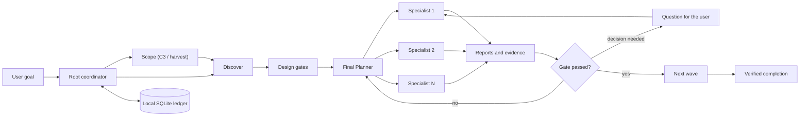

<table>
  <tr>
    <td width="190" align="center" valign="middle">
      
    </td>
    <td valign="middle">
      <h1>Cortex</h1>
      <p><strong>Reliable multi-agent orchestration for complex software engineering work in Codex.</strong></p>
      <p>
        Cortex turns a large task into a verifiable pipeline. It selects the
        right profile, model, and reasoning effort for every stage, isolates
        workers, preserves decisions and reports in a local ledger, and does
        not declare the work complete without evidence.
      </p>
      <p>
        
        
        
        
      </p>
    </td>
  </tr>
</table>

> Cortex is activated only when you explicitly select it. An ordinary complex
> request—or merely mentioning orchestration—does not create a Cortex session.

## Table of contents

- [Installation](#installation)
  - [System requirements](#1-system-requirements)
  - [macOS-specific notes](#macos-specific-installation-notes)
  - [Required Codex configuration](#required-codex-configuration)
  - [Required hook trust](#required-post-install-hook-trust)
  - [Codex Desktop](#2-install-on-codex-desktop)
  - [Codex CLI](#3-install-on-codex-cli)
  - [Orchestration commands](#4-orchestration-commands)
  - [Existing repositories: run harvest first](#existing-repositories-run-harvest-first)
- [Strongly recommended: Codebase Memory MCP](#strongly-recommended-codebase-memory-mcp)
- [How orchestration works](#how-orchestration-works)
- [Profiles and model routing](#profiles-and-model-routing)
- [Developing Cortex](#developing-cortex)
- [Verification and diagnostics](#verification-and-diagnostics)

---

## Installation

### 1. System requirements

| Component | Requirement | Why it is needed |
| --- | --- | --- |
| Codex | Desktop or CLI with Plugins and multi-agent v2 support | Loads the plugin, skills, MCP server, and internal agents |
| Python | **3.11+**, with the standard-library `tomllib` module | Runs the local Cortex MCP server, hooks, and validators |
| Git | A current version | Fetches and refreshes the GitHub Marketplace source |
| Bash | **3.2+** | The launcher is compatible with the Bash shipped by macOS; no Bash 4.2+ install is required |
| Operating system | macOS or Linux; WSL is recommended on Windows | The current runtime launcher is Bash-based |

No additional Python packages are required through `pip`: the Cortex runtime
uses the Python standard library. Confirm that the required tools are available:

```bash
python3 --version
python3 -c 'import tomllib; print("tomllib: ok")'
git --version
codex --version
```

If the correct Python interpreter is not the default `python3`, provide its
absolute path:

```bash
export CORTEX_PYTHON=/absolute/path/to/python3.11
```

The variable must be visible to the process that launches Codex. A Desktop app
started from the graphical shell may not read `~/.bashrc`; in that case, set
`CORTEX_PYTHON` in the environment used to launch the app.

### macOS-specific installation notes

The Plugins Marketplace workflow is the same on macOS, but the local runtime
requires additional preparation:

- macOS does not guarantee a suitable Python 3.11+ installation. Python 3.11+
  remains the only runtime prerequisite that may need to be provided separately.
- macOS ships `/bin/bash` 3.2, which the Cortex launcher supports directly.
  Bash 4.2+, GNU coreutils, and third-party shell libraries are not required.
- Homebrew uses `/opt/homebrew` on Apple Silicon and `/usr/local` on Intel.
  Use `brew --prefix` instead of hard-coding either location.
- Apps opened from Finder or the Dock do not necessarily inherit shell startup
  files such as `~/.zprofile`, `~/.zshrc`, or `~/.bashrc`.

Install the prerequisites with [Homebrew](https://brew.sh/):

```bash
# Install Apple's command-line tools first if they are not already present.
xcode-select --install

brew install python@3.11 git
```

Resolve and verify the installed runtimes:

```bash
export CORTEX_PYTHON="$(brew --prefix python@3.11)/bin/python3.11"

"/bin/bash" --version
"$CORTEX_PYTHON" --version
"$CORTEX_PYTHON" -c 'import tomllib; print("tomllib: ok")'
```

For Codex CLI sessions, make sure Homebrew is initialized before running
`codex`. Homebrew prints the exact `shellenv` command for your machine during
installation. A portable setup for the current shell is:

```bash
eval "$(brew shellenv)"
export CORTEX_PYTHON="$(brew --prefix python@3.11)/bin/python3.11"
codex
```

For Codex Desktop, the application process must receive `CORTEX_PYTHON`. If the
app is launched from Finder or the Dock, set it for the current macOS login
session before opening Codex:

```bash
launchctl setenv CORTEX_PYTHON "$(brew --prefix python@3.11)/bin/python3.11"
```

Fully quit and reopen Codex afterward, then start a new task. `launchctl setenv`
is scoped to the current login session and may need to be repeated after a
logout or restart. If your app launcher or device-management system already
provides environment variables, configure the same values there instead.

### Required Codex configuration

> [!IMPORTANT]
> Configure Codex before the first orchestration, then start a **new task**.
> Cortex requires multi-agent v2, and the global default model for internal
> subagents must be **Luna**. Without a confirmed Luna default, the host cannot
> reliably apply the standard hidden-worker routing policy.

Add the following settings to `~/.codex/config.toml`:

```toml
[features]
multi_agent_v2 = true

[agents]
default_subagent_model = "gpt-5.6-luna"
```

Both settings are required:

- `multi_agent_v2 = true` enables explicit model and reasoning-effort routing
  for each subagent. An already-open task retains the adapter selected when it
  was created.
- `default_subagent_model = "gpt-5.6-luna"` allows Cortex to launch standard
  hidden Luna workers without copying the expected model into a native model
  override. Cortex still selects Terra and Sol explicitly when policy requires
  them.

Marketplace installation does not replace these global Codex settings. Verify
both values yourself before starting the first Cortex task and after changing
Codex configuration.

You may also approve all tools exposed by the local Cortex MCP server:

```toml
[plugins."cortex@cortex".mcp_servers.cortex]
default_tools_approval_mode = "approve"
```

The MCP setting affects Cortex tools only. It does not change the approval
policy for shell commands, patches, or tools provided by other plugins.

To keep other approval decisions routed to the user:

```toml
approval_policy = "on-request"
approvals_reviewer = "user"
```

> [!WARNING]
> ### Do not use **Ask for me / Approve for me** with Cortex
>
> This Codex permission mode enables auto-review by setting
> `approvals_reviewer = "auto_review"`. Every eligible approval request is then
> routed to a **separate reviewer agent** instead of being shown directly to
> the user. That review is an additional model request with its own context,
> latency, token usage, and model-budget cost.
>
> Cortex already has its own evidence, report, and gate-review pipeline. Adding
> a second model-based approval reviewer increases cost and makes the execution
> path harder to reason about without improving the Cortex orchestration
> contract. Keep `approvals_reviewer = "user"` and select the manual user-review
> permission mode. Do not continue until **Ask for me / Approve for me** is
> disabled.

Codex Desktop may change the active permission mode when the selected model
changes. Recheck the permission control after changing models and confirm that
it still routes approvals to the user. See the
[official OpenAI auto-review documentation](https://developers.openai.com/codex/sandboxing/auto-review)
for the separate reviewer-agent flow.

### Required post-install hook trust

> [!IMPORTANT]
> After every installation or update, review and trust the Cortex lifecycle
> hooks **before starting orchestration**. Hook trust is content-hash based, so
> a new plugin build may require renewed approval even when the hook names have
> not changed.

Cortex registers exactly five lifecycle hooks:

| Hook | Purpose |
| --- | --- |
| `SessionStart` | Restores coordinator context on startup, resume, clear, and compaction |
| `SubagentStart` | Binds the native worker identity to the issued Cortex dispatch |
| `SubagentStop` | Records whether a worker reported, paused for a question, or failed |
| `PreToolUse` | Enforces coordinator and worker safety guards before relevant tools run |
| `PostToolUse` | Records lifecycle results and injects bounded recovery/report context |

For a Marketplace installation, accept the hook trust prompt shown by Codex
after installing or enabling Cortex. Before approving it, confirm that:

- the plugin ID is exactly `cortex@cortex`;
- the source is the installed plugin's `hooks/hooks.json`;
- the command invokes the same installed cache's `scripts/cortex-launcher` and
  `scripts/cortex_hook.py`;
- the set contains the five hooks listed above and no unexpected additional
  hooks.

Do not approve a hook whose plugin ID, source path, command, or hook set differs
from this contract. Resolve the mismatch or reinstall the plugin first.

If trust is missing, stale, rejected, or cannot be verified, do not start
Cortex orchestration. Untrusted hooks can prevent durable worker binding,
coordinator isolation, report recovery, and compaction-safe resume from working
as designed. After trust is approved, fully restart Codex and open a new task.

### 2. Install on Codex Desktop

Codex Desktop and Codex CLI use the Plugins Marketplace system. The general
user workflow is documented in the
[official OpenAI plugin documentation](https://developers.openai.com/codex/plugins).

#### Add the GitHub Marketplace and install Cortex

> [!IMPORTANT]
> **Cortex is not published in the public plugin directory.** Add this GitHub
> repository as a Marketplace source before looking for Cortex in Desktop.

1. Open the **Plugins** tab in Codex Desktop.
2. Select **Manage** in the upper-right corner of the Plugins page.
3. Open the **Marketplace** tab under **Manage extensions**.
4. Select **Add marketplace**.
5. Complete the **Add plugin marketplace** dialog:

   | Field | Value |
   | --- | --- |
   | **Source** | `https://github.com/igovet/codex-cortex-orchestrator` |
   | **Git ref** | `main` |
   | **Sparse paths** | Leave empty; the Marketplace manifest is at the repository root |

6. Select **Add marketplace** and wait for the confirmation. The new source
   should appear in **Manage → Marketplace** as **cortex**.
7. Return to the Plugins directory, open **Personal**, and find **Cortex**. Do
   not search for it in the public directory.
8. Open the Cortex details page and select **+ / Install**.
9. Review the requested permissions and bundled hooks/MCP server.
10. Approve the exact five Cortex hooks described in
   [Required post-install hook trust](#required-post-install-hook-trust).
11. Verify the [required configuration](#required-codex-configuration).
12. Start a **new Codex task**. Existing tasks do not load newly installed
   skills, hooks, MCP tools, or a different multi-agent adapter.
13. Open **Skills**, select **Cortex Orchestrator**, and describe your goal.

#### Update on Desktop

1. Open **Plugins → Manage → Marketplace**.
2. Find **cortex** and select **Upgrade marketplace**. To refresh every
   configured Git Marketplace, use **Upgrade all marketplaces**.
3. Return to **Plugins → Installed → Cortex**.
4. Install the available newer Cortex version. If the UI offers only uninstall
   and install actions, uninstall Cortex and install it again from **Personal**.
5. Reapprove or verify trust for the updated five hook content hashes.
6. Recheck `multi_agent_v2` and the Luna default.
7. Start a **new Codex task**. An existing task may retain absolute paths to the
   previous cachebusted plugin installation.

### 3. Install on Codex CLI

Register the GitHub Marketplace first. Cortex is not available in the public
plugin directory:

```bash
codex plugin marketplace add https://github.com/igovet/codex-cortex-orchestrator --ref main --json
```

Then start the interactive Codex CLI:

```bash
codex
```

Open the plugin browser:

```text
/plugins
```

Then:

1. Switch to the newly added **cortex** Marketplace tab.
2. Open **Cortex** and install it.
3. If needed, press `Space` to enable the installed plugin.
4. Approve the exact five Cortex hooks described in
   [Required post-install hook trust](#required-post-install-hook-trust).
5. Verify the [required configuration](#required-codex-configuration).
6. Exit the current CLI session and start `codex` again.
7. In the new session, invoke `$cortex:orchestrator` or open `/skills`.

For a direct, non-interactive installation after adding the Marketplace, run:

```bash
codex plugin add cortex@cortex --json
```

#### Update on CLI

Open `/plugins`, select the **cortex** Marketplace, and install the newer
version. To refresh and reinstall it entirely from the terminal, run:

```bash
codex plugin marketplace upgrade cortex --json
codex plugin remove cortex@cortex --json
codex plugin add cortex@cortex --json
```

After every update, reapprove or verify the new hook content hashes, exit the
current session, and start a new one.

### 4. Orchestration commands

Cortex exposes one explicit entry point with several routes. On Desktop,
select **Skills → Cortex Orchestrator** or mention the skill in chat. In the
CLI, use `$cortex:orchestrator` or `/skills`.

| Command | Purpose | Example |
| --- | --- | --- |
| `$cortex:orchestrator <task>` | Start ordinary orchestration | `$cortex:orchestrator Find the race condition and fix it with tests` |
| `$cortex:orchestrator help` | Show read-only help without changing the project or ledger | `$cortex:orchestrator help` |
| `$cortex:orchestrator harvest` | Build or synchronize the repository knowledge baseline; required before the first task in an existing project | `$cortex:orchestrator harvest` |
| `$cortex:orchestrator harvest-refresh` | Rebuild project knowledge documentation from source | `$cortex:orchestrator harvest-refresh` |
| `$cortex:orchestrator prune` | Remove completed Cortex task state older than seven days | `$cortex:orchestrator prune` |
| `$cortex:orchestrator normal` | Leave the active Cortex route | `$cortex:orchestrator normal` |

Example tasks:

```text
$cortex:orchestrator Design and implement secure API-key rotation,
including the migration, tests, and documentation.

$cortex:orchestrator Review the current PR, identify regressions,
check security, and verify the findings with tests.

$cortex:orchestrator harvest-refresh
```

#### Existing repositories: run harvest first

> [!IMPORTANT]
> ### Run `$cortex:orchestrator harvest` before the first task in an existing project
>
> Cortex workers rely on durable repository knowledge under `docs/project/` and
> `docs/features/`. For an existing codebase, run the harvest route once before
> ordinary feature, debugging, migration, review, or refactoring work. This
> gives later workers an evidence-backed map of the project's architecture,
> features, commands, conventions, verification paths, decisions, and known
> pitfalls.

Start the initial knowledge build with:

```text
$cortex:orchestrator harvest
```

If the project does not already have a current, source-backed coverage manifest,
`harvest` automatically performs a full baseline census rather than a shallow
incremental update. The pipeline plans the repository domains, explores them,
synthesizes the architecture, writes the canonical documentation, independently
reviews coverage, and verifies the finished knowledge tree.

The resulting baseline includes:

```text
docs/project/index.md
docs/project/conventions.md
docs/project/verification.md
docs/project/decisions.md
docs/project/gotchas.md
docs/features/index.md
docs/features/<feature>/index.md
```

For large restructures, a stale knowledge tree, or suspected coverage gaps, run
a full independent rebuild:

```text
$cortex:orchestrator harvest-refresh
```

#### Documentation is maintained automatically after tasks

After the initial harvest, you do **not** need to run `harvest` after every
task. Cortex automatically adds scoped documentation synchronization after C2
or C3 work, and whenever verified changes affect behavior, interfaces,
architecture, project commands, conventions, gotchas, decisions, or feature
ownership.

The documentation worker updates only the affected durable pages, preserves
protected human-authored text, verifies links and commands against the finished
implementation, and keeps the feature registry consistent. Documentation is
therefore updated as part of the task pipeline before the final close gate.

A small local C1 fix that changes none of those durable facts intentionally
skips documentation sync. Cortex does not create documentation merely to record
that a task occurred.

`help` and `normal` do not start durable orchestration. `prune` is a separate,
bounded maintenance operation: it does not remove the project, source code,
documentation, or plugin files. `harvest` is incremental only after a verified
coverage manifest establishes a complete baseline; otherwise Cortex performs a
full audit. `harvest-refresh` always rebuilds the inventory from current source.

> [!CAUTION]
> `/cortex` and `/normal` are not registered Codex slash commands. Use
> `$cortex:orchestrator ...` or select the skill through `/skills`.

---

## Strongly recommended: Codebase Memory MCP

> [!WARNING]
> ### Install Codebase Memory MCP before serious orchestration work
>
> **[DeusData/codebase-memory-mcp](https://github.com/DeusData/codebase-memory-mcp)**
> builds a local graph of functions, classes, calls, routes, and dependencies.
> Cortex uses it for fast architecture discovery, impact analysis, and tracing
> end-to-end execution paths. This is especially valuable in large monorepos:
> without the graph, workers must search and read files more sequentially,
> consuming more time and context while increasing the chance of missing a
> non-obvious caller, alternate entry point, or cross-service relationship.
>
> Codebase Memory is not a hard runtime dependency. If the MCP server is not
> available, a worker makes one bounded attempt and falls back to ordinary
> repository tools. Nevertheless, it is **strongly recommended** for C2 and C3
> tasks.

Quick install on macOS/Linux:

```bash
curl -fsSL https://raw.githubusercontent.com/DeusData/codebase-memory-mcp/main/install.sh | bash
```

Review the remote installation script before running it. For Windows, manual
installation, and package-manager options, see the
[official Codebase Memory README](https://github.com/DeusData/codebase-memory-mcp#quick-start).

After installation:

1. Restart Codex so it loads the new MCP server.
2. Ask Codex to index the project, or enable automatic indexing:

   ```bash
   codebase-memory-mcp config set auto_index true
   ```

3. Confirm that the project is resolved by its **exact absolute root**.

Internal Cortex workers use Codebase Memory; the coordination-only root does
not. Every immutable worker briefing includes a project key precomputed from
the canonical root with Codebase Memory's current path-key algorithm: safe
ASCII is preserved, separators and other unsafe ASCII become collapsed dashes,
non-ASCII UTF-8 bytes become lowercase hex, and overlong keys receive the
same bounded FNV-1a suffix. Workers use this key directly and call
`list_projects` at most once only after a real lookup failure, ambiguity, or
key drift/collision; any fallback must match the exact canonical root. The
`planner`, `explorer`, `architect`, and `database_architect` profiles may
perform one bounded refresh when the exact index is missing or stale. Other
profiles do not loop on MCP setup and use the safe fallback instead.

---

## How orchestration works

Cortex is more than a prompt asking Codex to “run several agents.” It is a
local control plane with explicit stages, durable state, and verifiable
transitions.



### The orchestration cycle

1. **Explicit activation.** Cortex preserves the exact user request,
   acceptance criteria, and task boundaries.
2. **Evidence-first scoping and planning.** C2 starts with Explorer discovery.
   C3 and knowledge harvest start with a read-only Planner **scope** phase that
   publishes a discovery brief and up to eight non-overlapping domains. The
   final Planner **plan** phase runs after discovery and all design gates, and
   consumes their predecessor reports before publishing the decision-complete
   `planning` artifact. `scope` gathers evidence but never closes a user-intent
   question; material decisions still use the worker-question flow.
3. **Canonical ordering.** C1 is `discover → implementation → review → close`.
   C2 is `discover → design gates → plan → implementation → qa → review →
   documentation → close`. C3 is `scope → discover → design gates → plan →
   implementation → qa → review → documentation → close`. Harvest is `scope →
   discover → architecture → plan → documentation → review → close`.
   Architecture, database architecture, and UX gates precede plan; security,
   performance, and accessibility remain post-implementation audits before
   review.
4. **Precise dispatch.** Every worker receives a profile, model, reasoning
   effort, allowed paths, ownership, acceptance criteria, and verification
   responsibilities.
5. **Isolated execution.** The root remains a coordinator and does not mix its
   own project changes with worker work. Independent read-only tasks run in
   parallel, while overlapping writes are serialized.
6. **Reports instead of trust.** Every worker publishes the unchanged strict
   seven-field `cortex/report/v1` contract. Planner Scope may additionally
   publish the top-level `scoping` sibling (`overview`, `context_files`, and
   up to eight validated discovery domains); Planner Plan may publish
   `planning`. These siblings do not alter the seven report fields.
7. **Fresh approvals and adaptive replanning.** Required approval is available
   only after the final plan. The review records the plan revision, planner
   report reference, verified-predecessor digest, and semantic future-pipeline
   digest. A material future-wave change or plan rework preserves history,
   resets approval to `pending_plan`, and requires a replacement Planner plus a
   new approval. No-op and transport-only changes do not invalidate approval;
   stale basis digests block dispatch with recoverable reapproval guidance.
8. **Automatic documentation sync.** When completed work changes durable
   behavior, interfaces, architecture, commands, decisions, or ownership,
   Cortex dispatches a technical writer to update the affected project and
   feature documentation before closing the task.
9. **Verified close.** A task completes only after the required gates are
   satisfied and the final handoff is ready.

### Why this is more reliable than ordinary multi-agent work

- **State survives compaction and resume.** The goal, decisions, workers,
  reports, checks, and blockers are recovered from the ledger rather than
  guessed from a shortened chat history.
- **No accidental duplicate dispatch.** Idempotent lifecycle calls and opaque
  `task_ref` values prevent an active wave from being started twice.
- **Explicit file ownership.** Each worker knows its allowed scope. Independent
  writers can use separate worktrees when isolation is required.
- **Material decisions are not invented.** A worker can persist a question,
  pause, and resume the same attempt after the user answers.
- **Verification is contractual.** Executed checks record the command, working
  directory, exit code, and decisive result.
- **Documentation does not override source.** `docs/project/` and
  `docs/features/` provide navigation, while consequential claims are verified
  against source, tests, schemas, or executable configuration.
- **Knowledge stays current automatically.** After the initial harvest,
  behavior- or architecture-changing tasks synchronize the affected durable
  documentation before the close gate.
- **Privacy is the default.** The ledger and internal reports remain local.
  Secrets and sensitive data must not be included in dispatches, reports, or logs.

### Internal structure

```text
plugins/cortex/
├── .codex-plugin/plugin.json   # Manifest and UI metadata
├── .mcp.json                   # Local MCP server
├── agents/                     # 21 worker profiles
├── assets/logo.png             # Plugin logo
├── hooks/hooks.json            # Lifecycle hooks
├── profiles.json               # Routing and model policy
├── scripts/                    # Server, launcher, hooks, and runtime
└── skills/                     # 10 bundled skills
```

The public MCP surface is deliberately small. The coordinator uses
`start_orchestration`, `continue_orchestration`, `manage_orchestration`, and
reads predecessor reports with `read_worker_report`. Workers use
`read_dispatch_briefing`, `worker_question`, `get_report_template`,
`validate_report_draft`, and `record_report`.

The complete worker assignment is stored in an immutable briefing protected by
a SHA-256 digest. The constructor transmits only a compact bootstrap plus the
exact `dispatch_ref`, briefing path, and digest; the worker reads and verifies
that briefing before project work. The briefing carries the phase/profile,
selection rationale, objective, ownership, paths, dependencies, context files,
acceptance criteria, verification, and predecessor handoffs, so scheduler data
cannot silently disappear from the worker prompt. A worker never browses
unrelated `.codex/cortex` coordination data. Canonical state is stored in the
local SQLite `cortex/v8` ledger. New tasks use pipeline contract v2; active v1
tasks without that field resume their persisted pipeline unchanged.

The nine public MCP tools remain the v4 surface. Workers build from
`get_report_template`, repeat side-effect-free `validate_report_draft` until
valid, then send the exact unchanged payload and returned
`validation_digest` in one atomic `record_report` call. Tool-side questions and
approval prompts are projected into the original user language by the root
coordinator; worker protocol messages and durable reports remain English.
Sensitive MCP exceptions are appended to
`~/.codex/logs/cortex-tool-errors.jsonl`; the writer retains complete newest
records and caps the file at 10 MiB by dropping oldest records first.

---

## Profiles and model routing

Cortex ships 21 profiles. They are not decorative personas: every profile has
its own sandbox, eligible gates, ownership boundaries, completion criteria, and
professional playbook.

| Area | Profiles |
| --- | --- |
| Discovery and planning | `explorer`, `planner`, `architect`, `database_architect` |
| Implementation | `frontend_dev`, `backend_dev`, `fullstack_dev`, `mobile_dev`, `data_engineer`, `devops_engineer`, `general` |
| Diagnosis and improvement | `debugger`, `refactorer`, `performance_engineer`, `ux_designer`, `accessibility_engineer` |
| Quality control | `qa_engineer`, `code_reviewer`, `security_auditor`, `build_verification` |
| Documentation | `technical_writer` |

### Adaptive model policy

Cortex selects a model based on task type, complexity, and the cost of failure:

- **Luna** handles fast, well-bounded tasks, exploration, most efficient
  implementation work, and low- or moderate-risk adaptive work.
- **Terra** handles deep C2/C3 planning, architecture, migrations, review,
  uncertain diagnosis, concurrency, performance, integration conflicts, and
  work with a high cost of failure.
- **Sol** handles security context and the `security_auditor` profile. Outside
  security work, Sol is allowed only when the user explicitly selects it.

| Work class | C1 | C2 | C3 |
| --- | --- | --- | --- |
| Efficient / Luna | `high` | `high` | `xhigh` |
| Adaptive / Luna | `high` | `xhigh` | `max` |
| Deep / Terra | `high` | `high` | `xhigh` |
| Security / Sol | minimum `medium` | minimum `high` | minimum `xhigh` |

Automatic `max` effort is limited to bounded C3 Luna work. Risk also raises the
minimum effort: low/moderate → `medium`, high → `high`, and critical → `xhigh`.
If Luna is unavailable on the host, Cortex may use a hidden Terra fallback, but
it never labels Terra as Luna and never creates a visible sidebar task without
an explicit request.

Adaptive routing is separate from adaptive replanning. The profiles and risk
policy choose the worker model and effort at dispatch time; evidence-driven
replanning changes only the not-yet-started semantic pipeline. The coordinator
must record the evidence and reason for a material change, while Cortex keeps
the prior plan, approval, and basis digests in history. This makes a changed
specialist, dependency, path, acceptance criterion, or verification step
auditable without silently reinterpreting a completed wave.

The root coordinator model is an operator choice separate from worker routing.
Luna `xhigh` is the practical default for multi-wave orchestration. Terra is a
better fit when reports conflict, strategy is unclear, or a routing/completion
mistake would be expensive.

---

## Developing Cortex

> [!CAUTION]
> The shell workflow below is for contributors testing a source checkout only.
> End users must install and update Cortex through the GitHub Marketplace as
> described in [Installation](#installation); they should not run these scripts.

### Runtime boundary

The complete installable product lives under `plugins/cortex/`: the manifest,
profiles, skills, hooks, MCP configuration, and runtime. Root-level `scripts/`,
`tests/`, `docs/`, and `AGENTS.md` support repository development and are not
part of the installed plugin's runtime contract.

Important entry points:

| Path | Purpose |
| --- | --- |
| `plugins/cortex/scripts/cortex.py` | MCP server |
| `plugins/cortex/scripts/cortex-launcher` | Python selection and server startup |
| `plugins/cortex/scripts/cortex_hook.py` | Lifecycle hooks |
| `plugins/cortex/profiles.json` | Canonical profiles and routing policy |
| `plugins/cortex/skills/orchestrator/SKILL.md` | The single authoritative orchestration skill |
| `.agents/plugins/marketplace.json` | Repository-local Marketplace |
| `scripts/sync-cortex.sh` | Install, update, and verify the checkout version |

### Recommended development loop

```bash
# 1. Inspect the checkout and host without changing Codex configuration
python3 scripts/cortex-host-preflight.py

# 2. Preview the update without writing
./scripts/sync-cortex.sh --dry-run

# 3. Install or reinstall the current checkout
./scripts/sync-cortex.sh

# 4. Open a new Codex task and test the changed behavior

# 5. Confirm that the installed copy matches the checkout
./scripts/sync-cortex.sh --check
```

`sync-cortex.sh` validates the Marketplace and manifest, registers the local
Marketplace, reinstalls `cortex@cortex`, detects same-version content drift,
verifies trust for the five lifecycle hooks, and enforces the required Luna
default. It does not import, clean, or modify user Cortex ledgers or unrelated
plugin data.

To select another Python interpreter:

```bash
CORTEX_PYTHON=/absolute/path/to/python3.11 ./scripts/sync-cortex.sh --dry-run
CORTEX_PYTHON=/absolute/path/to/python3.11 ./scripts/sync-cortex.sh
```

### Versioning

When changing the plugin, update the version in
`plugins/cortex/.codex-plugin/plugin.json` according to SemVer:

- patch for a fix without new functionality;
- minor for a backward-compatible feature;
- major for a large or breaking change.

Do not publish an ordinary fix or feature as a major release. Build metadata
after `+` may be used as a cachebuster, while SemVer communicates public
compatibility.

### Development agreements

- Do not create a second repository-level copy of the orchestration skill.
- Preserve exact machine-readable profile names from `profiles.json`.
- Do not embed complete worker prompts in mutable task state.
- Synchronize changes to behavior, architecture, interfaces, or verification
  commands with `docs/project/` and `docs/features/`.
- Read-only checks must not leave caches, bytecode, or generated artifacts.
- Never commit `.codex/cortex`, runtime ledgers, diagnostic logs, credentials,
  or private data.

---

## Verification and diagnostics

Run the relevant checks before publishing a change:

```bash
PYTHONDONTWRITEBYTECODE=1 python3 -m unittest discover -s tests -v
python3 scripts/validate-cortex-marketplace.py
python3 scripts/cortex-cold-boot-smoke.py
python3 scripts/cortex-luna-high-eval.py
python3 -m py_compile plugins/cortex/scripts/cortex.py plugins/cortex/scripts/cortex_hook.py
bash -n scripts/sync-cortex.sh
./scripts/sync-cortex.sh --check
```

Live source-mode validation runs the MCP server directly from the checkout. It
does **not** install or update the user's plugin:

```bash
python3 scripts/cortex-luna-high-eval.py --live --scenario automatic_sequential
```

Run the read-only preflight on a local or SSH host with:

```bash
python3 scripts/cortex-host-preflight.py
```

It independently checks the Codex CLI, selected Python/`tomllib` runtime,
plugin manifest, launcher, and same-user plugin cache.
For the SSH-specific failure signatures, source-versus-cache distinction, and
same-user remediation sequence, see the [SSH host troubleshooting runbook](docs/project/ssh-hetzner-troubleshooting.md).

Before a release, verify the exact committed candidate:

```bash
python3 scripts/verify-cortex-release.py --require-tracked
```

The command builds a fresh `git archive HEAD` and rejects runtime state,
bytecode, symlinks, nested Marketplace artifacts, and secret-prone paths. The
remaining external publication requirements are documented in
[docs/release-readiness.md](docs/release-readiness.md).

Unexpected Cortex MCP errors are written to the private diagnostic log at
`~/.codex/logs/cortex-tool-errors.jsonl`. Treat it as sensitive: inspect a small
tail, extract only correlation metadata, and never paste the raw log into a
chat, issue, or external system.

---

<p align="center">
  <strong>Cortex makes multi-agent work reproducible:</strong><br />
  exact goal → specialist workers → verifiable reports → proven completion.
</p>
