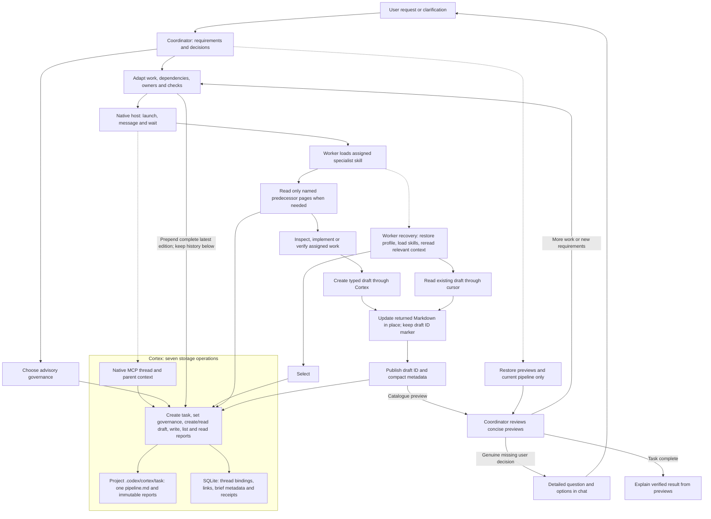

<table>
  <tr>
    <td width="190" align="center" valign="middle">
      
    </td>
    <td valign="middle">
      <h1>Cortex</h1>
      <p><strong>Reliable multi-agent coordination for complex software engineering work in Codex.</strong></p>
      <p>
        Cortex turns a large task into durable, evidence-backed coordination.
        It preserves tasks, advisory governance, one Markdown pipeline per task,
        and reports in local storage. The coordinator owns delegation,
        evidence assessment, user steering, and completion.
      </p>
      <p>
        
        
        
        
      </p>
    </td>
  </tr>
</table>

## Install with Codex — recommended

> [!IMPORTANT]
> **⚡ Copy the prompt below into a new Codex task.** It tells Codex to read this
> repository's current installation guide, install Cortex from the GitHub
> Marketplace `main` branch, install and configure Codebase Memory MCP,
> configure Codex, and verify the result.

```text
Install and configure the Cortex plugin for this Codex environment.

First, read the complete installation instructions and requirements in this
repository's README. Treat it as authoritative:
https://github.com/igovet/codex-cortex-orchestrator/blob/main/README.md

Then complete the setup end to end:

1. Check every prerequisite required by that README (including Codex plugin and
   multi-agent support, Python 3.11+ with tomllib, Git, and Bash). Install every
   missing prerequisite with the supported package manager for this operating
   system. Do not install unnecessary packages or Python dependencies.
2. Install and configure the Codebase Memory MCP server as `codebase_memory`,
   following the README's **Codebase Memory MCP** section and its linked
   official upstream instructions. Install its required dependencies, register
   it with Codex, enable automatic indexing when supported, and verify that
   Codex can use it for this exact project root. Restart Codex if its
   instructions require a restart.
3. For a fresh installation, add the Cortex Marketplace from the main branch
   exactly with:
   codex plugin marketplace add https://github.com/igovet/codex-cortex-orchestrator --ref main --json
   If the `cortex` Marketplace is already registered, refresh it with the
   documented update flow instead of adding a duplicate. Then install the
   plugin (or use the README's documented remove/reinstall update flow) with:
   codex plugin add cortex@cortex --json
4. Preserve existing ~/.codex/config.toml settings and add or correct every
   Cortex-required setting documented in the README: multi_agent_v2 = true and
   agents.default_subagent_model = "gpt-5.6-luna".
   Keep user approval review enabled; do not enable Ask for me / Approve for me.
5. Confirm the plugin catalogue includes the 22 `cortex:worker-*` specialist
   skills. Native subagents load those skills; global agent registration is not
   required. Start a fresh task after updating the plugin.
6. Confirm that the installed package exposes exactly the seven documented
   storage tools and ships no orchestration hooks. Run the relevant
   verification checks and start a new Codex task.

Use only the instructions and commands documented in that README. If an
elevated system permission, an interactive desktop confirmation, or a material
choice is required, explain exactly what is needed and ask me before proceeding.
```

> Cortex is activated only when you explicitly select it. An ordinary complex
> request—or merely mentioning orchestration—does not create a Cortex session.

## Table of contents

- [Install with Codex — recommended](#install-with-codex--recommended)
- [Installation](#installation)
  - [System requirements](#1-system-requirements)
  - [Choose a project root](#choose-a-project-root)
  - [macOS-specific notes](#macos-specific-installation-notes)
  - [Required Codex configuration](#required-codex-configuration)
  - [Post-install verification](#required-post-install-verification)
  - [Codex Desktop](#2-install-on-codex-desktop)
  - [Codex CLI](#3-install-on-codex-cli)
  - [Orchestration commands](#4-orchestration-commands)
  - [Existing repositories and harvest](#existing-repositories-use-harvest-when-needed)
- [Preferred worker route: Codebase Memory MCP](#preferred-worker-route-codebase-memory-mcp)
- [How orchestration works](#how-orchestration-works)
- [Profiles and model routing](#profiles-and-model-routing)
- [Developing Cortex](#developing-cortex)
- [Support Cortex 💜](#support-cortex-)
- [Verification and diagnostics](#verification-and-diagnostics)

---

## Installation

### 1. System requirements

| Component | Requirement | Why it is needed |
| --- | --- | --- |
| Codex | Desktop or CLI with Plugins and multi-agent support | Loads the plugin, skills, MCP server, and advisory agents |
| Python | **3.11+**, with the standard-library `tomllib` module | Runs the local Cortex MCP server and validators |
| Git | A current version | Fetches and refreshes the GitHub Marketplace source |
| Bash | **3.2+** | Runs repository development and local-source synchronization scripts |
| Operating system | macOS or Linux; WSL is recommended on Windows | The MCP server launches through `python3` and repository tooling uses Bash |

No additional Python packages are required through `pip`: the Cortex runtime
uses the Python standard library. Confirm that the required tools are available:

```bash
python3 --version
python3 -c 'import tomllib; print("tomllib: ok")'
git --version
codex --version
```

### Choose a project root

Use a specific existing repository or worktree, for example `/workspace/my-service`.
The host supplies its absolute canonical directory. Each task stores that exact
project boundary; do not use a broad system or home directory as the project.

Task documents are real files under `.codex/cortex/<task>/` in that project.
The active Codex home's `cortex/cortex.sqlite3` contains the private SQLite
metadata index. Task/report association is checked on every read. Keep both locations
together for offline backups. The installed MCP configuration invokes `python3`
directly, so its launch environment must resolve Python 3.11 or newer.

### macOS-specific installation notes

The Plugins workflow is the same on macOS, but the local runtime may require a
separate Python 3.11+ installation:

- macOS does not guarantee a suitable Python 3.11+ runtime.
- macOS ships `/bin/bash` 3.2, which the repository helper scripts support.
- Homebrew uses `/opt/homebrew` on Apple Silicon and `/usr/local` on Intel; use
  `brew --prefix` instead of hard-coding either location.
- Apps opened from Finder or the Dock do not necessarily inherit shell startup
  files such as `~/.zprofile`, `~/.zshrc`, or `~/.bashrc`.

Install the prerequisites with [Homebrew](https://brew.sh/):

```bash
# Install Apple's command-line tools first if they are not already present.
xcode-select --install

brew install python@3.11 git
```

Resolve and verify the installed runtimes:

```bash
"/bin/bash" --version
"$(brew --prefix python@3.11)/bin/python3.11" --version
"$(brew --prefix python@3.11)/bin/python3.11" -c 'import tomllib; print("tomllib: ok")'
```

For Codex CLI sessions, make sure Homebrew is initialized before running
`codex`. Homebrew prints the exact `shellenv` command for the machine:

```bash
eval "$(brew shellenv)"
export PATH="$(brew --prefix python@3.11)/bin:$PATH"
python3 --version
codex
```

For Codex Desktop, ensure its launch environment resolves `python3` to the same
Python 3.11+ installation. A Desktop app opened from Finder or the Dock may not
inherit the shell `PATH`; configure the application launch environment or start
Codex from a shell where `python3 --version` is correct. Fully quit and reopen
Codex afterward, then start a new task.

The packaged MCP server uses the host-resolved `python3 -B` command. Cortex does
not hard-code `/usr/bin/python3`; `-B` prevents runtime bytecode from changing the
content-addressed package. If CLI and Desktop behave differently, compare their
Python versions and launch environments. No hook setup is required.

### Required Codex configuration

> [!IMPORTANT]
> Configure Codex before the first Cortex 1.15.6 orchestration, then start a **new task**.
> Cortex requires the Codex multi-agent runtime, and the global default model
> for internal subagents must be **Luna**.

Add the following settings to `~/.codex/config.toml`:

```toml
[features]
multi_agent_v2 = true

[agents]
default_subagent_model = "gpt-5.6-luna"
```

The settings have distinct purposes:

- `multi_agent_v2 = true` enables exact native model and reasoning-effort
  selection for each subagent.
- `default_subagent_model = "gpt-5.6-luna"` lets Cortex select logical Luna
  without copying Luna into a native `model` override. Terra and Sol remain
  explicit overrides. Every selected effort is passed unchanged.

For clearer coordinator explanations and full plain-text question/answer
context, the recommended top-level Codex setting is:

```toml
model_verbosity = "high"
```

This setting is recommended rather than required. Apply it before starting a
new task so the task inherits the configured response style.

You may also approve all tools exposed by the local Cortex MCP server:

```toml
[plugins."cortex@cortex".mcp_servers.cortex]
default_tools_approval_mode = "approve"
```

The MCP setting affects Cortex storage tools only. It does not authorize shell
commands, patches, external messages, destructive actions, scope expansion, or
tools from other plugins. Keep those decisions routed through Codex or the
user's configured approval policy.

> [!WARNING]
>
> ### Keep external and destructive approvals with the user
>
> Cortex governance is advisory. It is not an approval system and cannot
> replace Codex/user authorization for destructive, external, privileged, or
> materially scope-expanding actions.

### Marketplace specialist delivery

All 22 specialist profiles are distributed as `cortex:worker-*` skills in the
plugin. The coordinator assigns one exact skill token to each native subagent;
the worker loads its complete instructions through the host skill mechanism before
project work. Marketplace installation needs no copying into `~/.codex/agents`,
setup command, configuration hook, or custom profile selector. After an update,
start a fresh task so the host provides the current skill catalogue.

Generated TOML exports remain available for explicit personal custom-agent use,
but Cortex orchestration always uses the packaged worker skills. The optional
`scripts/cortex_setup.py --install` manages only those personal exports and refuses
conflicting user files. It is not part of marketplace or dev preparation.


### Required post-install verification

Start a new task after installation and confirm that Cortex advertises exactly
`create_task`, `set_governance`, `create_draft`, `read_draft`, `write_report`, `list_reports`,
and `read_report`. All seven operations are available to the coordinator and native workers. The
package ships no orchestration hooks, actor-binding callbacks or workflow gates.

Confirm the required native-agent configuration and Python runtime. A small
explicitly selected task should create one pipeline, delegate bounded work,
read selected reports and save its result. Actual CLI and Desktop observations
are distinct from source validation; see [release evidence](docs/release-readiness.md).

### 2. Install on Codex Desktop

Codex Desktop and Codex CLI use the Plugins Marketplace system. The general
user workflow is documented in the
[official OpenAI plugin documentation](https://developers.openai.com/codex/plugins).

#### Add the GitHub Marketplace and install Cortex

> [!IMPORTANT]
> **Cortex is not published in the public plugin directory.** Add this GitHub
> repository as a Marketplace source before looking for Cortex in Desktop.

1. Open the **Plugins** tab in Codex Desktop.
2. Select **Manage** in the upper-right corner of the Plugins page.
3. Open the **Marketplace** tab under **Manage extensions**.
4. Select **Add marketplace**.
5. Complete the **Add plugin marketplace** dialog:

   | Field | Value |
   | --- | --- |
   | **Source** | `https://github.com/igovet/codex-cortex-orchestrator` |
   | **Git ref** | `main` |
   | **Sparse paths** | Leave empty; the Marketplace manifest is at the repository root |

6. Select **Add marketplace** and wait for confirmation. The source should
   appear in **Manage → Marketplace** as **cortex**.
7. Return to the Plugins directory, open **Personal**, and find **Cortex**. Do
   not search for it in the public directory.
8. Open the Cortex details page and select **+ / Install**.
9. Review the requested permissions and bundled seven-operation MCP server.
10. Verify the [required configuration](#required-codex-configuration).
11. Start a **new Codex task**. Existing tasks do not load newly installed
    skills, MCP tools, profiles, or a different multi-agent adapter.
12. Open **Skills**, select **Cortex Orchestrator**, and describe your goal.

#### Update on Desktop

1. Open **Plugins → Manage → Marketplace**.
2. Find **cortex** and select **Upgrade marketplace**. To refresh every
   configured Git Marketplace, use **Upgrade all marketplaces**.
3. Return to **Plugins → Installed → Cortex**.
4. Install the available newer Cortex version. If the UI offers only uninstall
   and install actions, uninstall Cortex and install it again from **Personal**.
5. Confirm the seven storage operations and absence of orchestration hooks.
6. Recheck `multi_agent_v2` and the Luna default.
7. Start a **new Codex task**. An existing task may retain the previous plugin
   cache and catalog.

### 3. Install on Codex CLI

Register the GitHub Marketplace first. Cortex is not available in the public
plugin directory:

```bash
codex plugin marketplace add https://github.com/igovet/codex-cortex-orchestrator --ref main --json
```

Then start the interactive Codex CLI:

```bash
codex
```

Open the plugin browser:

```text
/plugins
```

Then:

1. Switch to the newly added **cortex** Marketplace tab.
2. Open **Cortex** and install it.
3. If needed, press `Space` to enable the installed plugin.
4. Confirm the seven storage operations and absence of orchestration hooks.
5. Verify the [required configuration](#required-codex-configuration).
6. Exit the current CLI session and start `codex` again.
7. In the new session, invoke `$cortex:orchestrator` or open `/skills`.

For a direct, non-interactive installation after adding the Marketplace, run:

```bash
codex plugin add cortex@cortex --json
```

#### Update on CLI

Open `/plugins`, select the **cortex** Marketplace, and install the newer
version. To refresh and reinstall it entirely from the terminal, run:

```bash
codex plugin marketplace upgrade cortex --json
codex plugin remove cortex@cortex --json
codex plugin add cortex@cortex --json
```

After every update, verify the required configuration, exit the current
session, and start a new one.

### 4. Orchestration commands

Cortex exposes one explicit entry point with several routes. On Desktop,
select **Skills → Cortex Orchestrator** or mention the skill in chat. In the
CLI, use `$cortex:orchestrator` or `/skills`.

| Command | Purpose | Example |
| --- | --- | --- |
| `$cortex:orchestrator <task>` | Start ordinary Cortex 1.15.6 coordination | `$cortex:orchestrator Find the race condition and fix it with tests` |
| `$cortex:orchestrator help` | Show read-only help without changing the project or task storage | `$cortex:orchestrator help` |
| `$cortex:orchestrator harvest` | Update missing or stale source-backed project knowledge | `$cortex:orchestrator harvest` |
| `$cortex:orchestrator harvest-refresh` | Re-audit and rebuild project knowledge documentation | `$cortex:orchestrator harvest-refresh` |
| `$cortex:orchestrator clear 7 days` | Delete this project's tasks and artifacts older than seven days, protecting active tasks | `$cortex:orchestrator clear 7 days` |
| `$cortex:orchestrator normal` | Leave the active Cortex route | `$cortex:orchestrator normal` |

Example tasks:

```text
$cortex:orchestrator Design and implement secure API-key rotation,
including migration evidence, tests, and residual-risk documentation.

$cortex:orchestrator Review the current change, identify regressions,
and synthesize independently verified findings.

$cortex:orchestrator harvest-refresh
```

#### Existing repositories: use harvest when needed

> [!IMPORTANT]
>
> ### Knowledge maintenance is an explicit route, not a lifecycle prerequisite
>
> Run `$cortex:orchestrator harvest` when an existing repository needs a
> source-backed knowledge baseline. Cortex 1.15.6 never blocks ordinary coordination
> because harvest has not run or project documentation is incomplete.

Start the knowledge update with:

```text
$cortex:orchestrator harvest
```

The resulting baseline uses the established project layout:

```text
docs/project/index.md
docs/project/conventions.md
docs/project/verification.md
docs/project/decisions.md
docs/project/gotchas.md
docs/features/index.md
docs/features/<feature>/index.md
```

`harvest-refresh` rebuilds inventory from current source, audits every in-scope
page, independently checks completeness and performs a second no-change planning
comparison. Harvest preserves manual material outside generated blocks. The
coordinator reads only report previews and the current pipeline; workers own
index-driven routing, source discovery, documentation edits and checks.
Workers receive mandatory requirements directly and select only useful reports.
Missing indexes do not force harvest during an ordinary task.

#### Documentation impact is assessed after verified tasks

The coordinator obtains a concise documentation-impact finding from a specialist.
When updates are required, a worker loads the bundled documentation-sync skill,
updates affected knowledge and verifies it before the task is completed.
Independent checking is proportional to the material impact. A supported no-impact
conclusion may use existing evidence; no extra worker or fixed report section is
required merely to state it. Source, tests and executable configuration outrank prose.

Never put secrets, personal data, private reports or diagnostic logs into public
documentation.

---

## Preferred worker route: Codebase Memory MCP

> [!WARNING]
>
> ### Use Codebase Memory MCP for preferred project structural discovery
>
> **[DeusData/codebase-memory-mcp](https://github.com/DeusData/codebase-memory-mcp)**
> builds a local graph of functions, classes, calls, routes, and dependencies.
> Cortex workers can use it for architecture discovery, impact analysis, and
> end-to-end tracing, especially in large monorepos.
>
> Codebase Memory is a preferred worker route: every native worker uses it when
> available before structural project-code discovery. If the MCP is missing,
> denied, timed out, erroneous, unusable, or insufficient, the worker records
> that bounded limitation and uses exactly one safe assignment-scoped
> ordinary-repository fallback. There is no silent or chained fallback. The
> coordinator delegates both structural discovery and documentation-index routing
> to workers, keeping the main context focused on pipeline state and report previews.

Quick install on macOS/Linux:

```bash
curl -fsSL https://raw.githubusercontent.com/DeusData/codebase-memory-mcp/main/install.sh | bash
```

Review the remote installation script before running it. For Windows, manual
installation, and package-manager options, see the
[official Codebase Memory README](https://github.com/DeusData/codebase-memory-mcp#quick-start).

After installation:

1. Restart Codex so it loads the MCP server.
2. Ask Codex to index the exact project root, or enable automatic indexing:

   ```bash
   codebase-memory-mcp config set auto_index true
   ```

3. Confirm that the indexed root matches the exact absolute `project_root`.

Codebase Memory is an evidence source and preferred worker capability, not a
Cortex storage capability. Its absence allows one bounded safe fallback; only
inability to establish the assigned surface after that fallback is a worker
blocker. Reports can preserve that limitation and support an honest final answer.

---

## How orchestration works

Cortex stores documents and metadata. The model decides the work, dependencies,
specialists, verification depth and completion. No server graph executor or
semantic report parser is involved. The coordinator stays active until a genuine
user question or completed result; while workers run it uses native wait rather
than ending the turn with a progress-only message.



The coordinator speaks to the user in their language. All worker communication
and authored reports, pipeline editions and governance reasoning are in English;
original requests and necessary exact quotations retain their source language.

The coordinator owns the adaptive loop and keeps waiting while delegated work is
unfinished. Storage protects files and metadata without deciding whether the
work is complete. For project discovery, workers prefer Codebase Memory and use
one bounded fallback when needed; documentation routing starts at index files.
Before project mutation, the coordinator resolves read-only predecessors whose
answers can change implementation and never overlaps an implementation worker with
an active explorer, designer, architect or planner governing that same result.
Greenfield or unfamiliar work spanning at least three acceptance domains uses full
governance, parallel independent investigations, then a plan grounded in their
saved reports before implementation; bounded familiar work remains adaptive.
Workers that need the same externally shared browser, emulator, port or interactive
application run sequentially unless the host supplies isolated instances. Other
independent discovery and verification can still run in parallel.

| Operation | Purpose |
| --- | --- |
| `create_task` | Save the original request and bind its task to the current native thread |
| `set_governance` | Save advisory depth and rationale without execution gates |
| `create_draft` | Create a typed project draft and return its complete initial Markdown, path and short ID |
| `read_draft` | Recover or later inspect an existing same-thread draft through bounded pages |
| `write_report` | Publish a server-created draft by short ID as a report or pipeline edition |
| `list_reports` | Return brief metadata, newest activity first, with cursor continuation |
| `read_report` | Read the current pipeline or a selected report, with cursor continuation |

Task and thread identifiers are absent from MCP tool arguments and results.
The host supplies thread context in transport metadata. A coordinator thread owns
one task; children inherit it through registered parents. Reading without selecting
a report returns the current pipeline. Missing or conflicting host context returns
an actionable error; the server never selects the latest unrelated task.

The live advertised schemas and descriptions are the sole MCP argument authority.
Skills and assignments describe intent and constraints, not duplicated tool payloads.
The server advertises MCP 2025-11-25, explicit input/output schemas and safe English
error corrections. Results include structured data and its identical JSON text.
Markdown bodies and paths never enter the writer call. The server creates a typed
draft with a short ID in its filename and body and returns its complete initial Markdown.
The actor updates that same project file in place without an immediate duplicate read,
and never deletes or recreates it. `read_draft` remains available for recovery or a
genuinely needed later read. The writer accepts the ID, then streams, validates
and atomically publishes every byte into the private task directory, then deletes
the draft only after the file and metadata commit. Report size is limited only by
the filesystem and available space.

### Activation and project access

Only explicit selection of `cortex:orchestrator` activates coordination. Help is
read-only; normal returns to ordinary work. The coordinator saves the original
request, selects advisory governance and writes an initial pipeline. Its only
durable-content reads are catalogue previews, the current pipeline beginning and
the exact initial pipeline Markdown returned when it creates its draft. A later
`read_draft` is allowed only for recovery or a genuinely changed draft.
It never runs shell, Git, package, build, test, browser or project-file operations.
Its sole project-file exception is filling the exact pipeline draft returned by
`create_draft`; every other read, edit and check belongs to a native worker.
Native subagents load their assigned packaged worker skill before project work. Workers read relevant indexes and reports, and own
project inspection, implementation, verification and documentation. The coordinator
does not open project/plugin files, report bodies, diffs, logs or report examples.

### Markdown pipeline and readiness

Each task has exactly one `pipeline.md`. A new edition is prepended to that same
file, with older editions below a separator. Its report identifier remains stable.
Write a complete, concise current pipeline so its beginning normally suffices.
Describe the necessary work, ordering, dependencies, executors and intended checks.

The coordinator owns pipeline editions and governance decisions. Workers publish
ordinary reports with findings and proposed next steps. The coordinator updates
the pipeline when requirements or evidence change, adds or reorders work, and
adjusts affected native agents. Dependencies are model decisions. There
are no mandatory planning, audit or approval stages; select useful work in the
order its evidence requires and avoid overlapping edits.

### Native workers and results

Packaged worker skills contain complete specialist role instructions and are loaded before project work. Applicable skills are supplied only through Codex's ordinary host skill
mechanism when relevant. Worker assignments never name internal skills, loaders,
plugin files or installation paths, and workers never locate those files themselves.

The coordinator selects its conversation language from the user’s own request
and checks every progress message, question and final answer. Project language,
locale and tool responses do not override it; worker messages and reports remain
English. Tool discipline covers executable wrapper syntax as well as MCP arguments.

All 22 profiles share one reporting protocol. The coordinator uses native host
tools to launch, message, wait for and stop agents. It directly supplies the concrete assignment and every mandatory requirement and
constraint. Codex supplies native thread context separately from model arguments;
the server links children to their registered parent task automatically.
Every project worker is spawned with `fork_turns: "none"`; its complete English
assignment replaces inherited chat history. This keeps the coordinator skill,
plugin path and unrelated user conversation out of the worker context while native
parent metadata still selects the correct task.
A worker receives exact predecessor report references from the coordinator, reads
only the pages needed for its assignment, performs its work and saves a Markdown
report. It does not list the catalogue or read the pipeline for routine startup.

The draft creator offers general, planning, investigation, implementation,
verification, documentation, synthesis and pipeline heading sets. They guide the
agent while its specialist profile remains authoritative; no semantic parser treats
headings as completion state. Agents update the existing file body in place and never
delete, replace or recreate it. Cortex verifies both its marker and server-created
file identity. The short draft ID marker remains in the final Markdown.
A saved identifier proves persistence, not correctness or completion.

### Artifact consistency and recovery

The coordinator manages overlapping edits and judges whether earlier evidence
still applies. It uses actual native-agent status; silence alone is not failure.
The server protects document storage rather than sealing project source files.

After summarization, compaction or restart, the coordinator restores host-supplied
rules, fresh catalogue previews and the current pipeline beginning. Workers reload
their assigned worker skills and reread previously selected reports and relevant
index-driven documentation. They reread the pipeline only when it was a necessary
evidence source and list reports only when required saved references were lost.
Both restore their assignments and constraints.
Resume the same native thread and automatically resolved pipeline. A summary is an orientation aid,
not a substitute for rereading. Do not automatically read all historical reports.

### Decisions, fixes and completion

New user instructions are applied to the existing task and recorded in the next
pipeline edition. They do not require a second confirmation. Genuine questions
from any specialist go through the coordinator, who shows the context, question,
answer alternatives and their consequences as ordinary chat text. The user can
choose an option or answer in their own words. No question UI tool is required.

Governance, planning and finishing do not themselves require approval. Actual
host/user permissions still govern external or destructive actions. The coordinator
uses meaningful previews, delegates evidence assessment and detailed final-report
publication, continues authorized corrections and explains results, risks and unrun checks. Completion is its judgment,
not a server state transition.

### Storage, receipts and Markdown files

```text
<project>/.cortex/
  draft-reports/
    <draft-id>.md
  pipeline-drafts/
    <draft-id>.md

<project>/.codex/cortex/
  <task>/
    pipeline.md
    <report>.md

$CODEX_HOME/cortex/
  cortex.sqlite3
```

Agents edit only the `.cortex` drafts. Codex protects the project `.codex`
directory from ordinary file writes, so only the MCP server publishes into
`.codex/cortex/<task>`.

The active Codex home's `cortex/cortex.sqlite3` is an owner-private SQLite index.
It stores task/project links, brief report metadata, digests and delivery receipts,
not report bodies. Task and report references use a short type prefix plus 12
hexadecimal characters, with collision-checked allocation. Ordinary reports are immutable. Governance and the original
request are also readable reports. Files and directories use private permissions.

Writes serialize through SQLite transactions and fsynced files. Publication uses
a fixed-block stream copy, destination fsync and atomic rename before the metadata
commit; the source draft is removed only afterward. Repeated delivery returns the same
identifiers without duplicate reports or pipeline editions. Changed content under
the same delivery key conflicts. Unknown storage layouts are rejected, not migrated.

The newest-first catalogue uses a stable metadata snapshot across cursor pages.
Document and draft reads use Unicode pages of at most 4,000 characters, beginning
at the newest content and continuing only with the returned compact cursor when needed.
Ordinary cursors survive restart; an
updated pipeline expires its earlier read cursor, so start at its current beginning.
See [storage](docs/project/storage.md) and [security](SECURITY.md) for reliability,
backup and filesystem limits. Do not commit private task artifacts inadvertently.

---

## Profiles and model routing

Cortex includes 22 advisory specialist profiles:

| Area | Profiles |
| --- | --- |
| Discovery and planning | `explorer`, `planner`, `architect`, `database_architect` |
| Implementation | `frontend_dev`, `backend_dev`, `fullstack_dev`, `mobile_dev`, `data_engineer`, `devops_engineer`, `general` |
| Diagnosis and improvement | `debugger`, `refactorer`, `performance_engineer`, `ux_designer`, `accessibility_auditor`, `accessibility_fixer` |
| Quality control | `qa_engineer`, `code_reviewer`, `security_auditor`, `build_verification` |
| Documentation | `technical_writer` |

The host-supplied orchestrator skill contains a routing table for all profiles.
The coordinator names the exact packaged worker skill and supplies the
complete English assignment and constraints with `fork_turns: "none"`. The worker loads that complete skill before project work. Neither role reads profile TOML
or explores the plugin. Workers read only the exact skill paths advertised by the host.

Profiles have structured role, input, workflow, quality, reporting and recovery
sections. One shared source protocol plus 22 specialization fragments generates
22 self-contained worker skills and matching optional Agent v2 TOML exports. A byte-for-byte test prevents
profile drift. Each profile also fixes its default draft class:

| Draft template | Profiles |
| --- | --- |
| `planning` | `planner`, `architect`, `database_architect`, `ux_designer` |
| `investigation` | `explorer`, `debugger` |
| `implementation` | `frontend_dev`, `backend_dev`, `fullstack_dev`, `mobile_dev`, `data_engineer`, `devops_engineer`, `refactorer`, `accessibility_fixer` |
| `verification` | `qa_engineer`, `code_reviewer`, `security_auditor`, `build_verification`, `accessibility_auditor`, `performance_engineer` |
| `documentation` | `technical_writer` |
| `general` | `general` |

Using another report class requires a fresh worker with the matching profile; the
live audit reports a mismatch. Optional [report examples](plugins/cortex/skills/cortex-control/references/index.md)
for planning, investigation, implementation, verification, documentation and final
synthesis. Examples guide content without imposing exact report headings.

Codex supplies the selected orchestrator skill and the worker skill catalogue.
The host supplies required skills through Codex's normal procedure only when relevant.
Workers never inspect plugin files to find their instructions or report examples.
[Tool discipline](plugins/cortex/skills/tool-discipline/SKILL.md) requires checking
live tool declarations, complete arguments and actual results; it forbids guessed
calls and unexplained mutation replays. Profiles do not authorize tools or select models.

### Adaptive model policy

The coordinator chooses the model and supported reasoning effort per assignment;
Luna remains the default, while Terra also covers genuinely cross-cutting
implementation with several interdependent behavioral and verification contracts;
governance does not determine a single pair for the entire task. The bundled
orchestrator skill owns this policy.

| Exact model | Effort | Choose for |
| --- | --- | --- |
| `gpt-5.6-luna` | Up to `max` | Default for most bounded work, ordinary discovery, implementation and checks |
| `gpt-5.6-terra` | Up to `max` | Genuinely complex planning, architecture, or cross-cutting implementation |
| `gpt-5.6-sol` | Rare, up to `max` | Materially risky security-sensitive work |

Choose effort proportionally from the host's advertised range; do not make max
an automatic default. Ultra is not used. Luna uses the configured native default
without an explicit model override. Terra and Sol use explicit native overrides.
Respect explicit user selections and report unavailable choices rather than
silently substituting them. The server neither selects nor enforces models.

---

## Developing Cortex

End users install through the Marketplace flow above. Repository development
prepares only the isolated candidate; it never updates the stable user plugin.

### Runtime boundary

The complete installable product lives under `plugins/cortex/`. Root-level
`scripts/`, `tests/`, `docs/` and `AGENTS.md` are development support.

| Path | Purpose |
| --- | --- |
| `plugins/cortex/scripts/cortex.py` | Seven-operation MCP entry point |
| `plugins/cortex/.mcp.json` | Direct Python server startup |
| `plugins/cortex/scripts/cortex_runtime/contracts.py` | Advertised schemas and limits |
| `plugins/cortex/scripts/cortex_runtime/store.py` | SQLite metadata and real Markdown storage |
| `plugins/cortex/scripts/cortex_runtime/server.py` | Bounded stdio transport and private errors |
| `plugins/cortex/scripts/cortex_clear.py` | Explicit host-side retention command |
| `plugins/cortex/profiles.json` | 22 advisory specialist descriptions |
| `plugins/cortex/skills/orchestrator/SKILL.md` | Coordination and model selection |
| `plugins/cortex/skills/cortex-control/SKILL.md` | Shared worker reporting protocol |
| `.agents/plugins/marketplace.json` | Repository Marketplace |
| `scripts/cortex_package.py` | Complete payload hashing and candidate validation |
| `scripts/sync-cortex.sh` | Read-only source validation or isolated candidate preparation |
| `scripts/cortex-dev` | Prepare candidate and launch ordinary interactive Codex |
| `scripts/cortex-desktop-dev` | Actual Desktop with a disposable profile |
| `cortex-dev` | Repository-root forwarding launcher |

### Isolated candidate runtime

`./scripts/cortex-dev` creates or reuses the exact `$HOME/.cortex-dev` candidate,
sets its own `HOME` and `CODEX_HOME`, prepares the content-stamped package through
the supported sync path and launches ordinary Codex in the caller's project.
It does not create tmux or modify the stable installed plugin.

```bash
./scripts/cortex-dev --prepare-only
./scripts/cortex-dev
# Equivalent interactive entry point:
./cortex-dev
```

The interactive CLI driver exposes the same complete observation gates:
`./scripts/cortex-live-smoke calls` and `./scripts/cortex-live-smoke audit`.
Run both before accepting or stopping a live session.

Actual Desktop uses the same prepared candidate and a disposable Electron profile:

```bash
./scripts/cortex-desktop-dev start --workdir /absolute/existing/test-project \
  --prompt-file /absolute/TASK_PROMPT.txt --data-dir /absolute/fresh-private-data
./scripts/cortex-desktop-dev status
./scripts/cortex-desktop-dev send
./scripts/cortex-desktop-dev events
./scripts/cortex-desktop-dev calls
./scripts/cortex-desktop-dev audit
./scripts/cortex-desktop-dev stop
```

`CORTEX_DESKTOP_BINARY` can select the actual Desktop executable. `send` verifies
the isolated window PID, focuses its prepared composer, submits with `Ctrl+Enter`,
and records success only after exactly one new task receipt appears. It refuses a
second acknowledged submission while leaving a prompt retryable when no receipt
appears. `calls` emits the full run by default and correlates every coordinator and
worker wrapper, nested host invocation and actual Cortex MCP event while retaining
only argument/result digests and safe routing metadata. `audit` reads the same
complete history and fails on MCP or host errors, truncation, missing command
outcomes, forbidden role or file access, calls made by a worker after successful
publication, oversized document pages, or a command session without a terminal result.
Every observed error is retained chronologically in `tool_error_history` and fails
the run even when a later retry succeeds. `resolved_host_failures` explains a later
correction but never makes that run acceptable. Pre-dispatch wrapper syntax errors
are separated from nested calls that never executed.
This exposes redundant or misplaced operations without commands or report bodies.
Inspect the visible result too. CLI and
Desktop qualification requires consecutive successful scenarios on one unchanged
payload. Any installable edit invalidates earlier live results.

### Recommended development loop

```bash
python3 -B scripts/cortex_package.py stamp
python3 -B scripts/validate-cortex-marketplace.py
./scripts/sync-cortex.sh --check
PYTHONDONTWRITEBYTECODE=1 python3 -B -m pytest -q
git diff --check
./scripts/cortex-live-smoke start --workdir /absolute/existing/test-project
```

Stamp before release-sensitive checks after every installable edit. Run package,
tests and sync checks sequentially in one checkout. Normal sync is allowed only
through `cortex-dev` in the exact isolated environment; `--check` and `--dry-run`
are read-only source checks. Observe the interactive composer and candidate receipt
before submitting an ordinary product workload.

### Operator maintenance

`$cortex:orchestrator clear 7 days` deletes only this project's tasks and all their
artifacts whose latest recorded activity is older than seven days. Active task
identifiers are protected using the coordinator's native-host knowledge. This
explicit instruction authorizes the bounded deletion without another confirmation.

The coordinator delegates the installed `scripts/cortex_clear.py` host command,
obtaining its usage from `--help`. It is not an MCP operation and does not
create a cleanup task. Committed deletion intents recover interrupted cleanup.
The operation does not remove project source or other projects' tasks. Back up
SQLite and task directories together while storage access is stopped.

### Versioning

This replacement preserves semantic version **1.15.6** as requested. The manifest
and MCP server advertise `1.15.6+codex.sha256.<digest-prefix>`, computed from the
complete installable payload. Regenerate the suffix whenever that payload changes.
Different bytes must not reuse a stamp. The package validator and candidate
preparation verify it; the server is not a workflow compatibility layer.

### Development agreements

- Keep one authoritative bundled orchestrator and exactly seven public operations.
- Keep all 22 profiles with a shared free-form Markdown reporting workflow.
- Keep model selection, delegation, steering and completion in the coordinator.
- Store one latest-first pipeline file; ordinary reports remain immutable.
- Keep tool argument contracts in advertised schemas, not model instructions.
- Preserve help, harvest, refresh, clear, index routing and context rereading.
- Verify storage integrity without interpreting Markdown completion claims.
- Never retain compatibility routes, orchestration hooks or lifecycle barriers.
- Update affected documentation and record actual evidence and unrun checks.
- Refresh only the isolated candidate; never alter stable installation for tests.
- Never commit private task reports, credentials or diagnostic logs.

---

## Support Cortex 💜

Cortex remains open source. If it is useful to your work, you can support its
continued development and maintenance through
[GitHub Sponsors](https://github.com/sponsors/igovet). Sponsorship helps fund
testing and experimentation with multi-agent coordination, plus the tooling,
documentation, skills, and MCP integrations that make it better. Sponsorship is
entirely optional.

---

## Verification and diagnostics

Run the focused source checks before publishing:

```bash
python3 -B scripts/validate-cortex-marketplace.py
PYTHONDONTWRITEBYTECODE=1 python3 -m pytest -q
./scripts/sync-cortex.sh --check
git diff --check
```

The suite verifies exactly seven tools and 22 profiles, atomic durable writes,
real Markdown files, a single newest-first pipeline, immutability, task isolation,
delivery deduplication, bounded cursor reads, restart, private errors and retention.
It does not evaluate the meaning of a model report. Source tests do not substitute
for actual CLI/Desktop sessions. CI runs only for pull requests targeting `dev`
or `main`, with Linux/macOS and Python 3.11/3.12 jobs.

Optional live observations contain bounded process, operation, outcome and package
identity metadata, never arguments or report bodies. Inspect only the exact test
session and remove its temporary streams afterward. The operator, not transport
code, decides whether results are sufficient. Actual outcomes and unrun checks
are recorded in [release evidence](docs/release-readiness.md).

## Interactive tmux live-dev workflow

Use the ordinary interactive CLI on the default tmux server. The helper creates
the exact `cortex-markdown-smoke` session, attaches an owner-only output observer and
enters the fixed isolated launcher. That session name is a development locator.
The launcher prints `Cortex live-dev exit=<status>` and exits with that status.

```bash
./scripts/cortex-live-smoke start --workdir /absolute/existing/test-project
./scripts/cortex-live-smoke status
./scripts/cortex-live-smoke capture
./scripts/cortex-live-smoke events
TERM=xterm-256color tmux -f /dev/null attach -t cortex-markdown-smoke
# Only after observing a fresh-project trust prompt:
./scripts/cortex-live-smoke enter
# Only after observing the composer and matching candidate receipt:
./scripts/cortex-live-smoke send --prompt-file TASK_PROMPT.txt
./scripts/cortex-live-smoke capture
./scripts/cortex-live-smoke events
./scripts/cortex-live-smoke stop
```

A pane process name alone does not prove readiness. Observe the actual composer
and passive initialize receipt showing the expected candidate, registered server
and seven-tool catalogue before work. Initial workloads begin with the actual
`$cortex:orchestrator` token; everything after it is ordinary product work rather
than instructions about test transport or internal orchestration.

Exercise task and pipeline creation, native-worker selective report reads and
publication, ordinary user steering, added work, final reporting and recovery.
Inspect every worker's metadata stream as well as the visible coordinator result.
Tool errors and unexplained acknowledged write replays are not clean passes.
Questions and answers are ordinary detailed chat text with alternatives.

To check recovery, exit and stop only that smoke session, then use the same project:

```bash
./scripts/cortex-live-smoke start --workdir /absolute/existing/test-project --resume-last
```

Confirm the resumed transcript and existing thread binding before continuing.
The coordinator and workers reread current task context without creating a duplicate.
Capture the explicit exit marker before cleanup; use `stop --interrupt` after a
failed run when needed. Never kill the tmux server, use an alternate socket,
`codex exec` or the stable plugin environment. Desktop uses the launcher described
above and the same unchanged candidate. Record limitations rather than counting
an app launch as a complete live test.

### Current live transport submission

The helper performs one literal normalized insertion, waits five seconds, and sends exactly one standalone named `Enter` key to the same exact pane. Receipts report transport delivery only; the coordinator/LLM confirms TUI acceptance from the pane and bounded events.

Report publication rejects unfilled template markers and preserves drafts on failure.
Pipeline recovery retains the committed edition through interrupted publication
and directory-sync failures. Draft editing uses one in-place patch with independent
marker replacements, consistently across coordinator and specialist instructions.
