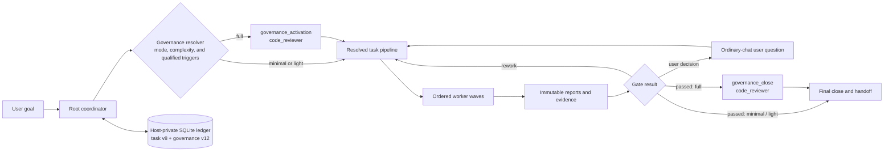

<table>
  <tr>
    <td width="190" align="center" valign="middle">
      
    </td>
    <td valign="middle">
      <h1>Cortex</h1>
      <p><strong>Reliable multi-agent orchestration for complex software engineering work in Codex.</strong></p>
      <p>
        Cortex turns a large task into a verifiable pipeline. It selects the
        right profile, model, and reasoning effort for every stage, isolates
        workers, preserves decisions and reports in a local ledger, and does
        not declare the work complete without evidence.
      </p>
      <p>
        
        
        
        
      </p>
    </td>
  </tr>
</table>

## Install with Codex — recommended

> [!IMPORTANT]
> **⚡ Copy the prompt below into a new Codex task.** It tells Codex to read this
> repository's current installation guide, install Cortex from the GitHub
> Marketplace `main` branch, install and configure Codebase Memory MCP,
> configure Codex, and verify the result.

```text
Install and configure the Cortex plugin for this Codex environment.

First, read the complete installation instructions and requirements in this
repository's README. Treat it as authoritative:
https://github.com/igovet/codex-cortex-orchestrator/blob/main/README.md

Then complete the setup end to end:

1. Check every prerequisite required by that README (including Codex plugin and
   multi-agent support, Python 3.11+ with tomllib, Git, and Bash). Install every
   missing prerequisite with the supported package manager for this operating
   system. Do not install unnecessary packages or Python dependencies.
2. Install and configure the Codebase Memory MCP server as `codebase_memory`,
   following the README's **Codebase Memory MCP** section and its linked
   official upstream instructions. Install its required dependencies, register
   it with Codex, enable automatic indexing when supported, and verify that
   Codex can use it for this exact project root. Restart Codex if its
   instructions require a restart.
3. For a fresh installation, add the Cortex Marketplace from the main branch
   exactly with:
   codex plugin marketplace add https://github.com/igovet/codex-cortex-orchestrator --ref main --json
   If the `cortex` Marketplace is already registered, refresh it with the
   documented update flow instead of adding a duplicate. Then install the
   plugin (or use the README's documented remove/reinstall update flow) with:
   codex plugin add cortex@cortex --json
4. Preserve existing ~/.codex/config.toml settings and add or correct every
   Cortex-required setting documented in the README: multi_agent_v2 = true and
   agents.default_subagent_model = "gpt-5.6-luna".
   Keep user approval review enabled; do not enable Ask for me / Approve for me.
5. Complete the required Cortex hook-trust flow and run the README's relevant
   verification checks. Start a new Codex task if the README requires it.

Use only the instructions and commands documented in that README. If an
elevated system permission, an interactive desktop confirmation, or a material
choice is required, explain exactly what is needed and ask me before proceeding.
```

> Cortex is activated only when you explicitly select it. An ordinary complex
> request—or merely mentioning orchestration—does not create a Cortex session.

## Table of contents

- [Install with Codex — recommended](#install-with-codex--recommended)
- [Installation](#installation)
  - [System requirements](#1-system-requirements)
  - [Choose a project root](#choose-a-project-root)
  - [macOS-specific notes](#macos-specific-installation-notes)
  - [Required Codex configuration](#required-codex-configuration)
  - [Required hook trust](#required-post-install-hook-trust)
  - [Codex Desktop](#2-install-on-codex-desktop)
  - [Codex CLI](#3-install-on-codex-cli)
  - [Orchestration commands](#4-orchestration-commands)
  - [Existing repositories: run harvest first](#existing-repositories-run-harvest-first)
- [Strongly recommended: Codebase Memory MCP](#strongly-recommended-codebase-memory-mcp)
- [How orchestration works](#how-orchestration-works)
- [Profiles and model routing](#profiles-and-model-routing)
- [Developing Cortex](#developing-cortex)
- [Support Cortex 💜](#support-cortex-)
- [Verification and diagnostics](#verification-and-diagnostics)

---

## Installation

### 1. System requirements

| Component | Requirement | Why it is needed |
| --- | --- | --- |
| Codex | Desktop or CLI with Plugins and multi-agent v2 support | Loads the plugin, skills, MCP server, and internal agents |
| Python | **3.11+**, with the standard-library `tomllib` module | Runs the local Cortex MCP server, hooks, and validators |
| Git | A current version | Fetches and refreshes the GitHub Marketplace source |
| Bash | **3.2+** | The launcher is compatible with the Bash shipped by macOS; no Bash 4.2+ install is required |
| Operating system | macOS or Linux; WSL is recommended on Windows | The current runtime launcher is Bash-based |

No additional Python packages are required through `pip`: the Cortex runtime
uses the Python standard library. Confirm that the required tools are available:

```bash
python3 --version
python3 -c 'import tomllib; print("tomllib: ok")'
git --version
codex --version
```

### Choose a project root

> [!WARNING]
> **Use a specific repository or worktree as `project_root`; never use an OS
> root or a broad system/home directory.** Do not start Cortex from `/`, your
> home directory, or directories such as `/home`, `/usr`, `/etc`, `/var`,
> `/opt`, `/tmp`, `/System`, `/Library`, or `/Users`.
>
> Before orchestration starts, Cortex recursively creates a
> content-addressed hash manifest of the selected root. On a system-wide or
> home-wide tree that can take a long time, consume substantial I/O, and make
> Codex or the terminal appear to hang. Select the actual project instead, for
> example `/workspace/my-service`. Cortex rejects the broad roots above
> before manifest capture.

If the correct Python interpreter is not the default `python3`, provide its
absolute path:

```bash
export CORTEX_PYTHON=/absolute/path/to/python3.11
```

The variable must be visible to the process that launches Codex. A Desktop app
started from the graphical shell may not read `~/.bashrc`; in that case, set
`CORTEX_PYTHON` in the environment used to launch the app.

### macOS-specific installation notes

The Plugins Marketplace workflow is the same on macOS, but the local runtime
requires additional preparation:

- macOS does not guarantee a suitable Python 3.11+ installation. Python 3.11+
  remains the only runtime prerequisite that may need to be provided separately.
- macOS ships `/bin/bash` 3.2, which the Cortex launcher supports directly.
  Bash 4.2+, GNU coreutils, and third-party shell libraries are not required.
- Homebrew uses `/opt/homebrew` on Apple Silicon and `/usr/local` on Intel.
  Use `brew --prefix` instead of hard-coding either location.
- Apps opened from Finder or the Dock do not necessarily inherit shell startup
  files such as `~/.zprofile`, `~/.zshrc`, or `~/.bashrc`.

Install the prerequisites with [Homebrew](https://brew.sh/):

```bash
# Install Apple's command-line tools first if they are not already present.
xcode-select --install

brew install python@3.11 git
```

Resolve and verify the installed runtimes:

```bash
export CORTEX_PYTHON="$(brew --prefix python@3.11)/bin/python3.11"

"/bin/bash" --version
"$CORTEX_PYTHON" --version
"$CORTEX_PYTHON" -c 'import tomllib; print("tomllib: ok")'
```

For Codex CLI sessions, make sure Homebrew is initialized before running
`codex`. Homebrew prints the exact `shellenv` command for your machine during
installation. A portable setup for the current shell is:

```bash
eval "$(brew shellenv)"
export CORTEX_PYTHON="$(brew --prefix python@3.11)/bin/python3.11"
codex
```

For Codex Desktop, the application process must receive `CORTEX_PYTHON`. If the
app is launched from Finder or the Dock, set it for the current macOS login
session before opening Codex:

```bash
launchctl setenv CORTEX_PYTHON "$(brew --prefix python@3.11)/bin/python3.11"
```

Fully quit and reopen Codex afterward, then start a new task. `launchctl setenv`
is scoped to the current login session and may need to be repeated after a
logout or restart. If your app launcher or device-management system already
provides environment variables, configure the same values there instead.

### Required Codex configuration

> [!IMPORTANT]
> Configure Codex before the first orchestration, then start a **new task**.
> Cortex requires multi-agent v2, and the global default model for internal
> subagents must be **Luna**. Without a confirmed Luna default, the host cannot
> reliably apply the standard hidden-worker routing policy.

Add the following settings to `~/.codex/config.toml`:

```toml
[features]
multi_agent_v2 = true

[agents]
default_subagent_model = "gpt-5.6-luna"
```

The two settings above are required in every configuration:

- `multi_agent_v2 = true` enables explicit model and reasoning-effort routing
  for each subagent. An already-open task retains the adapter selected when it
  was created.
- `default_subagent_model = "gpt-5.6-luna"` allows Cortex to launch standard
  hidden Luna workers without copying the expected model into a native model
  override. Cortex still selects Terra and Sol explicitly when policy requires
  them.

For clearer coordinator explanations, self-contained questions, and more
detailed answer choices, the recommended top-level Codex setting is:

```toml
model_verbosity = "high"
```

This setting is recommended rather than required by the Cortex runtime. Apply
it before starting a new task so the new task inherits the configured response
style.

Marketplace installation does not replace these global Codex settings. Verify
both values yourself before starting the first Cortex task and after changing
Codex configuration.

Cortex questions and plan approval use ordinary chat messages and do not
require or invoke MCP form elicitation. The coordinator sends one detailed
final assistant message, ends the turn, and resumes the same durable task when
the user replies in the next ordinary message.

You may also approve all tools exposed by the local Cortex MCP server:

```toml
[plugins."cortex@cortex".mcp_servers.cortex]
default_tools_approval_mode = "approve"
```

The MCP setting affects Cortex tools only. It does not change the approval
policy for shell commands, patches, or tools provided by other plugins.

To keep other approval decisions routed to the user:

```toml
approval_policy = "on-request"
approvals_reviewer = "user"
```

> [!WARNING]
> ### Do not use **Ask for me / Approve for me** with Cortex
>
> This Codex permission mode enables auto-review by setting
> `approvals_reviewer = "auto_review"`. Every eligible approval request is then
> routed to a **separate reviewer agent** instead of being shown directly to
> the user. That review is an additional model request with its own context,
> latency, token usage, and model-budget cost.
>
> Cortex already has its own evidence, report, and gate-review pipeline. Adding
> a second model-based approval reviewer increases cost and makes the execution
> path harder to reason about without improving the Cortex orchestration
> contract. Keep `approvals_reviewer = "user"` and select the manual user-review
> permission mode. Do not continue until **Ask for me / Approve for me** is
> disabled.

Codex Desktop may change the active permission mode when the selected model
changes. Recheck the permission control after changing models and confirm that
it still routes approvals to the user. See the
[official OpenAI auto-review documentation](https://developers.openai.com/codex/sandboxing/auto-review)
for the separate reviewer-agent flow.

### Required post-install hook trust

> [!IMPORTANT]
> After every installation or update, review and trust the Cortex lifecycle
> hooks **before starting orchestration**. Hook trust is content-hash based, so
> a new plugin build may require renewed approval even when the hook names have
> not changed.

Cortex registers exactly five lifecycle hooks:

| Hook | Purpose |
| --- | --- |
| `SessionStart` | Restores coordinator context on startup, resume, clear, and compaction |
| `SubagentStart` | Binds the native worker identity to the issued Cortex dispatch |
| `SubagentStop` | Records whether a worker reported, paused for a question, or failed |
| `PreToolUse` | Enforces coordinator and worker safety guards before relevant tools run |
| `PostToolUse` | Records lifecycle results and injects bounded recovery/report context |

For a Marketplace installation, accept the hook trust prompt shown by Codex
after installing or enabling Cortex. Before approving it, confirm that:

- the plugin ID is exactly `cortex@cortex`;
- the source is the installed plugin's `hooks/hooks.json`;
- the command invokes the same installed cache's `scripts/cortex-launcher` and
  `scripts/cortex_hook.py`;
- the set contains the five hooks listed above and no unexpected additional
  hooks.

Do not approve a hook whose plugin ID, source path, command, or hook set differs
from this contract. Resolve the mismatch or reinstall the plugin first.

If trust is missing, stale, rejected, or cannot be verified, do not start
Cortex orchestration. Untrusted hooks can prevent durable worker binding,
coordinator isolation, report recovery, and compaction-safe resume from working
as designed. After trust is approved, fully restart Codex and open a new task.

### 2. Install on Codex Desktop

Codex Desktop and Codex CLI use the Plugins Marketplace system. The general
user workflow is documented in the
[official OpenAI plugin documentation](https://developers.openai.com/codex/plugins).

#### Add the GitHub Marketplace and install Cortex

> [!IMPORTANT]
> **Cortex is not published in the public plugin directory.** Add this GitHub
> repository as a Marketplace source before looking for Cortex in Desktop.

1. Open the **Plugins** tab in Codex Desktop.
2. Select **Manage** in the upper-right corner of the Plugins page.
3. Open the **Marketplace** tab under **Manage extensions**.
4. Select **Add marketplace**.
5. Complete the **Add plugin marketplace** dialog:

   | Field | Value |
   | --- | --- |
   | **Source** | `https://github.com/igovet/codex-cortex-orchestrator` |
   | **Git ref** | `main` |
   | **Sparse paths** | Leave empty; the Marketplace manifest is at the repository root |

6. Select **Add marketplace** and wait for the confirmation. The new source
   should appear in **Manage → Marketplace** as **cortex**.
7. Return to the Plugins directory, open **Personal**, and find **Cortex**. Do
   not search for it in the public directory.
8. Open the Cortex details page and select **+ / Install**.
9. Review the requested permissions and bundled hooks/MCP server.
10. Approve the exact five Cortex hooks described in
   [Required post-install hook trust](#required-post-install-hook-trust).
11. Verify the [required configuration](#required-codex-configuration).
12. Start a **new Codex task**. Existing tasks do not load newly installed
   skills, hooks, MCP tools, or a different multi-agent adapter.
13. Open **Skills**, select **Cortex Orchestrator**, and describe your goal.

#### Update on Desktop

1. Open **Plugins → Manage → Marketplace**.
2. Find **cortex** and select **Upgrade marketplace**. To refresh every
   configured Git Marketplace, use **Upgrade all marketplaces**.
3. Return to **Plugins → Installed → Cortex**.
4. Install the available newer Cortex version. If the UI offers only uninstall
   and install actions, uninstall Cortex and install it again from **Personal**.
5. Reapprove or verify trust for the updated five hook content hashes.
6. Recheck `multi_agent_v2` and the Luna default.
7. Start a **new Codex task**. An existing task may retain absolute paths to the
   previous cachebusted plugin installation.

### 3. Install on Codex CLI

Register the GitHub Marketplace first. Cortex is not available in the public
plugin directory:

```bash
codex plugin marketplace add https://github.com/igovet/codex-cortex-orchestrator --ref main --json
```

Then start the interactive Codex CLI:

```bash
codex
```

Open the plugin browser:

```text
/plugins
```

Then:

1. Switch to the newly added **cortex** Marketplace tab.
2. Open **Cortex** and install it.
3. If needed, press `Space` to enable the installed plugin.
4. Approve the exact five Cortex hooks described in
   [Required post-install hook trust](#required-post-install-hook-trust).
5. Verify the [required configuration](#required-codex-configuration).
6. Exit the current CLI session and start `codex` again.
7. In the new session, invoke `$cortex:orchestrator` or open `/skills`.

For a direct, non-interactive installation after adding the Marketplace, run:

```bash
codex plugin add cortex@cortex --json
```

#### Update on CLI

Open `/plugins`, select the **cortex** Marketplace, and install the newer
version. To refresh and reinstall it entirely from the terminal, run:

```bash
codex plugin marketplace upgrade cortex --json
codex plugin remove cortex@cortex --json
codex plugin add cortex@cortex --json
```

After every update, reapprove or verify the new hook content hashes, exit the
current session, and start a new one.

### 4. Orchestration commands

Cortex exposes one explicit entry point with several routes. On Desktop,
select **Skills → Cortex Orchestrator** or mention the skill in chat. In the
CLI, use `$cortex:orchestrator` or `/skills`.

| Command | Purpose | Example |
| --- | --- | --- |
| `$cortex:orchestrator <task>` | Start ordinary orchestration | `$cortex:orchestrator Find the race condition and fix it with tests` |
| `$cortex:orchestrator help` | Show read-only help without changing the project or ledger | `$cortex:orchestrator help` |
| `$cortex:orchestrator harvest` | Build or synchronize the repository knowledge baseline; required before the first task in an existing project | `$cortex:orchestrator harvest` |
| `$cortex:orchestrator harvest-refresh` | Rebuild project knowledge documentation from source | `$cortex:orchestrator harvest-refresh` |
| `$cortex:orchestrator prune` | Remove completed Cortex task state older than seven days | `$cortex:orchestrator prune` |
| `$cortex:orchestrator normal` | Leave the active Cortex route | `$cortex:orchestrator normal` |

Example tasks:

```text
$cortex:orchestrator Design and implement secure API-key rotation,
including the migration, tests, and documentation.

$cortex:orchestrator Review the current PR, identify regressions,
check security, and verify the findings with tests.

$cortex:orchestrator harvest-refresh
```

#### Existing repositories: run harvest first

> [!IMPORTANT]
> ### Run `$cortex:orchestrator harvest` before the first task in an existing project
>
> Cortex workers rely on durable repository knowledge under `docs/project/` and
> `docs/features/`. For an existing codebase, run the harvest route once before
> ordinary feature, debugging, migration, review, or refactoring work. This
> gives later workers an evidence-backed map of the project's architecture,
> features, commands, conventions, verification paths, decisions, and known
> pitfalls.

Start the initial knowledge build with:

```text
$cortex:orchestrator harvest
```

If the project does not already have a current, source-backed coverage manifest,
`harvest` automatically performs a full baseline census rather than a shallow
incremental update. The pipeline plans the repository domains, explores them,
synthesizes the architecture, writes the canonical documentation, independently
reviews coverage, and verifies the finished knowledge tree.

The resulting baseline includes:

```text
docs/project/index.md
docs/project/conventions.md
docs/project/verification.md
docs/project/decisions.md
docs/project/gotchas.md
docs/features/index.md
docs/features/<feature>/index.md
```

For large restructures, a stale knowledge tree, or suspected coverage gaps, run
a full independent rebuild:

```text
$cortex:orchestrator harvest-refresh
```

#### Documentation is maintained automatically after tasks

After the initial harvest, you do **not** need to run `harvest` after every
task. Cortex automatically adds scoped documentation synchronization after C2
or C3 work, and whenever verified changes affect behavior, interfaces,
architecture, project commands, conventions, gotchas, decisions, or feature
ownership.

The documentation worker updates only the affected durable pages, preserves
protected human-authored text, verifies links and commands against the finished
implementation, and keeps the feature registry consistent. Documentation is
therefore updated as part of the task pipeline before the final close gate.

A small local C1 fix that changes none of those durable facts intentionally
skips documentation sync. Cortex does not create documentation merely to record
that a task occurred.

`help` and `normal` do not start durable orchestration. `prune` is a separate,
bounded maintenance operation: it does not remove the project, source code,
documentation, or plugin files. `harvest` is incremental only after a verified
coverage manifest establishes a complete baseline; otherwise Cortex performs a
full audit. `harvest-refresh` always rebuilds the inventory from current source.

> [!CAUTION]
> `/cortex` and `/normal` are not registered Codex slash commands. Use
> `$cortex:orchestrator ...` or select the skill through `/skills`.

---

## Strongly recommended: Codebase Memory MCP

> [!WARNING]
> ### Install Codebase Memory MCP before serious orchestration work
>
> **[DeusData/codebase-memory-mcp](https://github.com/DeusData/codebase-memory-mcp)**
> builds a local graph of functions, classes, calls, routes, and dependencies.
> Cortex uses it for fast architecture discovery, impact analysis, and tracing
> end-to-end execution paths. This is especially valuable in large monorepos:
> without the graph, workers must search and read files more sequentially,
> consuming more time and context while increasing the chance of missing a
> non-obvious caller, alternate entry point, or cross-service relationship.
>
> Codebase Memory is not a hard runtime dependency. If the MCP server is not
> available, a worker makes one bounded attempt and falls back to ordinary
> repository tools. Nevertheless, it is **strongly recommended** for C2 and C3
> tasks.

Quick install on macOS/Linux:

```bash
curl -fsSL https://raw.githubusercontent.com/DeusData/codebase-memory-mcp/main/install.sh | bash
```

Review the remote installation script before running it. For Windows, manual
installation, and package-manager options, see the
[official Codebase Memory README](https://github.com/DeusData/codebase-memory-mcp#quick-start).

After installation:

1. Restart Codex so it loads the new MCP server.
2. Ask Codex to index the project, or enable automatic indexing:

   ```bash
   codebase-memory-mcp config set auto_index true
   ```

3. Confirm that the project is resolved by its **exact absolute root**.

Internal Cortex workers use Codebase Memory; the coordination-only root does
not. Every immutable worker briefing includes a project key precomputed from
the canonical root with Codebase Memory's current path-key algorithm: safe
ASCII is preserved, separators and other unsafe ASCII become collapsed dashes,
non-ASCII UTF-8 bytes become lowercase hex, and overlong keys receive the
same bounded FNV-1a suffix. Workers use this key directly and call
`list_projects` at most once only after a real lookup failure, ambiguity, or
key drift/collision; any fallback must match the exact canonical root. The
`planner`, `explorer`, `architect`, and `database_architect` profiles may
perform one bounded refresh when the exact index is missing or stale. Other
profiles do not loop on MCP setup and use the safe fallback instead.

---

## How orchestration works

Cortex is more than a prompt asking Codex to “run several agents.” It is a
local control plane with explicit stages, durable state, and verifiable
transitions.



### Governance resolution

Before dispatching the resolved pipeline, Cortex evaluates the requested
governance mode, task complexity, and qualified risk or topology signals. The
requested mode is `auto`, `required`, or `off`; the effective mode is
`minimal`, `light`, or `full`.

| Request and context | Effective mode | Result |
| --- | --- | --- |
| `auto`, C1, and no qualified signal | `minimal` | Runs the resolved task pipeline with verification evidence and an audit receipt. |
| `auto`, C2, and no qualified signal | `light` | Retains the resolved task pipeline and adds policy, decision/assumption/risk, process-reflection, and verification obligations at close. |
| `auto` with C3 or a qualified signal | `full` | The server inserts independent governance review before ordinary work and immediately before final close. |
| `required` at any complexity | `full` | The server applies the same full-governance lifecycle. |
| `off` | `minimal` only for C1 with a complete Boolean assessment of every documented trigger; C2/C3 or any triggered risk is rejected. |

Qualified signals include security, privacy, credentials or sensitive data,
destructive work, migrations, external actions, public-contract,
authorization, or integrity work, and explicit multi-repository, linked-task,
long-lived-lane, conflicting-resource, or multi-session topology. Counts
alone do not raise the governance mode.

In `full` mode, the server owns the two additional read-only review gates:
`governance_activation` runs first, and `governance_close` runs immediately
before final `close`. Both are assigned to `code_reviewer`; the server binds
their evidence to immutable artifacts and report receipts. The close review
also requires the matching linked task, report, and completed independent
native reviewer session. The coordinator cannot omit either gate from a
full-governance pipeline. For the record model, capability boundary, and
integrity rules, see the [orchestration ledger documentation](docs/features/orchestration-ledger/index.md).

### The orchestration cycle

1. **Explicit activation.** Cortex preserves the exact user request,
   acceptance criteria, and task boundaries.
2. **Evidence-first scoping and planning.** C2 starts with Explorer discovery.
   C3 and knowledge harvest start with a read-only Planner **scope** phase that
   publishes a discovery brief and up to eight non-overlapping domains. The
   final Planner **plan** phase runs after discovery and all design gates, and
   consumes their predecessor reports before publishing the decision-complete
   `planning` artifact. `scope` gathers evidence but never closes a user-intent
   question; material decisions still use the worker-question flow.
3. **Canonical ordering.** C1 is `discover → implementation → review → close`.
   C2 is `discover → design gates → plan → implementation → qa → review →
   documentation → close`. C3 is `scope → discover → design gates → plan →
   implementation → qa → review → documentation → close`. Harvest is `scope →
   discover → architecture → plan → documentation → review → close`.
   Architecture, database architecture, and UX gates precede plan; security,
   performance, and accessibility remain post-implementation audits before
   review. These are base routes: the governance resolver may wrap any route
   with the full-mode review gates described above.
4. **Precise dispatch.** Every worker receives a profile, model, reasoning
   effort, allowed paths, ownership, acceptance criteria, and verification
   responsibilities.
5. **Isolated execution.** The root remains a coordinator and does not mix its
   own project changes with worker work. Independent read-only tasks run in
   parallel, while overlapping writes are serialized.
6. **Reports instead of trust.** Every worker publishes the unchanged strict
   seven-field `cortex/report/v1` contract. Planner Scope may additionally
   publish the top-level `scoping` sibling (`overview`, `context_files`, and
   up to eight validated discovery domains); Planner Plan may publish
   `planning`. The server also attaches the task-wide
   `resolved_user_decisions` snapshot. These siblings do not alter the seven
   worker-authored report fields.
   A report read is repeatable, but its user-facing completion link is not:
   only the first complete coordinator read after the matching native worker
   stop may publish the link. That same message summarizes what completed and
   what happens next; early reads and rereads remain link-free.
7. **Fresh approvals and adaptive replanning.** Required approval is available
   only after the final plan. The review records the plan revision, planner
   report reference, verified-predecessor digest, and semantic future-pipeline
   digest. A material future-wave change or any pipeline operation that reopens
   `plan` preserves history,
   resets approval to `pending_plan`, and requires a replacement Planner plus a
   new approval. No-op and transport-only changes do not invalidate approval;
   stale basis digests block dispatch with recoverable reapproval guidance. The
   approval decision is a detailed `cortex/chat-interaction/v1` ordinary-chat
   hold. The message summarizes the objective, work packages, paths,
   dependencies, verification, risks, remaining phases, all
   approve/revise/cancel outcomes, and the LLM-recommended response with its
   rationale. The turn then ends. The next user message is bound to the opaque
   request ID; revision text is preserved verbatim, cancellation stays pending,
   and silence never implies approval.
8. **Automatic documentation sync.** When completed work changes durable
   behavior, interfaces, architecture, commands, decisions, or ownership,
   Cortex dispatches a technical writer to update the affected project and
   feature documentation before closing the task.
9. **Verified close.** A task completes only after the required gates are
   satisfied and the final handoff is ready.

### 9.2.21 prompt-contract and dispatch-authority release

This source-tree patch prepares report drafts outside the mutation lease and
revalidates the task revision, draft registration, file identity, and content
digest before the final commit. Lock acquisition is bounded to five seconds;
the commit itself remains serialized and may still perform canonical artifact,
finding, and index writes. All ledger mutation paths now use the same bounded
lock-acquisition policy by default, with non-secret holder metadata in
retryable `ledger_busy` diagnostics. Contention returns retryable
`ledger_busy`; stale preparation preserves the draft and returns retryable
`stale_preparation`. The `CORTEX_REPORT_PREPARE_COMMIT=off` environment flag
retains the serialized legacy path for rollback without invalidating committed
artifacts or queued projections.

Lifecycle hooks read one existing SQLite database through a bounded read-only
snapshot and keep optional telemetry writes fail-open with a 100 ms busy
timeout. Coordinator targetless waits and read-only file inspection receive
non-blocking advisories; worker identity and all mutation boundaries remain
fail-closed.

Prompt Contract Architecture v2 compiles each v3 briefing from the canonical
ownership matrix: stable authority and worker policy are Markdown sections,
while every dispatch-controlled value is fenced, untrusted assignment JSON.
The old expanded v2 path is a deprecated compatibility adapter only. Offline
prompt fixtures compare stable SHA-256 goldens and structural metrics (heading
order/count, byte ceiling, one assignment boundary, and data-boundary markers),
including a fixed v2-versus-v3 delta; they do not make model-quality claims.
The separate live A/B runner is disabled unless explicitly selected. It sends
both versions of the same fixture through Codex with exactly Luna at `high`
reasoning, no fallback, and scores only structured response, report shape,
question/tool/metadata leakage, route/retry/replay/completion signals, and
bounded output/token/time observations. Missing Luna or authentication is
`SKIP`/`BLOCKED`, never evidence of a pass.

Planner revisions preserve the complete requirement history and the latest
user steer, require explicit requirement-to-plan coverage, and maintain one
task-local tracker for package and microtask status, order, dependencies, gates,
acceptance, and verification. Worker sessions rehydrate their exact immutable
assignment, compiled plan unit, and user-intent artifact after compaction.
User-facing updates use the configured `natural`, `compact`, or `technical`
communication profile; internal identifiers remain in separate metadata, and
start/progress/approval/question/problem/blocker/completion messages pass the
same quality checks. Report validation returns all correctable diagnostics
together.

### 9.2.18 orchestration recovery hardening release

This source-tree patch removes dispatch-briefing size rejection from report
acceptance and dispatch preparation: complete plans remain immutable artifacts
addressed by ref/path/SHA-256, while briefings carry only compact guidance.
It also scopes no-progress retries to the failed gate, so an unpaused sibling
in the current parallel wave can finish. Multi-gate recovery remains
Planner-first and releases only the explicitly named paused gate.

### 9.2.17 skill-read deduplication advisory release

This source-tree patch makes duplicate full reads of an unchanged bundled
Cortex skill advisory and context-aware. A repeated read in the same context
is recorded for diagnosis but remains allowed; compaction or a new context
epoch permits a fresh read. Host-internal UI skill loads are outside the
project-tool hook's accounting boundary.

### 9.2.16 coordinator recovery and report-contract hardening release

This source-tree patch closes three recovery and contract gaps. Coordinator
recovery no longer asks a reviewer to retry an impossible resolution report;
review and close now preserve honest `BLOCKED` markers when corrective work is
still required; and the `record_report` schema branch matches the runtime
validation branch, keeping its public contract aligned.
Report intake retains complete submitted strings and list items instead of
applying the former 64 KiB and 100-item sanitization caps. The explicit atomic
artifact boundary is 8 MiB; private report drafts allow 17 MiB so envelope
metadata cannot reject an otherwise valid report. Reports are immutable
cursor-paged artifacts, with 32 KiB limiting transport pages only. Detailed
plans are passed by their exact artifact ref/path/SHA-256 tuple in the worker
briefing.

### 9.2.15 report, hook, and governance-rework hardening release

The current source-tree hardening draft retains the 9.2.10 stopped-report and
plan-approval recovery guarantees, and additionally hardens worker reporting,
lifecycle-hook loading, and multi-hop corrective handoff. `record_report` accepts only the worker identity
from its briefing/template plus `draft_ref` and an optional patch or report
payload; `task_ref`, `dispatch_ref`, and `submission_id` are coordinator
transport fields. A direct draft must remain a current-user regular
non-symlink file with exact `0600` permissions; it is rejected for correction
rather than being path-repaired after an untrusted replacement. Evidence
marker diagnostics now state the exact required marker and criterion, and
`changed_files` must describe only paths changed since that exact attempt's
baseline. The lifecycle hook resolves its bundled runtime when a host loads it
through `importlib`. While a closure rework is active, the exact
server-bound corrective report remains in later QA/security and final-verifier
handoffs even when normal transitive frontier compaction would otherwise cover
them; the originating verifier therefore has every receipt required to resolve
each finding. Before it dispatches that verifier, Cortex proves all active
closure-rework routes have a current passed, server-bound corrective receipt.
If one is missing, it returns a recoverable preflight result without creating a
worker or a report draft, instead of issuing a reviewer an impossible
resolution contract. An empty `required_missing` list is scoped to the current
gate: it cannot silently resolve a server-created verification blocker from a
different gate or charge that worker with a provenance transition it never
submitted. The controller keeps that blocker open and, for governance-origin
findings, places the fresh originating governance gate and all later closure
verifiers after corrective work before any resolution can be recorded.
Malformed JSON values at the public report boundary are converted to bounded,
same-attempt validation diagnostics rather than leaking interpreter exceptions.
An explicitly external `codex://threads/...` ledger-continuation request that
does not ask to mutate the project also avoids write-required implementation
and QA gates; a request that names project changes keeps the ordinary strict
implementation path.

Governance record bodies are read from verified
immutable content artifacts; exact normalized scope, task/initiative links,
linear revisions, strict JSON, immutable-field triggers, and idempotent
submission receipts fail closed on corruption or replay conflict. Schema v11
adds the append-only lifecycle chain for status and approval-basis authority;
schema v12 adds host-keyed authentication for the complete lifecycle envelope,
requires terminal success for linked milestone/deliverable tasks before an
initiative can complete, and prevents deletion of initiative-task links that
are referenced by governance records. Pre-v10 upgrades deterministically
reconcile safe v9 duplicate revisions/sibling successors and fail closed on
ambiguous scope or predecessor graphs. Coordinator capabilities are
short-lived scoped claims carrying principal, thread, generation, expiry, and
allowed actions. A lost bearer enters two-phase recovery on the normal
compatibility or explicit coordinator audience with the same active identity
and non-durable recovery proof returned by authorization. Cortex redelivers
the same derived replacement pair until acknowledgement presents both
replacements and the prior proof; only then is the old generation revoked.
Plaintext is never stored. A lost *initial start* response remains fail-closed
until a host-attested delivery channel exists. An explicit worker audience
cannot call either recovery phase.

Corrective work remains open-ended while acceptance or findings require work,
but a repeated materially identical no-progress signature pauses autonomous
retries for an explicit user strategy without producing a false pass. The
pause belongs only to its failed gate: unpaused siblings in the same parallel
wave continue, while later dependent waves do not leapfrog it. A finding from
another gate cannot reset or alter its repeat signature. The pause can be
released only by a Planner-first recovery whose downstream pipeline, strategy,
or verification contract materially changes, or whose Planner wave names a
class-matched infrastructure/environment remediation; when multiple gates are
paused, recovery explicitly names the one gate to release. Free-text reason
prose is retained only as audit evidence. Material steer
classifies the earliest affected gate and invalidates downstream proof;
worker questions are bound to task/plan revision and strategy generation.
Manifest capture is bounded by entries, hashed bytes, and elapsed time and may
reuse a bounded digest cache. A partial capture remains diagnostic evidence
only: it cannot authorize read-only mutation reconciliation, a handoff, or
terminal close. CI runs the 50,000-file manifest benchmark and requires
`target_met: true`. A stopped native worker that has already recorded reports
is completion-pending rather than live: Cortex requires an explicit
receipt-attested report selection, refuses stale Planner revisions, and falls
back to a fresh Planner-first recovery when none can be safely consumed. The
historical 9.2.18 cachebuster and release/live result slots belong to that
prior candidate. Current 9.2.21 release evidence remains pending until the
release commit is validated. The
repository's [CODEOWNERS](.github/CODEOWNERS) file requires maintainer review
for runtime, release workflow, scripts, tests, and documentation changes.

### Why this is more reliable than ordinary multi-agent work

- **State survives compaction and resume.** The goal, decisions, workers,
  reports, checks, and blockers are recovered from the ledger rather than
  guessed from a shortened chat history.
- **No accidental duplicate dispatch.** Idempotent lifecycle calls and opaque
  `task_ref` values prevent an active wave from being started twice.
- **Explicit file ownership.** Each worker knows its allowed scope. Independent
  writers can use separate worktrees when isolation is required.
- **Material decisions are not invented.** A worker can persist a question,
  pause, and resume the same attempt after the user answers. Every later
  report carries that canonical question and answer so a successor cannot
  treat changed wording or a new key as a new decision.
- **Verification is contractual.** Executed checks record the command, working
  directory, exit code, and decisive result.
- **Documentation does not override source.** `docs/project/` and
  `docs/features/` provide navigation, while consequential claims are verified
  against source, tests, schemas, or executable configuration.
- **Knowledge stays current automatically.** After the initial harvest,
  behavior- or architecture-changing tasks synchronize the affected durable
  documentation before the close gate.
- **Privacy is the default.** The ledger and internal reports remain local.
  Secrets and sensitive data must not be included in dispatches, reports, or logs.

### Internal structure

```text
plugins/cortex/
├── .codex-plugin/plugin.json   # Manifest and UI metadata
├── .mcp.json                   # Local MCP server
├── agents/                     # 21 worker profiles
├── assets/logo.png             # Plugin logo
├── hooks/hooks.json            # Lifecycle hooks
├── profiles.json               # Routing and model policy
├── scripts/                    # Server, launcher, hooks, and runtime
└── skills/                     # 10 bundled skills
```

The public MCP surface is deliberately small. The coordinator uses
`start_orchestration`, `continue_orchestration`, `manage_orchestration`, and
the coordinator-only `manage_governance` surface; it reads predecessor reports
with `read_worker_report`. Workers use
`read_dispatch_briefing`, `worker_question`, `get_report_template`,
`record_report`, and scoped `read_worker_report` for explicitly granted
predecessor refs.

Worker briefings carry the verified transitive predecessor frontier, not inline
report bodies or the entire task history. A passed report covers only the exact
refs its attempt read and acknowledged, so long-running tasks may retain
thousands of immutable reports without growing every successor prompt or
discarding evidence. Compact inspect and recovery responses independently
retain the newest eight summaries; full history remains in SQLite.

Material worker questions are handed off with more than a bare reference:
`QUESTION_RECORDED` is followed by why input is needed, full self-contained
questions, concrete outcome-based options, descriptions, trade-offs, and a
recommendation. Cortex returns one detailed ordinary-chat projection in the
user's language; the root sends it as the final assistant message and ends the
turn without calling any UI/input/approval/elicitation tool. The user's next
message is recorded before the same worker resumes. Every question explicitly
names the option(s) the LLM recommends—or a concrete recommended text answer—
and explains why. Localized batch
items use `localized_question`, `localized_header`, `localized_options`, and
`localized_custom_label`; `question`, `header`, `options`, and `custom_label`
remain compatibility aliases. Generic numbered, A/B, or
recommended/alternative placeholders are rejected, and option descriptions
may be rendered with the choices. Every choice also permits optional free-form
constraints. That text is preserved beside the stable option IDs
and translated to canonical English before a worker resumes when necessary.

The complete worker assignment is stored in an immutable briefing protected by
a SHA-256 digest. The constructor transmits only a compact bootstrap plus the
exact `dispatch_ref`, briefing path, and digest; the worker reads and verifies
that briefing before project work. Worker Briefing v3 JSON-serializes every
task-controlled assignment value inside one explicitly untrusted data block;
the surrounding authority, bounded role contract, optional mode overlay,
evidence rules, and worker protocol remain fixed instructions. Its byte budget
is enforced before dispatch. Full Planner microtasks are not embedded in that
bounded assignment: Cortex writes an immutable compiled-plan artifact and
places only its exact artifact ref/path/SHA-256, byte size, and compact counts
in the briefing and native bootstrap. The implementation worker reads that
one authorized artifact and verifies its digest, so a detailed valid plan is
not rejected or silently truncated merely to fit a worker prompt. Ordinary profiles do not carry
harvest specialization; exact harvest routes add a conditional mode overlay.
A worker never browses unrelated Cortex coordination data. Canonical state is
stored in the host-private SQLite `cortex/v8` task ledger plus its additive v12
governance ledger. By default the ledger lives below
`~/.codex/cortex/projects/p-<sha256>/`; `CORTEX_HOST_STATE_DIR` is a host-only
override and must resolve to a private directory outside the workspace. A
legacy project-local `.codex/cortex` database is eligible only for a
same-filesystem atomic rename after ancestry, database, and split-state checks;
unsafe, non-database, or cross-filesystem legacy state fails closed.
Ordinary opens preserve an already-matching host-project identity without
rewriting its metadata; an identity or rename-provenance change remains a
durable control-plane transition.
Briefings have non-blocking compactness targets: 1.5 KiB for the bootstrap,
16 KiB for ordinary work, and 18 KiB for harvest work. They are template
guidance, not dispatch or Planner-report validators. Full plans remain
immutable artifacts, and plan-backed implementation briefings carry only an
exact digest-bound reference; cursor paging handles transport without asking a
planner to shorten evidence.
New tasks use pipeline contract v2; active v1 tasks without that field resume
their persisted pipeline unchanged.

The v5 registry contains nine MCP operations. An unspecified or unknown
transport audience uses a compatibility projection exposing all nine, so an
ordinary Desktop launch makes `$cortex:orchestrator` operational. Explicit
`worker` and `coordinator` audiences remain strict five-operation projections:
the worker projection contains `worker_question`, `get_report_template`,
`record_report`, `read_dispatch_briefing`, and scoped `read_worker_report`; the
coordinator projection contains `start_orchestration`,
`continue_orchestration`, `manage_orchestration`, `manage_governance`, and
scoped `read_worker_report`. The audience is fixed for the stdio process and
cannot be selected through
JSON-RPC initialization or tool arguments. Coordinators also use the server-owned `manage_governance` surface for initiatives, dependencies,
immutable governance records, active snapshots, constrained exceptions, and
coordinator-approved policy promotion. Workers build from
`get_report_template`, which creates a private fully structured JSON file and
returns its short `draft_ref` and absolute `draft_path` without echoing the
body. A worker fills that file and calls `record_report` with the same
`draft_ref`; read-only workers can provide a small JSON Merge Patch or a
complete replacement through `record_report` when their sandbox cannot edit
the file. A draft must be a current-user regular non-symlink file with exact
`0600` mode; the server rejects an unsafe direct edit rather than repairing it
by path. `record_report` uses only `project_root`, `task_id`, `attempt_id`,
`profile`, `draft_ref`, and optional patch/report fields—never coordinator
`task_ref`, `dispatch_ref`, or `submission_id`. Invalid records keep the draft
and consume no worker attempt. Caller/input/schema validation
from any allowed worker tool is also corrected and retried on the same attempt
without consuming recovery budget; only explicit `retryable: false` integrity
or storage blockers are terminal. Successful finalization revalidates the
current draft and state, commits the durable report atomically, and deletes the
draft post-commit. Bounded briefing and coordinator artifact reads clamp
oversized `max_bytes` requests to 32768 and continue with cursors. Report reads
expose the complete immutable report artifact through the same cursor protocol;
32768 is only the transport page size, not a report-content cap.
QA, review, implementation, and corrective pipeline rework are unbounded while
acceptance criteria, required verification, or canonical findings remain
unresolved. Failure counts are audit and routing inputs, never a completion
shortcut. Cortex raises the next worker's reasoning effort to `high`, `xhigh`,
then `max`; after two unresolved attempts it selects Terra for ordinary
adaptive/deep work unless the user explicitly chose another model. An optional
`next_strategy` or evidence-backed replan may improve the approach but is never
required merely to continue fixing defects.
Drafts expire after one hour and a new template supersedes
the prior attempt draft. Read-only
workers do not claim source changes observed in the shared checkout as their
own; Cortex records those paths as concurrency evidence while still rejecting
claimed writes and arbitrary `.gitignore` outputs. The read-only result check
tolerates only manifest-recognized cross-language ephemeral outputs—
conventional generated directories/roots/files, virtual environments,
recognized build-output directories, and bytecode suffixes, including matching
conventional paths listed in `.gitignore`—so unrecognized generated, cache,
coverage, snapshot, or ignored artifacts remain failures. Tool-side questions and
approval prompts are projected into the original user language by the root
coordinator; worker protocol messages and durable reports remain English.
Sensitive MCP exceptions are appended to
`~/.codex/logs/cortex-tool-errors.jsonl`; the writer retains complete newest
records and caps the file at 10 MiB by dropping oldest records first.

Governance authorization is returned once by the original successful start;
the project ledger stores only its SHA-256 digest and a separate digest for a
non-durable coordinator recovery proof. An idempotent start retry does not
recover or reissue either value. Capability recovery is available through the
compatibility or explicit coordinator MCP audience and requires the exact task,
principal, thread, and original recovery proof. It stages/redelivers one
deterministically derived replacement pair until acknowledgement returns the
prior proof plus both replacement values; only acknowledgement rotates the
generation. Neither raw value is durable. A lost initial start response stays
fail-closed rather than treating public identifiers as recovery authority. An
explicit worker audience cannot call this surface. Legacy plaintext
capabilities are removed and invalidated on first registry access. Explicit
`governance_mode=off` is accepted only for C1 after an exhaustive boolean
assessment of every documented hard and topology trigger; prose detection may
raise the floor but can never authorize `off`. Sensitive governance records
require an approved exact-type policy with `retention_days` and
`allowed_roles`; the server derives or bounds `expires_at`, enforces optional
field/redaction lists, and retains expired rows only in append-only audit
history. Initiative close review is accepted only when its immutable artifact
resolves to a passed `code_reviewer` `governance_close` attempt, matching report
reference, and completed independent native worker session.

---

## Profiles and model routing

Cortex ships 21 profiles. They are not decorative personas: every profile has
its own sandbox, eligible gates, ownership boundaries, completion criteria, and
professional playbook.

| Area | Profiles |
| --- | --- |
| Discovery and planning | `explorer`, `planner`, `architect`, `database_architect` |
| Implementation | `frontend_dev`, `backend_dev`, `fullstack_dev`, `mobile_dev`, `data_engineer`, `devops_engineer`, `general` |
| Diagnosis and improvement | `debugger`, `refactorer`, `performance_engineer`, `ux_designer`, `accessibility_engineer` |
| Quality control | `qa_engineer`, `code_reviewer`, `security_auditor`, `build_verification` |
| Documentation | `technical_writer` |

### Adaptive model policy

Cortex selects a model based on task type, complexity, and the cost of failure:

- **Luna** handles fast, well-bounded tasks, exploration, most efficient
  implementation work, and low- or moderate-risk adaptive work.
- **Terra** handles deep C2/C3 planning, architecture, migrations, review,
  uncertain diagnosis, concurrency, performance, integration conflicts, and
  work with a high cost of failure.
- **Sol** handles security context and the `security_auditor` profile. Outside
  security work, Sol is allowed only when the user explicitly selects it.

| Work class | C1 | C2 | C3 |
| --- | --- | --- | --- |
| Efficient / Luna | `high` | `high` | `xhigh` |
| Adaptive / Luna | `high` | `xhigh` | `max` |
| Deep / Terra | `high` | `high` | `xhigh` |
| Security / Sol | minimum `medium` | minimum `high` | minimum `xhigh` |

Automatic `max` effort is used for C3 adaptive Luna work and after three or
more unresolved corrective failures on eligible work. Risk also raises the
minimum effort: low/moderate → `medium`, high → `high`, and critical → `xhigh`.
If Luna is unavailable on the host, Cortex may use a hidden Terra fallback, but
it never labels Terra as Luna and never creates a visible sidebar task without
an explicit request.

Adaptive routing is separate from adaptive replanning. The profiles and risk
policy choose the worker model and effort at dispatch time; evidence-driven
replanning changes only the not-yet-started semantic pipeline. The coordinator
must record the evidence and reason for a material change, while Cortex keeps
the prior plan, approval, and basis digests in history. This makes a changed
specialist, dependency, path, acceptance criterion, or verification step
auditable without silently reinterpreting a completed wave.

The root coordinator (the conductor for the orchestration) is an operator
choice separate from worker routing. Use **Terra** with `high` reasoning effort
as the default. Raise the conductor to **Terra** with `xhigh` only for very
large or unusually tangled tasks—for example, when reports conflict, strategy
is unclear, or a routing/completion mistake would be expensive. This setting
does not change Cortex's per-worker model policy.

---

## Developing Cortex

> [!CAUTION]
> The shell workflow below is for contributors testing a source checkout only.
> End users must install and update Cortex through the GitHub Marketplace as
> described in [Installation](#installation); they should not run these scripts.

### Runtime boundary

The complete installable product lives under `plugins/cortex/`: the manifest,
profiles, skills, hooks, MCP configuration, and runtime. Root-level `scripts/`,
`tests/`, `docs/`, and `AGENTS.md` support repository development and are not
part of the installed plugin's runtime contract.

Important entry points:

| Path | Purpose |
| --- | --- |
| `plugins/cortex/scripts/cortex.py` | MCP server |
| `plugins/cortex/scripts/cortex-launcher` | Python selection and server startup |
| `plugins/cortex/scripts/cortex_hook.py` | Lifecycle hooks |
| `plugins/cortex/profiles.json` | Canonical profiles and routing policy |
| `plugins/cortex/skills/orchestrator/SKILL.md` | The single authoritative orchestration skill |
| `.agents/plugins/marketplace.json` | Repository-local Marketplace |
| `scripts/sync-cortex.sh` | Install, update, and verify the checkout version |

### Recommended development loop

```bash
# 1. Inspect the checkout and host without changing Codex configuration
python3 scripts/cortex-host-preflight.py

# 2. Preview the update without writing
./scripts/sync-cortex.sh --dry-run

# 3. Install or reinstall the current checkout
./scripts/sync-cortex.sh

# 4. Open a new Codex task and test the changed behavior

# 5. Confirm that the installed copy matches the checkout
./scripts/sync-cortex.sh --check
```

`sync-cortex.sh` validates the Marketplace and manifest, registers the local
Marketplace, reinstalls `cortex@cortex`, detects same-version content drift,
verifies trust for the five lifecycle hooks, and enforces the required Luna
default. It does not import, clean, or modify user Cortex ledgers or unrelated
plugin data.

To select another Python interpreter:

```bash
CORTEX_PYTHON=/absolute/path/to/python3.11 ./scripts/sync-cortex.sh --dry-run
CORTEX_PYTHON=/absolute/path/to/python3.11 ./scripts/sync-cortex.sh
```

### Versioning

When changing the plugin, update the version in
`plugins/cortex/.codex-plugin/plugin.json` according to SemVer:

- patch for a fix without new functionality;
- minor for a backward-compatible feature;
- major for a large or breaking change.

Do not publish an ordinary fix or feature as a major release. Build metadata
after `+` may be used as a cachebuster, while SemVer communicates public
compatibility.

### Development agreements

- Do not create a second repository-level copy of the orchestration skill.
- Preserve exact machine-readable profile names from `profiles.json`.
- Do not embed complete worker prompts in mutable task state.
- Synchronize changes to behavior, architecture, interfaces, or verification
  commands with `docs/project/` and `docs/features/`.
- Read-only checks must prefer non-writing modes and never use cleanup
  commands. Recognized cross-language test/build/cache residue is tolerated
  and recorded; unknown output remains a validation failure.
- Never commit `.codex/cortex`, runtime ledgers, diagnostic logs, credentials,
  or private data.

---

## Support Cortex 💜

Cortex remains open source, and if it is useful to your work, you can support its continued
development and maintenance through [GitHub Sponsors](https://github.com/sponsors/igovet).
Sponsorship helps fund testing and experimentation with multi-agent orchestration, plus the
infrastructure, tooling, documentation, skills, and MCP integrations that make it better.
Sponsorship is entirely optional—a simple way to help sustain the project.

---

## Verification and diagnostics

Run the relevant checks before publishing a change:

```bash
PYTHONDONTWRITEBYTECODE=1 python3 -m unittest discover -s tests -v
python3 scripts/validate-cortex-marketplace.py
python3 scripts/cortex-cold-boot-smoke.py
python3 scripts/cortex-luna-high-eval.py
python3 -B scripts/cortex-manifest-benchmark.py --files 50000 --max-seconds 30
python3 -m py_compile plugins/cortex/scripts/cortex.py plugins/cortex/scripts/cortex_hook.py
bash -n scripts/sync-cortex.sh
./scripts/sync-cortex.sh --check
```

Live source-mode validation runs the MCP server directly from the checkout. It
does **not** install or update the user's plugin:

```bash
python3 scripts/cortex-luna-high-eval.py --live --scenario automatic_sequential
# Prove C3 automatically activates and completes full governance.
python3 scripts/cortex-luna-high-eval.py --live --scenario automatic_governance
# Narrow live handoff smoke: a deterministic public-API source prelude opens
# the finding; real Documentation and fresh Review workers must resolve it
# through the exact handoff route (hard 300 s).
python3 scripts/cortex-luna-high-eval.py --live --scenario finding_rework_documentation
# Full C2 real-host lifecycle: opening Review → corrective Documentation →
# fresh Review → Close → completed server-owned handoff (hard 1800 s).
python3 scripts/cortex-luna-high-eval.py --live --scenario finding_rework_documentation_full
```

The full source-mode scenario is a release-gate candidate only on a host that
can provision strict MCP access **per native process**: the parent may receive
an explicit `coordinator` endpoint, while every spawned child may receive the
`worker` endpoint. An ordinary static launch uses the nine-operation
compatibility projection, so `$cortex:orchestrator` works even when the host
does not provide per-agent audiences. Strict per-agent provisioning remains
the higher-assurance integration check. Because
the source command uses `--ignore-user-config`, it also deliberately does not
load trusted Cortex hooks and therefore does not claim durable binding of a
native child ID or model to a Cortex attempt. That higher-assurance hook and
per-agent MCP provisioning are separate host-integration checks; neither
source-mode command installs or changes the user's plugin.

Run the read-only preflight on a local or SSH host with:

```bash
python3 scripts/cortex-host-preflight.py
```

It independently checks the Codex CLI, selected Python/`tomllib` runtime,
plugin manifest, launcher, and same-user plugin cache.
For the SSH-specific failure signatures, source-versus-cache distinction, and
same-user remediation sequence, see the [SSH host troubleshooting runbook](docs/project/ssh-hetzner-troubleshooting.md).

Before a release, verify the exact committed candidate:

```bash
python3 scripts/verify-cortex-release.py --require-tracked
```

The command builds a fresh `git archive HEAD` and rejects runtime state,
bytecode, symlinks, nested Marketplace artifacts, and secret-prone paths. The
remaining external publication requirements are documented in
[docs/release-readiness.md](docs/release-readiness.md).

Unexpected Cortex MCP errors are written to the private diagnostic log at
`~/.codex/logs/cortex-tool-errors.jsonl`. Treat it as sensitive: inspect a small
tail, extract only correlation metadata, and never paste the raw log into a
chat, issue, or external system.

---

<p align="center">
  <strong>Cortex makes multi-agent work reproducible:</strong><br />
  exact goal → specialist workers → verifiable reports → proven completion.
</p>
